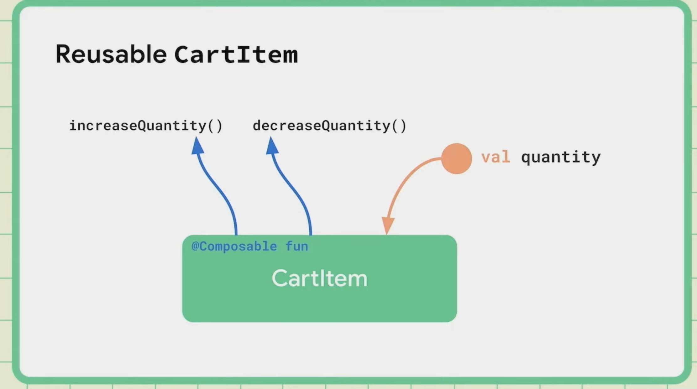
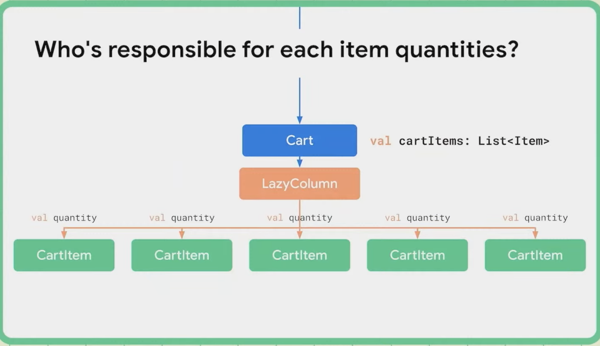
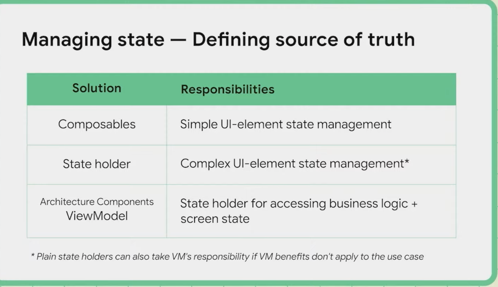
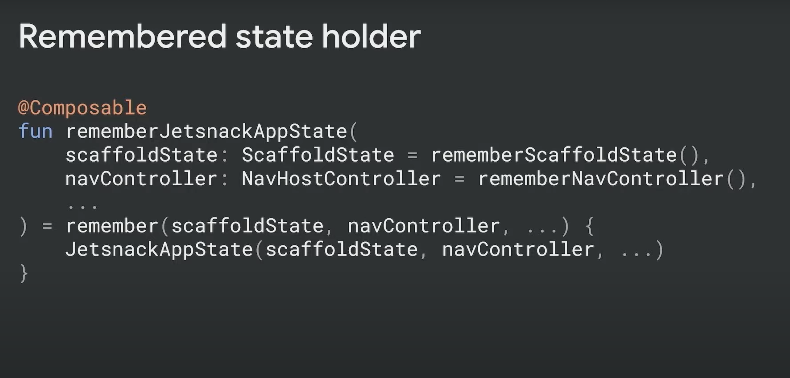
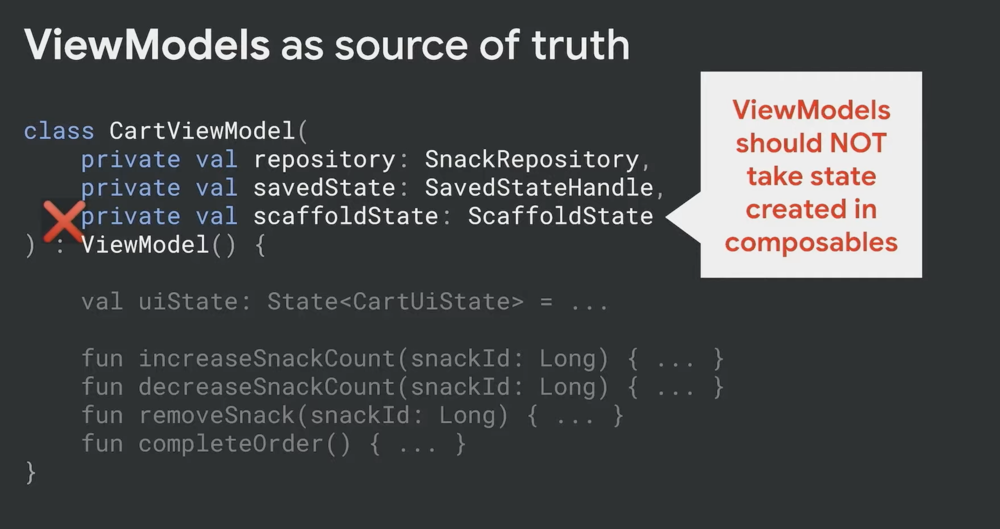
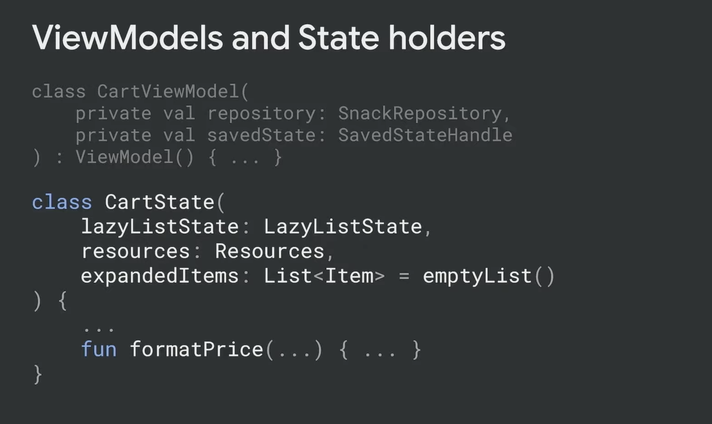
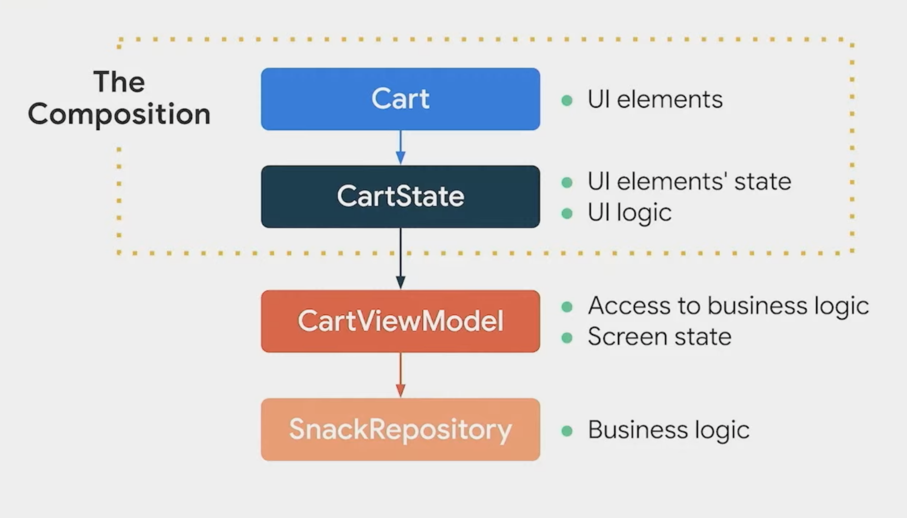
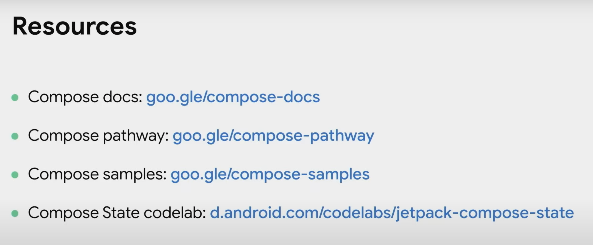

## Day 1
[dev-summit](https://developer.android.com/events/dev-summit)

日本時間
2021/10/28: 2:00~6:00

### 何かのコマンド...
```sh
cloc .
./gradlew clean
!find
findn "lint*.html"
./gradlew lint
```

### Footer の Profiler のところからいろいろできるらしい？

### App Inspection
shift * 2
App Inspection

### Persistent Work
CoroutineWorker のこと？

- Global scope
- process death
- reboot

### Stop worker
NotificationCompat.Builder ... とか

### Questions
- Whats  preffered, MVVM or MVI?
- Flows, or suspend function
  - kotlin coroutine, flow, livedata


## State in Compose
State not tracked by Compose

State created in composables needs to be remembered

```kotlin
val quantity = remember { mutableStateOf(1) }
```

### BONUS - rememberSaveable
State survives configuration changes

```kotlin
val quantity = rememberSaveable { mutableStateOf(1) }
```

### Reusable state
the data should be modified in one place (Single ... Principle)



state hoisting ?




Hoist state to at least the lowest common ancestor of its consumers.

Composable parameters: pass only what they need



### Def of words


### Remember state holder
Use a state holder to help you manage complexity




### ViewModels as source of truth
- access to business logic
- preparing data to present



- long life time

#### State


### Recap
- Hoists state out of the Composition
- Access to business logic and what to display on the screen (UI state)
- Depends on other layers of the hierarchy (i.e. data and business layers)
- Recommended for screen-level composable

#### ViewModels vs plain state holders
- ViewModel benefits over state holders
  - Operations survive configuration changes
  - Integration with Jetpack libraries
  - Cached in the Navigation backstack and cleared when the destination is popped off
- If benefits don't apply, prefere a simpler plain state holder
- State holders could depend on ViewModels



### Big picture 


### Resources



## Compose Tutorial
- 背景色を変えただけなのに、文字の色も勝手に変わる〜〜、確かに
- Box と同じノリで、Surface 使ってた
- Surface で囲むことの意味？
- OutlinedButton
- Totally xml free !


### kotlin
```kotlin
if (expanded) "Show less" else "Show more"

// animateDpAsState returns State
val extraPadding by animateDpAsState {
    targetValue = if (expanded) 48.dp else 0.dp
    animationSpec = tween(
        durationMillis = 2000
    )
}
```


### state, hoisting
- by と = で書き方微妙に違う
- 親の状態をそのまま渡すのは嫌だ
  - 子供が汚くなる
  - callBack を渡す！
    - onClick = {},,, とか
- rememberSaveable
  - remember the value over configuration changes


## 気になってること： [TODO]
アニメーション？
https://developer.android.com/jetpack/compose/animation

Material you
その人の背景色などの設定によって、アプリ内の色もダイナミカルに変わる！

Room
AutoMigration

MotionLayout
常に文字は読める向きになるような設定とかできる

RemoteCoroutineWorker

Work Manager ?

figma
export to Android Studio !?
working with designers
designtocode

### Compose
Surface で囲むことの意味？


## English
- outdated
- expedited work
- I think I can take this question.
- have a place in compose world
