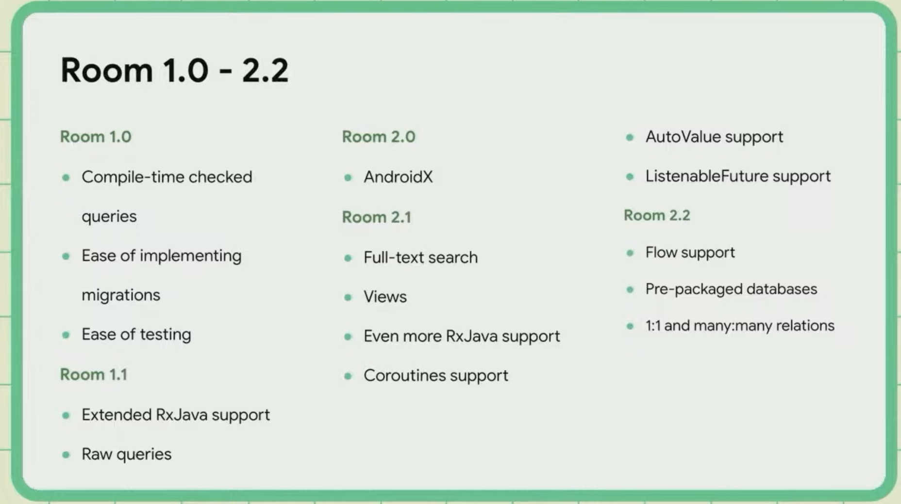
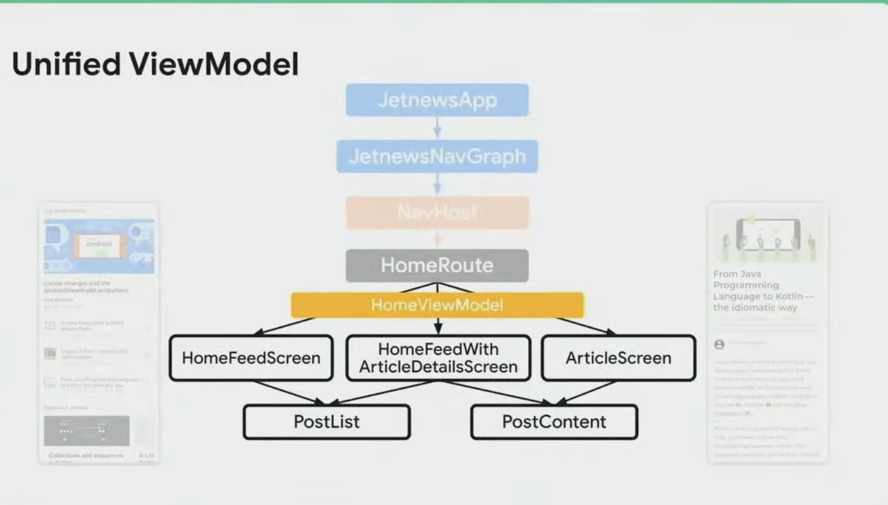
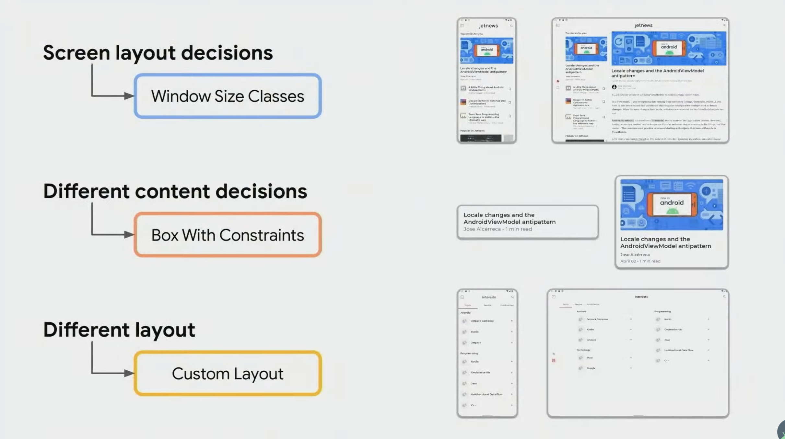

## Day 2

## Compose Coding
- Stateful = opinionated
- Stateless = Preview + reusable

UpperCase なのは、Kotlin での Factory ケースに従っている

### Composition local?


### renderHtml
composable * html を埋め込む方法

```kotlin
@BindingAdapter("renderHtml")
...
```


## Room



### Auto migraions
Database migrations allow you to update your database schema while avoiding any data loss.

automigrationspec

### Relational Query Methods
join?

`@Embedded`, `@Relation`, `@MapInfo`?


### Other
- kotlin-kapt builds are slow ?
  - Kotlin Symbol Processing (KSP) suport


## [Window Size Classes](https://developer.android.com/guide/topics/large-screens/support-different-screen-sizes#window_size_classes)
Compact, Medium, Expanded

### Resizable UI Checklist
- Optimize your application's layout for 'Compact' and 'Expanded' widths
- Test it across all reference devices, and pick the better layout for 'Medium'
- Consider additional improvements, including custom layouts and input support

### Jetpack
- [jetnews/utils/WindowSize.kt](https://github.com/android/compose-samples/blob/main/JetNews/app/src/main/java/com/example/jetnews/utils/WindowSize.kt)
- [developer something](https://developer.android.com/large-screens)
- [developer](https://developer.android.com/jetpack/compose/layouts/adaptive)

```kotlin
/**
 * Remembers the [WindowSize] class for the window corresponding to the current window metrics.
 */
@Composable
fun Activity.rememberWindowSizeClass(): WindowSize {
    // Get the size (in pixels) of the window
    val windowSize = rememberWindowSize()

    // Convert the window size to [Dp]
    val windowDpSize = with(LocalDensity.current) {
        windowSize.toDpSize()
    }

    // Calculate the window size class
    return getWindowSizeClass(windowDpSize)
}
```

#### unified viewmodel





### Device Postures


### ViewModels and LiveData
[page#7](https://developer.android.com/codelabs/jetpack-compose-migration?hl=ja#6)

## English
- As a bonus, 
- more to come
- anotomy
  - a study of the structure or internal workings of something.
