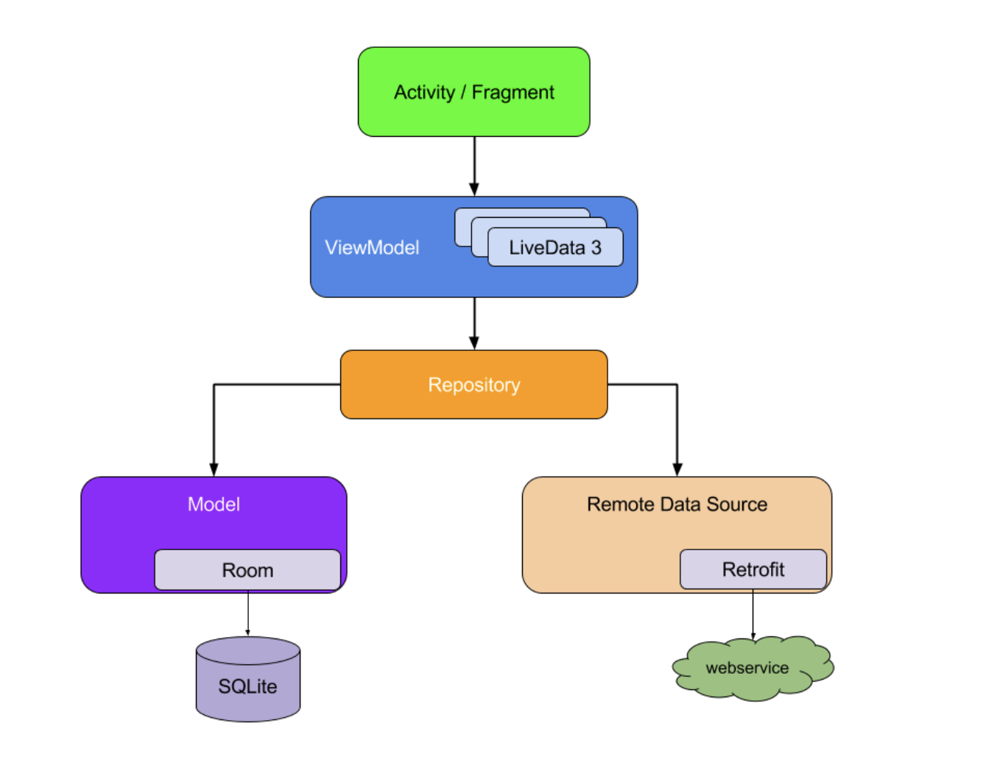

## [アーキテクチャガイド](https://developer.android.com/jetpack/guide?hl=ja)

### モバイルアプリの UX
- 電話等によるアプリの中断からの、スムーズな復帰
- リソースに限りがあるので、アプリプロセスが強制終了されることも
- アプリコンポーネントは個別に順不同で起動される
- OS やユーザーによって随時破棄される可能性がある
- アプリのデータや状態をアプリコンポーネントないに保存するな！

### 一般原則
- [関心の分離(Separation of concerns)](https://en.wikipedia.org/wiki/Separation_of_concerns)
  - Activity と Fragment の実装はデベロッパーが管理するものではない
    - Android OS とアプリ間のコントラクトを体現する単なる結合クラス
- UI をモデルで操作する
  - おすすめは永続モデル
    - Android OS がアプリを破棄してリソースを解放しても、ユーザーのデータが失われない
    - ネットワーク接続が不安定または利用不可の場合でもアプリが動作し続ける
  - モデルとは、アプリのデータを処理するコンポーネント

### 推奨アーキテクチャ

- 各コンポーネントがその１レベル下のコンポーネントのみに依存する
- リポジトリ モジュールは不要に見えますが、アプリの他の部分からデータソースを抽象化するという重要な目的を果たしている

### おすすめの方法
- アプリの各種モジュール間の責任の境界を明確に定義
- 各モジュールからの公開はできるだけ行わない
- 各モジュールを個別にテストできるようにする方法を検討
- アプリの特別な部分に焦点を当てて、他のアプリとの差別化を図る
  - 繰り返しのボイラープレートコードの記述には、Androidアーキテクチャコンポーネントやその他の推奨ライブラリを利用する
- データとの関連性と新鮮さをできる限り持続する
- 信頼できる唯一の情報源としてのデータソースを１つ指定する

### その他
- [データとその状態の両方をカプセル化する Resource クラス](https://developer.android.com/jetpack/guide?hl=ja#addendum)
- Hilt は、Android で依存関係インジェクションを行うための Jetpack の推奨ライブラリ
  - ロジェクトで依存関係の注入（DI）を手動で行うためのボイラープレートが減
  - DI はデザインパターン？
  - Hilt は依存関係ツリーをたどって自動的にオブジェクトが構築され、コンパイル時の依存関係が保証され
- Room
  - 最小限のボイラープレート コードを使用してローカルデータを永続化するオブジェクト マッピング ライブラ
  - コンパイル時に各クエリをデータスキーマに照らして検証することで、不完全な SQL クエリがランタイム エラーではなくコンパイル時エラーになるようニス
  - DaAO(Data access object)
- ディスク キャッシュを使用するかどうかにかかわらず、アプリの他の部分にとって信頼できる唯一の情報源としてのデータソースを、リポジトリで指定することをおすすめします
