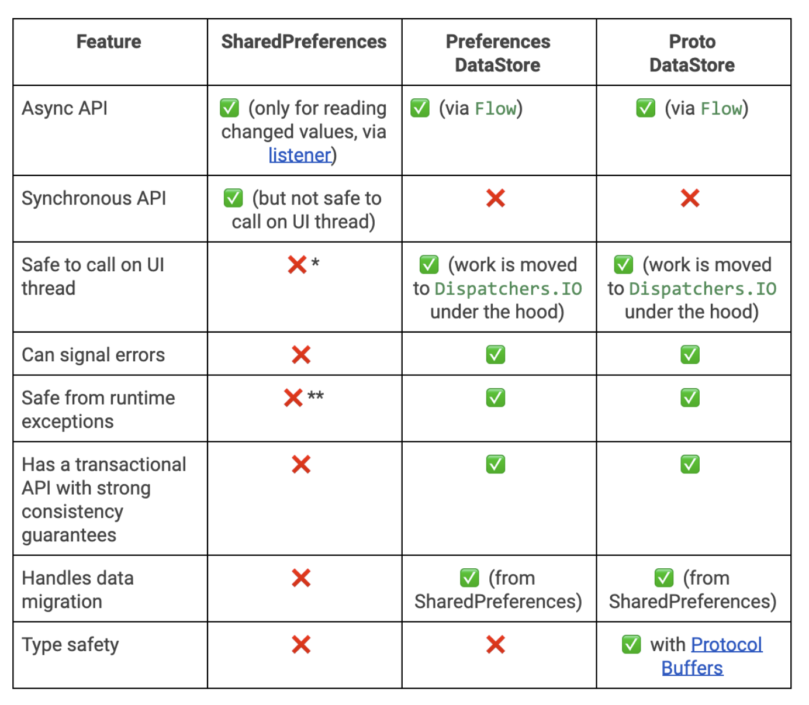
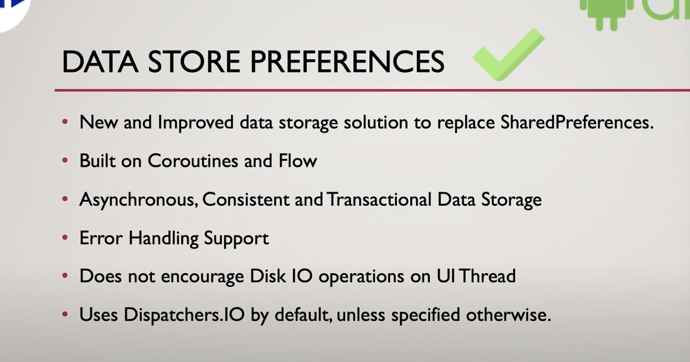

## What is a [DataStore](https://android-developers.googleblog.com/)?
DataStore is an advanced data storage solution provided by Jetpack in order to replace SharedPreferences. It was built using Kotlin coroutines and Flow to store data asynchronously, consistently, and transactionally.

### There are two ways of implementations using DataStore:
- Preferences DataStore: Stores data in key-value pairs similar to Shared Preferences. It doesn’t provide any type-safety. No predefined schema is required.
- Proto DataStore: Stores data as instances of a custom data type with predefined schema using Protocol buffers. It provides type-safety.

### references
- [official youtube](https://www.youtube.com/watch?v=sDYgfhuDTuE&ab_channel=AndroidHeroes)

