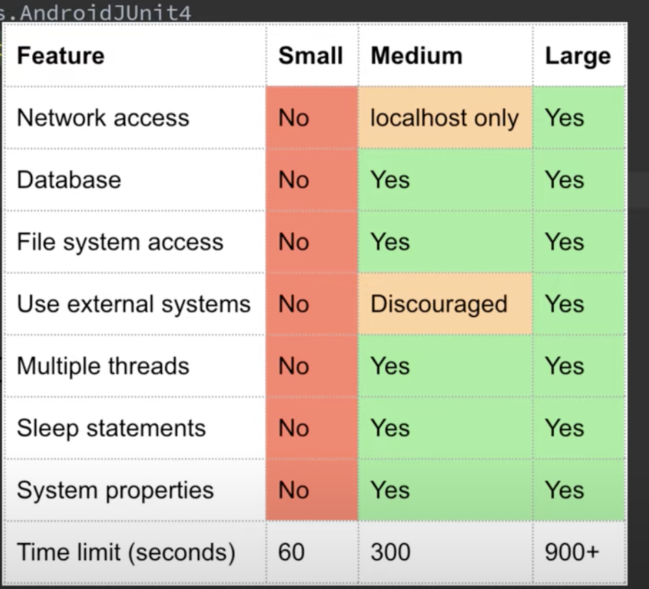

## Test
- [youtube](https://www.youtube.com/watch?v=EkfVL5vCDmo&list=PLQkwcJG4YTCSYJ13G4kVIJ10X5zisB2Lq)

### Testing in Android
- Without tests, you need to manually test the same functionality of your app over and over again to verify it is working.
- With JUnit, we can test our code with a single click whenerver we want.
- Unit tests - Integration Tests - UI Tests
- Unit tests: 70%
- Integration test: 20%
  - Tests how two components of our app work together
- UI tests: 10%
  - End to end test

### Test Driven Development
- Main Principle: 
  - Write the test case before the implementation of the function(only for unit tests)
- You should only have one assertion per test case.

#### What makes a good test?
1. Scope
2. Speed
3. Fidelity

Not a flaky test (sometmies succeeds and sometimes failes)

#### How many test cases should you write?
- As littele tests as necessary, but also as many as necessary.

### Context?
We rely on the androdi component

All our test cases should be independent each other



### その他
- [Pixabay Developer API](https://pixabay.com/ja/service/about/api/)

### memo
- viewmodel は普通のテスト (NOT AndroidTest)
- test フォルダの方では、`` で名前を囲む命名が使える


## kotlin
```kotlin
val string = buildString {
    for (i in 1..Constants.MAX_NAME_LENGTH + 1) {
        append(1)
    }
}
```
