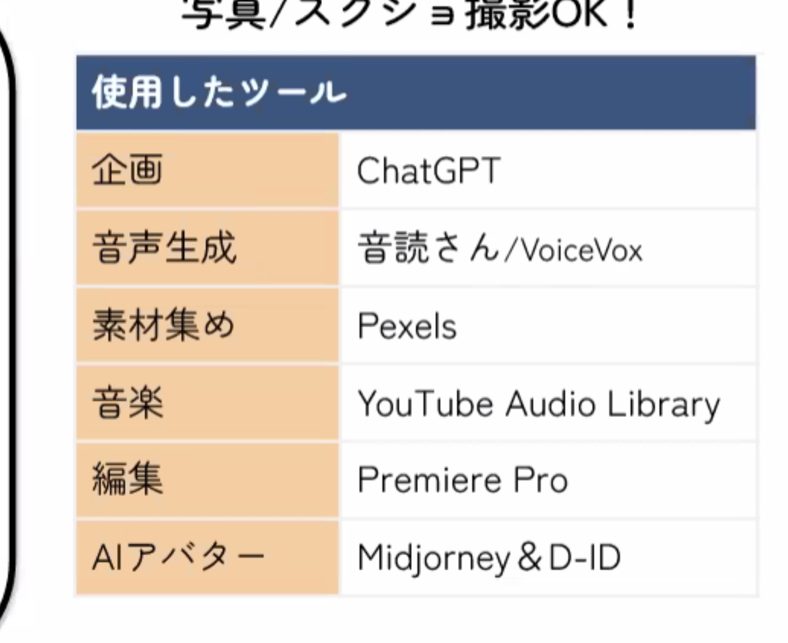

- セミナーがぴったりな人
  - 新たな収入源を探している
- [ViaVideo](https://service.via-video.jp/)
- AI スキル・SNS スキルが必須となりつつある
  - 動画 × AI × SNS
- 画像
  - midjourney
  - Leonardo.AI
- 動画生成
  - Kaiber
    - カイバー
    - サーフィン、浮世絵にする
- 動画合成
  - HeyGen
    - 口を動かしたり
- 動画編集
  - Pr
    - Premium Pro ?
- AI を使いこなす人になる！
  - ちょっと触るだけの人も多い
    - ちゃんとやる
  - みんな同じスタートライン
  - これからの成長市場
- 動画クリエイターとしての仕事と収入
  - クライアントワーク式
  - コンテンツオーナー式
- クライアントワーク取得の手段
  - Crowd Works
  - Lancers
  - VIDEO WORKS
  - 直接営業
- **情報収集ではなく実際の行動が重要**
  - スキル不足の泥沼
- Youtube の収益
  - 条件
    - 登録者1000人以上
    - 視聴時間4000時間以上
  - 広告収益相場
    - 相場、登録者数 × 5~10 円/月
  - 50 代とか 60 代とかの youtube に入ってくる人が今増えている
    - コンセプトを選べばチャンスはまだある

## AI × 動画制作、実演

- 3 steps
  - 企画構成: GPT
  - 素材集め: AI 生成声/動画素材/BGM
  - 動画編集: Premiere Pro
- GPT
  - 京都市内のおすすめの観光スポット2つを教えてください
    - 回答は箇条書きで200文字ほど
  - 台本
    - ターゲット
    - 動画の内容
    - 動画の長さ
  - タイトル
- 音声読み上げ
  - 音読さん
  - VOICEVOX
    - ずんだもんとか
    - 細かい調整
    - キャラクターに読んでもらうとか
- Pexels
  - 動画もある
- Youtube
  - オーディオライブラリ
- Premiere Pro
  - 文字起こしとかすごい
    - キャプションの制作



```
#役割：あなたは人気YouTubeチャンネルをプロデュースするプロのコンサルタントです。
#前提：手ごろにできるダイエットに関する人気YouTubeチャンネルのテーマを考えるため
#リクエスト：YouTube視聴者の「ダイエットに関する動画視聴ニーズ」をマークダウン形式に書いて欲しいです。
上記のマークダウンの回答に、先頭に関連する絵文字と、その後に数字を入れてください。
上記をMarkMapに対応したマークダウン記法にして下さい。
```
