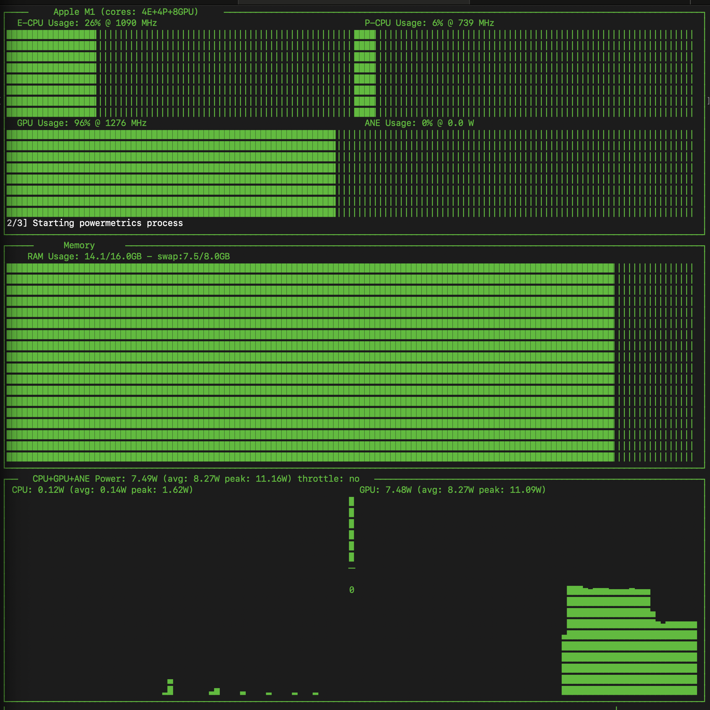
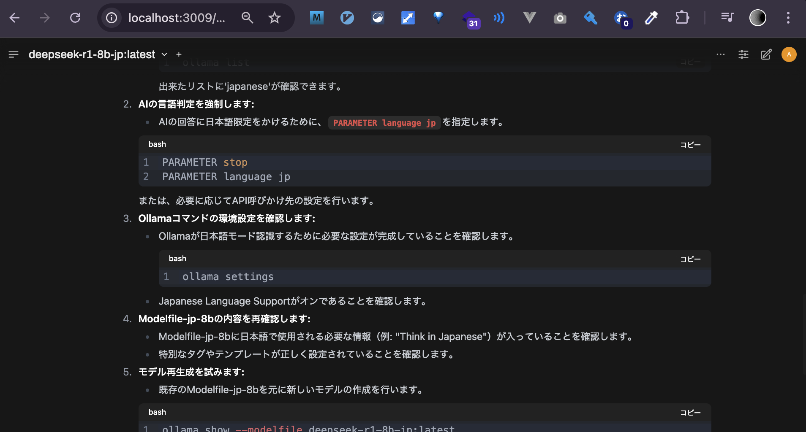

## asitop

https://github.com/tlkh/asitop

``` sh
pip install asitop

sudo asitop
```



## open webui

https://github.com/open-webui/open-webui



``` yml
# compose.yml
services:
  open-webui:
    container_name: open-webui
    image: ghcr.io/open-webui/open-webui:main
    ports:
      - "127.0.0.1:3000:8080"
    volumes:
      - open-webui:/app/backend/data
    extra_hosts:
      - "host.docker.internal:host-gateway"

volumes:
  open-webui:
```

## deepseek

using ollama

- https://zenn.dev/shirochan/articles/2949bf7b0dfdc7
- https://zenn.dev/yakan_k/articles/0a0c00a5080f1a
- https://zenn.dev/ollama/articles/2021-09-07-ollama
  - [modelfile](https://github.com/ollama/ollama/blob/main/docs/modelfile.md)

``` sh
ollama show --modelfile deepseek-r1:8b > Modelfile
vim Modelfile
ollama create deepseek-r1-8b-jp -f ./Modelfile

ollama show --modelfile deepseek-r1-8b-jp:latest
```
