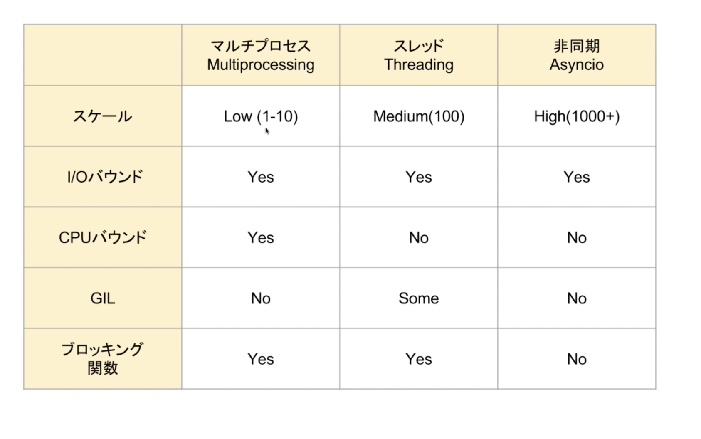

## マルチスレッド/マルチプロセス
- 平行（Concurrent） Threading
  - 完全な並列ではない
  - Python GIL 待ちがある
  - I/O バウンドには有効、CPU バウンドには不向き
- 並列（Parallel） Multiprocess
  - スケールしにくい（コアの数に限られる）




- CPU バウンド 数値計算
- I/O バウンド　ネットワーク通信、ファイル読み書き

- 非同期 I/O（Asyncio）、ノンブロッキング I/O


## 非同期処理とは


### コルーチン
[generator ベースコルーチン](./async_1.py)

こルーチンを呼び出す時には、yield from か await で呼び出す

### asyncio
```sh
pip install aiohttp 
```

[読み込んだライブラリも async に対応させる必要がある](./async_3.py)

[公式、コルーチンとタスク](https://docs.python.org/ja/3/library/asyncio-task.html)

[chain example](./async_5.py)

#### [aiohttp](https://docs.aiohttp.org/en/stable/0)


#### [websockets](https://websockets.readthedocs.io/en/stable/)
