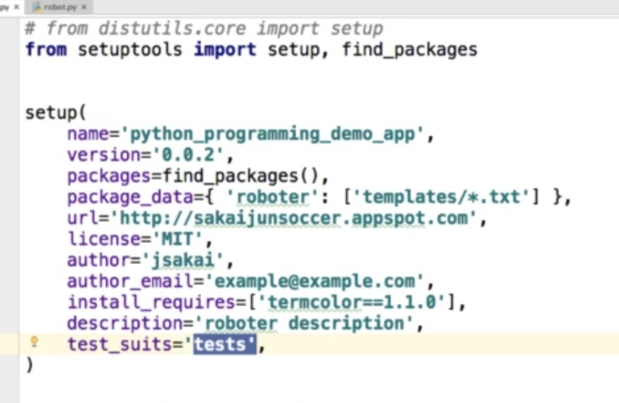

pytest はユニットテストよりも機能が充実している

pytest の fixture が充実している、それを見てみる

https://docs.pytest.org/en/6.2.x/fixture.html

```sh
pip install pytest-cov pytest-xdist

pytest pytest_prac.py --cov=calculation
pytest pytest_prac.py --cov=calculation --cov-report term-missing
```

## selenium
```sh
# driver , マックならこれで入るらしい
brew install geckodriver
```


## 後で見てみる
setuptools !




tox 飛ばした
