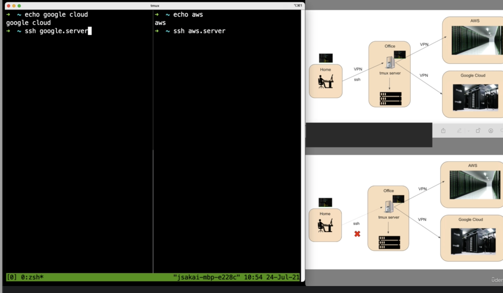

##　iterm2

### hot key
特定のキーで、iterm2 を呼び出せる

option + space

### shortcut
- Command + shift + h
  - クリップボードの履歴の呼び出し
- Command + f
  - 検索
- Command + enter
  - フルスクリーンと解除
- Command + u
  - 背景の透過を ON, OFF できる？？


## zsh
```sh
$ zsh --version
zsh 5.8 (x86_64-apple-darwin20.0)
$ cat /etc/shells
# List of acceptable shells for chpass(1).
# Ftpd will not allow users to connect who are not using
# one of these shells.
/bin/bash
/bin/csh
/bin/dash
/bin/ksh
/bin/sh
/bin/tcsh
/bin/zsh

# シェルを変更する
chsh -s /bin/bash
```

### 色々インストール
```sh
$ screen -v
Screen version 4.00.03 (FAU) 23-Oct-06
$ brew install tmux
$ tmux -V
tmux 3.2a
$ brew install neovim
```


## NeoVim

### Vim と NeoVim？ IDE と使い分ける
- Vim を IDE 化するのではなく補助的に
- ガッツリと開発するには IDE を使うのが良い

### neovim
- vim ができることは、ほぼ NeoVim でできる
- 使い方はほぼ一緒

config file `~/.config/nvim/init.vim`

### command
| command | feat |
| --- | --- |
| . | repeat |
| P | 現在の行に挿入 |
| :!python3 .. | コマンドラインで実行 |
| :!! | コマンドを繰り返す |
| :set number | 行番号を表示 |
| 0 | 先頭に移動 |
| { | 段落ごとに上に移動 |
| { | 段落ごとに下に移動 |
| [[ | セクションごとに上に移動 |
| ]] | セクションごとに下に移動 |
| ctrl + o | 移動前に戻る！！(not command) |
| :%s/search/replace/g | 一括置換 |
| :%s/search/replace/gc | 確認しながら置換 |
| J | 行の連結 |
| > (visual mode) | 右にインデントを移動 |


### ~/.config/nvim/init.vim
- [vim setting](https://vimhelp.org/)

```sh
set shell=/bin/zsh
set shiftwidth=4
set tabstop=4
set expandtab
set textwidth=0
set autoindent
set hlsearch
set clipboard=unnamed
syntax on
```

### plugin
- vim plugin managers
  - [vim plug](https://github.com/junegunn/vim-plug)
  - vundle
  - ...

- [vim-horizon](https://github.com/ntk148v/vim-horizon)
- [nerdtree](https://github.com/preservim/nerdtree)
- [fzf](https://github.com/junegunn/fzf)
  - brew install fzf
  - :FZF
  - :FZF ../
- [fugitive](https://github.com/tpope/vim-fugitive)
  - git blame fugitive.vim
  - :!git blame fugitive.vim
  - :Git blame
  - Ctrl+w w
- [gitgutter](https://github.com/airblade/vim-gitgutter)
- [vim commentary](https://github.com/tpope/vim-commentary)
  - コメントアウトを楽に！？
  - (visual mdoe) -> gc
- [polyglot](https://github.com/sheerun/vim-polyglot)
- [coc vim](https://github.com/neoclide/coc.nvim)
  - 補完
  - :CocInstall coc-python


```sh
# node package manager
$ brew install nvm
```

```
nnoremap <leader>n :NERDTreeFocus<CR>
nnoremap <C-n> :NERDTree<CR>
nnoremap <C-t> :NERDTreeToggle<CR>
nnoremap <C-f> :NERDTreeFind<CR>
```

:PlugInstall
:PlugStatus
:PlugClean

~/.config/nvim/plugged に保存されている


### そのほか
:set hlsearch
:set nohlsearch


## tmux
Terminal Multiplexer

client, tmux server, session, window, Pane

- ディタッチ
  - ctrl+g, d
- セッションに戻る：アタッチ
  - tmux ls
  - 1 つなら、`tmux a`
  - tmux a -t 1
- exit
- 時計表示
  - ctrl+g, t

```sh
# prefix の調整などする
$ vim ~/.tmux.conf
unbind C-b
set -g prefix C-g
bind C-g send-prefix
```

- ctrl + k で、カーソルより右を消せる！
  - ctrol + u の逆サイ


### ペイン
- ctrl + d, ペインを抜ける
- ctrl + g, z: 拡大縮小
- ctrl + g, o: 次のペインに移動
  - 左右キーとかでも
- ctrl + g, q: 数字を使って pane を移動
- ctrl + g, { (}): pane の左右を入れ替える

### window
- ctrl + g, c: 新しい window を起動
- ctrl + g, n: 次のウィンドウ
- ctrl + g, ,: window の名前を変える

### tmux 上で、vim みたいなコピ！
ctrl + g, [ で vim モードに！

crtl - V で貼り付け

```
setw -g mode-keys vi

bind-key -T copy-mode-vi 'v' send -X begin-selection
bind-key -T copy-mode-vi 'C-v' send -X rectangle-toggle
bind-key -T copy-mode-vi 'y' send -X copy-selection
```




## [zsh](https://zsh.org/)
- 直近のコマンドを実行： `!vim`
- 一つ上のコマンド！： `!!`
- pushd ~/
  - popd

- [ohmyzsh](https://ohmyz.sh/#install)
- [autojump](https://github.com/wting/autojump)
  - j tmp
  - jo music
    - finder を開く
- web-search
  - google python hoge
- fzf
  - Ctrl + t !!!
- [zsh syntax-hilighting](https://github.com/zsh-users/zsh-syntax-highlighting/blob/master/INSTALL.md)
- [auto suggestion](https://github.com/zsh-users/zsh-autosuggestions)
- [powerlevel10k](https://github.com/romkatv/powerlevel10k#oh-my-zsh)
  - p10k configure


## よく使うコマンド
```sh
$ find -name models.py
```

### アプリ
- [Rectangle](https://rectangleapp.com/)
- [Authy](https://authy.com/)
- [Last Pass](https://www.lastpass.com/)
- [chrome remote desktop](https://remotedesktop.google.com/?pli=1)


## 世界で通用するエンジニアになるには？
- 英語で技術情報収集
- わかりやすく最適なコード
  - コメントを書かないでもわかるくらいのわかりやすさ！
- 良いエンジニアはキャリア構築力がある
  - 世界のエンジニアと働ける環境
  - オープンソースに参加が良い手段
  - 自分よりスキルがある知人と一緒に開発
  - Udemy などでシリコンバレーの技術習得も良い手段

### 流行りのテクノロジー、言語
Programming language market share
