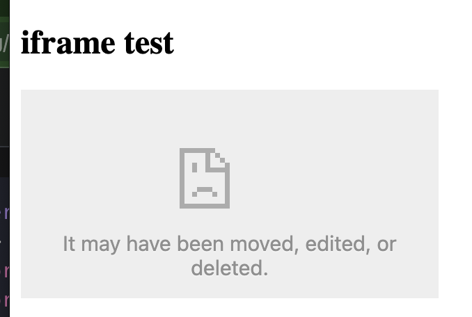

[Hatena Developer Center](https://developer.hatena.ne.jp/ja/documents/bookmark/apis/rest/my)

## 今やりたいこと

最新記事 5 つくらいを、自分のブログに埋め込みたい。

はてなブログにある埋め込みがあればそれでもいいし、情報もらって自分の方で表示するのでもいい。

## [はてなブログ AtomPub](https://developer.hatena.ne.jp/ja/documents/blog/apis/atom)

`https://blog.hatena.ne.jp/{はてなID}/{ブログID}/atom/entry/{entry_id}` を[認証つき](https://developer.hatena.ne.jp/ja/documents/blog/apis/atom/#auth)で叩く。

今回は API キーを使った Basic 認証方式で取得を行いました。 　
（API キーは[アカウント設定](https://blog.hatena.ne.jp/-/config)から取得可能です。）

以下の `api_key` を自身の API キーに置き換える必要があります。

```sh
curl -u kokoichi206:api_key https://blog.hatena.ne.jp/kokoichi206/koko206.hatenablog.com/atom/entry
```

結果が xml で返ってくる為、色々整形して使いやすい json にしてやる。

```sh
curl -u kokoichi206:api_key https://blog.hatena.ne.jp/kokoichi206/koko206.hatenablog.com/atom/entry > entry
cat entry | xq > entry_xq

# 最終系
cat entry_xq | jq '.feed.entry | map({ title: .title, url: .link[0]."@href", published: .published, summary: .summary."#text", category: .category })' > entry_output
```

### jq: 1 compile error

xml を無理やりパースして json にしているため、key の値に `#text`, `@href` などが含まれてしまっている。

これらをそのまま jq の `.` で繋げていくとエラーになるため、`"` で囲ってやる。

```sh
$ echo '{ "#text": "This is a text" }' | jq '. | { title: .#text }'
jq: error: syntax error, unexpected $end, expecting '}' (Unix shell quoting issues?) at <top-level>, line 1:
. | { title: .#text }
jq: 1 compile error

# " をつけてみる
$ echo '{ "#text": "This is a text" }' | jq '. | { title: ."#text" }'
{
  "title": "This is a text"
}
```

### 全件取得したい

[一覧取得 API](https://developer.hatena.ne.jp/ja/documents/blog/apis/atom/#%E3%83%96%E3%83%AD%E3%82%B0%E3%82%A8%E3%83%B3%E3%83%88%E3%83%AA%E3%81%AE%E4%B8%80%E8%A6%A7%E5%8F%96%E5%BE%97) では、（デフォルトでは）1 度に 7 件が取得可能らしい。

URL パラメータで page を指定することで、続きのエントリーを取得ができる。

```sh
# page 番号は、1つ前のレスポンスボディに含まれている。
curl -u kokoichi206:api_key https://blog.hatena.ne.jp/kokoichi206/koko206.hatenablog.com/atom/entry | xq | jq '.feed.link[1]."@href"'
> https://blog.hatena.ne.jp/kokoichi206/koko206.hatenablog.com/atom/entry?page=1667486025

# page 番号を指定して次のエントリーを取得。
curl -u kokoichi206:api_key https://blog.hatena.ne.jp/kokoichi206/koko206.hatenablog.com/atom/entry?page=1667486025
```

### jq で外側を配列にする

```sh
# このままだと正しい json の形をしていない
$ cat entry_xq | jq '.feed.entry[] | { category: .category }'
{
  "category": [
    {
      "@term": "Android-jetpack compose"
    },
    {
      "@term": "Android"
    }
  ]
}
{
  "category": {
    "@term": "Android"
  }
}
```

上では entry の各要素 `[]` に対して変換をおこなっていたが、map を使って `entry` 自身に対して返還をしてあげる。

```sh
$ cat entry_xq | jq '.feed.entry | map({ category: .category })'
[
  {
    "category": [
      {
        "@term": "Android"
      },
      {
        "@term": "Android-jetpack compose"
      }
    ]
  },
  {
    "category": {
      "@term": "Android"
    }
  },
  {
  ...
]
```

### category の型が異なる問題（未解決！）

xq で json にパースする際に、`category` が 1 つか複数かによって**返却される型が異なる**（`category` なしは何が返ってくるかも**要確認**）

```sh
$ cat entry_xq | jq '.feed.entry[] | { category: .category }'
{
  "category": [
    {
      "@term": "Android"
    },
    {
      "@term": "Android-jetpack compose"
    }
  ]
}
{
  "category": {
    "@term": "Android"
  }
}
```

これを他の他の型付き言語とかでパースしようと思ったらエラーになりそうな予感（わからん）がするので、json の段階で直しておきたい（`[]` に統一しておきたい）。

## [はてなブログ oEmbed API](https://developer.hatena.ne.jp/ja/documents/blog/apis/oembed)

Web サイトにさまざまなコンテンツを埋め込むための仕組み

現在、はてなでは、はてなブログの各記事を oEmbed を用いて埋め込むことが可能

```sh
# 301 Moved
curl -X GET http://hatenablog.com/oembed -d 'url=http://koko206.hatenablog.com/entry/2022/11/14/192751' -d 'format=json'

# url required
curl -L -X GET http://hatenablog.com/oembed -d 'url=http://koko206.hatenablog.com/entry/2022/11/14/192751' -d 'format=json'

# body -> url param にしたらいけた！
# ドキュメントが違いそう...
curl -L -X GET http://hatenablog.com/oembed?url=http://koko206.hatenablog.com/entry/2022/11/14/192751&format=json
```

レスポンス詳細

```sh
$ curl -L -X GET http://hatenablog.com/oembed\?url\=http://koko206.hatenablog.com/entry/2022/11/14/192751\&format\=json | jq
{
  "description": "今回は、Jetpack compose で Material You を使う方法についてメモしておきます。 なお、今回の内容は『Android DevSummit \"Material You in Compose apps\"』から学んだものとなります。 環境 - kotlinCompilerVersion '1.6' - compose_ui_version = '1.3.0-beta03' - androidx.compose.material3:material3:1.1.0-alpha02 - androidx.compose.material3:material3-window-siz…",
  "categories": [
    "Android",
    "Android-jetpack compose"
  ],
  "width": "100%",
  "height": "190",
  "provider_url": "https://hatenablog.com",
  "author_name": "kokoichi206",
  "provider_name": "Hatena Blog",
  "version": "1.0",
  "blog_url": "http://koko206.hatenablog.com/",
  "image_url": "https://cdn-ak.f.st-hatena.com/images/fotolife/k/kokoichi206/20221114/20221114192427.png",
  "published": "2022-11-14 19:27:51",
  "author_url": "https://blog.hatena.ne.jp/kokoichi206/",
  "blog_title": "Diary",
  "url": "http://koko206.hatenablog.com/entry/2022/11/14/192751",
  "html": "<iframe src=\"https://hatenablog-parts.com/embed?url=http%3A%2F%2Fkoko206.hatenablog.com%2Fentry%2F2022%2F11%2F14%2F192751\" title=\"Jetpack Compose で Material You を使う - Diary\" class=\"embed-card embed-blogcard\" scrolling=\"no\" frameborder=\"0\" style=\"display: block; width: 100%; height: 190px; max-width: 500px; margin: 10px 0px;\"></iframe>",
  "type": "rich",
  "title": "Jetpack Compose で Material You を使う"
}
```

iframe を試してみたが、全然機能してなさそう



全然だめ。

そもそも、エントリーの日時・ID を知っておく必要がある時点で今回の用途とは合わないかも？

## その他

### OAuth を使って投稿とか

ステップが今回やりたいことの割に複雑になってしまうので、1 回パス。

ルートエンドポイント
https://blog.hatena.ne.jp/kokoichi206/koko206.hatenablog.com/atom

= を url encode したら %3D

```
# sample
POST /oauth/initiate HTTP/1.1
Host: www.hatena.com
Authorization: OAuth realm="",
    oauth_callback="oob",
    oauth_consumer_key="yTVGWKqa6OiH5A%3D%3D",
    oauth_nonce="0c670efea71547422662",
    oauth_signature="lvQC7AXTRIaqxbjwVGgPlYuNaaw%3D",
    oauth_signature_method="HMAC-SHA1",
    oauth_timestamp="1291689730",oauth_version="1.0"
Content-Type: application/x-www-form-urlencoded
```
