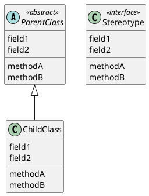

## memo

### 本書中での記号について
- 規則
  - Java の規則、絶対的な言語規則
- 原則
  - 設計原則、設計を改善するための指針
- ヒント
  - 言語ならびにコーディング上の有益なヒント

### 用語
- カージナリティ
  - あるクラスと別のクラスとの間のカージナル関係
  - 例として、１対多、多対多、１対 n などがある
- synchronized
  - synchronized として宣言されたメソッドには、同時に１つの実行スレッドだけが入れる

### UML
- Unified Modeling Language
- オブジェクト指向システムを記述、視覚化、構築、文章化するための汎用記述言
- stereotype、ステレオタイプ
  - `class Stereotype <<interface>>`
- "has a" 関係を表現するには、集約（aggregation）を使う
- "uses"の関係には、破線を引く
  - あるクラスが別のクラスや interface に対して**依存性（dependency）**をもっている場合
  - 下のケースでは、"PeripheralTester uses Peripheral"
  ```java
  public class PeripheralTester {
      public void test(Peripheral p) {...}
  }
  ```





