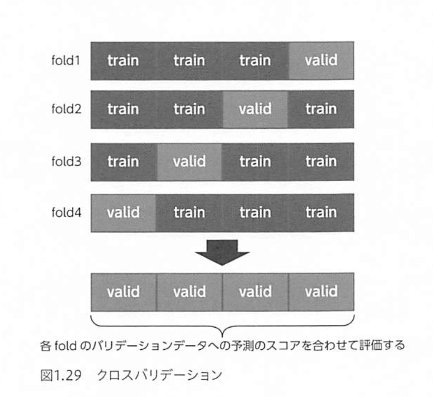

# Kaggleで勝つ データ分析の技術
2019/08での最新VER

テーブルデータを対象とする

- [Code](https://github.com/ghmagazine/kagglebook)

学習データとテストデータを読み込む

```python
train = pd.read_csv('../input/brabra.csv')
test = pd.read_csv('../xxx.csv')

# 学習データを特徴量と目的変数に分ける
train_x = train.drop(['target'], axis=1)
train_y = train['target']

# テストデータは特徴量のみなので、そのまま
test_x = test.copy()
```

学習データを学習データとバリデーションデータに分ける

```python
from sklearn.model_selection import KFold

kf = KFold(n_splits=4, shuffle=True, random_state=71)
tr_idx, va_idx = list(kf.split(train_x))[0]
tr_x, va_x = train_x.iloc[tr_idx], train_x.iloc[va_idx]
tr_y, va_y = train_y.iloc[tr_idx], train_y.iloc[va_idx]
```

[Kaggle API](https://github.com/Kaggle/kaggle-api)なんかも！


### データ理解（EDA）
Exploratory Data Analysis

### GBDT（勾配ブースティング木）
Gradienet Boosting Decision Trees

1. 意味のなさそうなデータを削除
2. 文字列は変換する（label encodingなど）
3. GBDTでは欠損は扱える（補完するのも手ではある）

GBDTのライブラリの1つであるxgboostを使うか、１回




### アンサンブル
単一のモデルでのスコアには限界があっても、複数のモデルを組み合わせて予測することでスコアが向上する場合があり、そのように予測することをアンサンブルと言います。

精度などに応じて、加重平均を撮ったりする

### 分析コンペの流れ
1. 特徴量を作成する
2. 作成した特徴料をそれまでの特徴量に加え、モデルの学習を行う
3. 予測が改善したかどうかをバリデーションで評価する


## sec 2

### 分析コンペ
ExcelなどのスプレッドシートやpandasのDataFrameで表されるような、行と列の形式のデータをテーブルデータ（tabular data）という。


### 決定係数（R^2）
決定係数は以下の式で表される指標で、回帰分析の当てはまりの良さを表す

分母は予測値によらず、分子は二条誤差を差し引いているため、この指標を最大化することは、RMSEを最小化することと同じ意味

$$R^2 = 1 - \frac{\Sigma(y_i-\hat{y_i})}{\Sigma(y_i-\bar{y})}$$


### 混同行列（confusion matrix）
TP, TN, FP, FN


## sec 3

### GDBD (Gradient Boosting Decision Tree: 勾配ブースティング木)
- 数値の大きさ自体には意味がなく、大小関係のみが影響する
- 欠損値があっても、そのまま取り扱うことができる
- 決定木の分岐の繰り返しによって変数間の相互作用を反映する

### 決定木の気持ちになって考える

### 欠損値の扱い
欠損値はその値が何らかの理由で欠損しているという情報を持っていると考えると、その情報を捨てるのはもったいないため、そのまま取り扱うのが自然な方法。

予測による補完なども使われることもある。

欠損値が、-1, 9999 などで扱われていることもある！

```python
# 欠損値を指定して train.csv を読み込む
train = pd.read_csv('train_csv', na_values=['', 'NA', -1, 9999])

# ある列の -1 のみ変換する
data['col1'] = data['col1'].replace(-1, np.nan)
```

### 標準化
```python
from sklearn.preprocessing import StandardScaler

scaler = StandardScaler()
scaler.fit(train_x[num_cols])

train_x[num_cols] = scaler.transform(train_x[num_cols])
test_x[num_cols] = scaler.transform(test_x[num_cols])
```

### 非線形変換
```python
x = np.array([1.0, 10.0, 1000.0, 10000.0])

# 単に対数を取る
x1 = np.log(x)

# 1 を加えた後に対数を取る！
x2 = np.log1p(x)    # こんな関数があるらしい

# 絶対値の対数をとってから元の符号を付加する
x3 = np.sign(x) * np.log(np.abs(x))
```

```python
all_x = pd.concat([train_x, test_x])
```


