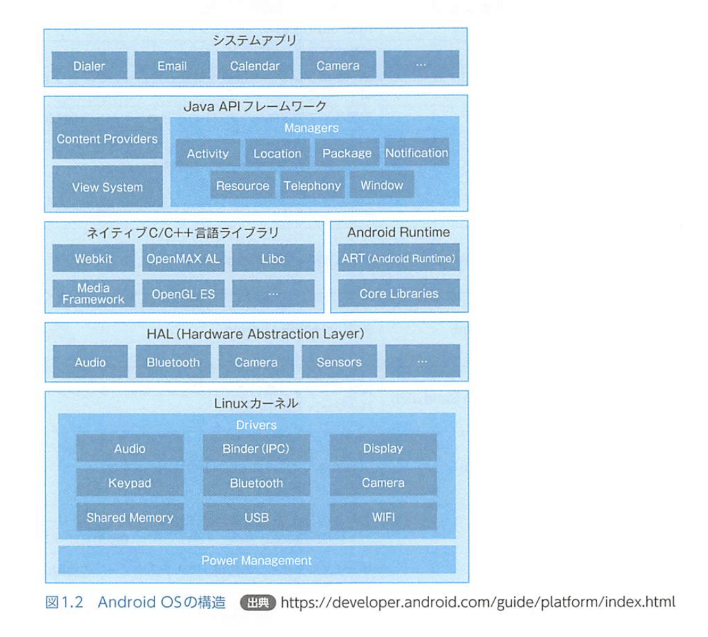
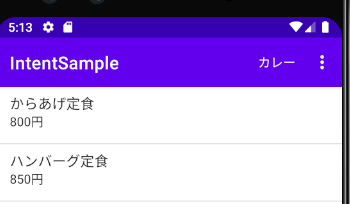
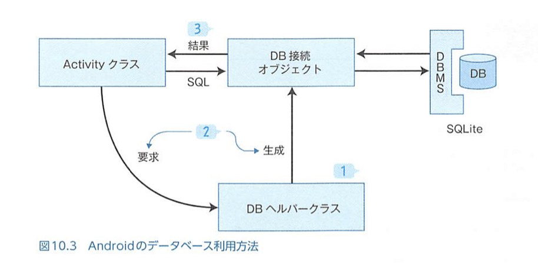
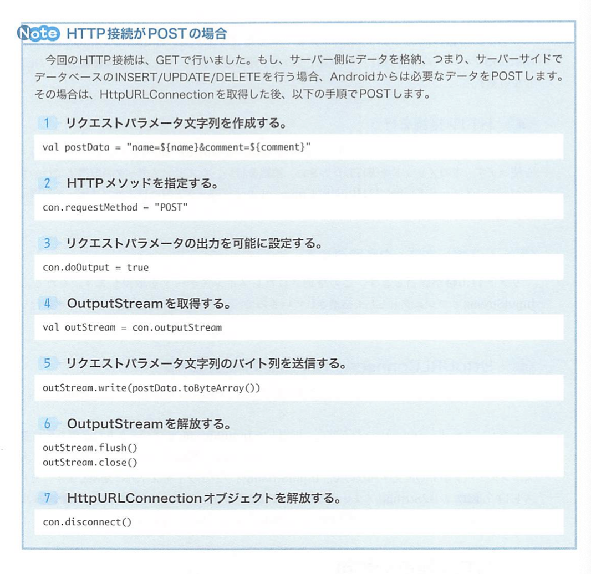
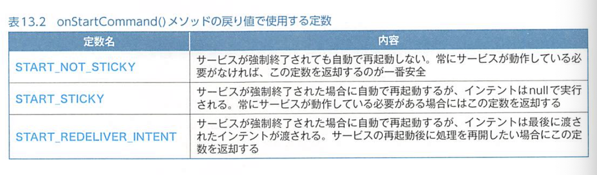

# Androidアプリ開発の教科書

- [Source Code](../../android/android_text/)

## Android 基礎知識
- 2005, GoogleがAndroid社を買収。
- コードネームがC ,D,E,,,と、お菓子の名前がついている
- APIレベルという通し番号がついており、現在30とか31とかが最新
- Androidだが、モバイル端末にとどまらず、腕時計やテレビ、ウェアラブルデバイス向けOSへと幅を広げている
- Androi OSの特徴は、なんといっても、オープンソース

### 内部構造



#### Linuxカーネル
最下層にLinuxカーネルが配置されている。

####  HAL (Hardware Abstraction Layer)
カメラなどAndroid端末のハードウェアを扱うためのライブラリ
#### ART (ASndroid Runtime)
Javaプログラムを実行するための実行環境。C/C++でプログラミングを行う場合、ネイティブライブラリを使うため、端末のメモリやCPUなどハードウェアを意識する必要がある。一方、Androidアプリの開発言語として採用されているJavaは、そういったことを意識する必要がなく、それを可能にしてるのがART

#### Java API フレームワーク
Javaのライブラリ。JDKに含まれているライブラリだけでなく、Android開発に必要なライブラリも含まれている

#### システムアプリ
Android OS にもともと備わっているアプリのこと。メーラやブラウザ、メッセージソフトや地図アプリなど。

### Kotlin
Kotlinは、JVM言語の一種。Javaで書かれたプログラムをコンパイルしたファイルは、JVM（Java Virtual Machine）上で動作する。ところが、Java以外にも、コンパイルしたファイルがJVM上で動作する言語が存在し（JVM言語）、Kotlinはそのうちの1つ。

Javaとの互換性を維持しつつ、Javaよりも簡潔に記述できることを目指している


## Android開発＠Android Studio

### ファイル構成

#### manifests
アプリの実行に必要な記述

#### java
このフォルダの中には、.javaファイルが格納されている。Kotlinのソースコードファイルである.ktファイルもこの中に格納する。

#### res
Androidでは、画面構成を.xmlファイルに記述する。そういった、.xmlファイルやアプリで使われる画像ファイルなどを格納するのが、このresフォルダ。


### dp, sp などの単位
単位として px は使用しない。px は画面解像度に依存し、端末ごとに解像度が違うAndroidでは不向きだから。代わりに、dpとspを使う。dp（Density-Independent Pixel）は、密度非依存ピクセルのことで、dipともいう。sp（Scale-independent Pixel）もある。使い分けとしては、ビューやグループのサイズ設定にはdpを、テキストサイズの設定にはspを使う

### その他
- レイアウトとアクティビティは通常、関連した名前をつける。

## Android基礎

### Layout

#### EditText
代表的なinputType属性値

| 値 | 内容 |
| --- | --- |
| text | 通常の文字列入力 |
| number | 数値の入力 |
| phone | 電話番号の入力 |
| textEmailAddress | メールアドレスの入力 |
| textMultiLine | 複数行の入力 |
| textPassword | パスワードの入力 |
| textUri | URIの入力 |

### Spinner
Androidではドロップダウンリストを表すタグは、Spinner。

`android:layout_weight="1"`にすると、画面に残った余白の全てを、その画面部品に割り当てることになる。割り当てたい余白の方向を、0dpにする。

#### 文字候補
- リストデータは、string-array タグで記述する
- android:entries 属性で受け取る

### AppCompatActivityクラス
サポートライブラリを利用するための基本となるアクティビティクラス。サポートライブラリとは、新しいAPIレベルで追加された機能を古いAPIレベルでも使えるようにしたり、その他便利な機能を利用できるようにするプログラムを一まとまりにしたファイルのこと。

### リソースを管理してくれるRクラス
resフォルダ内のファイルやそのファイル内に記述された「@+id」の値など（これらをリソースをいう）は、Androidアプリの管理対象として扱う。効率よくリソース管理するために、Androidではそのファイルや値を識別するためのJavaのint型定数を使用することになっている。このint型定数をまとめて記述するクラスとして**Rクラス**を用意し、そこにAndroid Studioが自動追記するようになっている。これによって、アプリ内では、Rクラス中の定数（R値）を使ってリソースをやり取りしている。

### Toast
`Toast.makeText(引数1,引数2,引数3).show()`

- 第一引数：context: Context
  - トーストを表示させるアクティビティオブジェクトを指定。このことを、Android開発ではコンテキストという。
- 第二引数：text: CharSequence
  - 表示文字列を指定する。
- 第三引数：duration: Int
  - トーストが表示される長さをToastクラスの定数を使って指定する。

### ダイアログ
トーストと異なり、ユーザーの反応を取得できる

### コンテキスト
Android開発では、コンテキストが重要な概念を果たす。実は、Activityクラスの親クラスとしてContextというクラスが存在する。このコンテキストの指定としては、通常Contextクラスが保持しているapplicationContextプロパティを利用する。

### Constraint layout


- ベースライン
- ガイドラインによるたての並び
  - ガイドラインは制約の設定先として利用できる
- チェイン


### アクティビティの起動
1. Intentクラスのインスタンスを生成する
2. 起動先アクティビティに渡すデータを格納する
3. アクティビティを起動する

- getIntExtra("price",)
- finish()
  - Activityクラスのメソッドで、自身を終了させるメソッドになる
  - ライフサイクルとの関係？？

### アクションバー
サンプルは IntentSample プロジェクト

- オプションメニュー
- オーバフローメニュー

### オプションメニュー
- res -> New -> ASndroid Resource Directory
  - Resource type -> menu
- 手順
  - それ用のフォルダとxmlファイルを用意
  - アクティビティにonCreateOptionsMenu()メソッドを実施する
- showAsActionの属性値
  - never, always, ifRoom



- android:icon 属性もある
- 戻るメニューもオプションメニューの1つ
  - android.R.id.home

### コンテキストメニュー
- 長押し時のイベントで出てくるメニュー
- 作り方はオプションメニューとほぼ一緒

### フラグメント
画面の一部を独立したブロックとして扱えるのがフラグメント！

ディスプレイサイズなどに対応する

Androidでは、layoutフォルダに修飾子をつけることで、どの画面用のレイアウトXMLファイルかを指定することができ、OS側で画面サイズに応じて自動的に切り替えてくれる仕組みが用意されている。

- layout-land: 横向き表示用
- layout-large: 7インチ画面用
- layout-xlarge: 10インチ画面用

フラグメント内で、画面サイズに応じて分岐が生じる

### フラグメントトランザクション

### bundleを直接生成する


### db


オブジェクトの開放って、具体的には何やってるん？

```kotlin
// ヘルパーオブジェクトの開放
_helper.close()
```

#### Tips
DBにデータがあるかないかで、INSERTとUPDATEを分ける必要がある。

存在をチェックしてからINSERTとUPDATEを分けるよりは、１回DELETEしてからINSERTする方が楽

本当は、この辺の取り扱いは、非同期で行った方が良さそうーAsyncTaskとか


### 非同期処理
Androidアプリで一番中心となるスレッドは、Activityが実行される画面スレッド。このスレッドは、UIスレッドと呼ばれる。

- Java、Kotlin
  - Thread クラス
  - Runnable インターフェース
- Android
  - AsyncTask
    - UIスレッドと頻繁にやりとりができる便利なクラス

- AsyncTask
  - AsyncTaskを継承したクラスを作る
  - 作成したクラス内のdoInBackground()メソッドに非同期で行いたい処理を記述する
  - アクティビティクラス内でこのクラスのインスタンスを作成し、execute()メソッドを実行する

- 実行するタイミングと、スレッドをよく理解する必要がある！

### media
Androidでは、アプリがインターネットに接続するには、その許可をアプリに与える必要がある（＠AndroidManifest）

Weather

- [livedoor](https://weather.tsukumijima.net/)
  - [地点定義表](https://weather.tsukumijima.net/primary_area.xml)
- [効果音Lab](https://soundeffect-lab.info/sound/environment/)



### サービス
アクティビティから独立してバックグラウンドで処理を続ける仕組みのことを、「サービス」という。

サービスは、アクティビティとは別のクラス。サービスくらすもウィザードを使って作成する。javaフォルダをみ

> [New] -> [Service] -> [Service]



サービスは画面を持たない代わりに、通知を飛ばせる

### 通知
通知を扱うにはまずチャネルを生成する

通知チャネルは、Android 8 から導入された機能で、通知の重要度、通知音、バイブレーションなどをまとめて設定できる。

### 通知からアクティビティの起動
PendingIntentを使う

### 暗黙的インテント
アプリ関連系の基礎！

アプリチューザが開かれる！！


## Kotolin 基礎

### 継承
`class MainActivity : AppCompatActivity()`

メソッドシグニチャに、`override`キーワードをつける

`override fun onCreate(savedInstanceState: Bundle?)`

### idで処理を分岐
```kotlin
// idのR値に応じて処理を分岐
when(view.id) {
    // 表示ボタンの場合
    R.id.btClick -> {
        val inputStr = input.text.toString()
        output.text = inputStr + "さん、こんにちは！"
    }
    // クリアボタンの場合
    R.id.btClear -> {
        input.setText("")
        output.text = ""
    }
}
```

### セーフコール演算子
Nullable型のメンバに対してアクセスする際`supportActionBar?`みたいに`?.`を使ってアクセスするのがよい

- vari?.let{}
  - variがnullじゃない時のみ、letブロックを実行
  - letブロック内ではvariではなく、itとして記述する

### !! メソッド
確実にnullでないことがわかってるものには、!!演算子を用いて、非null型に変換できる

？？これ安全なの？？

