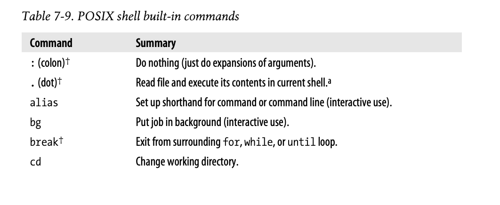
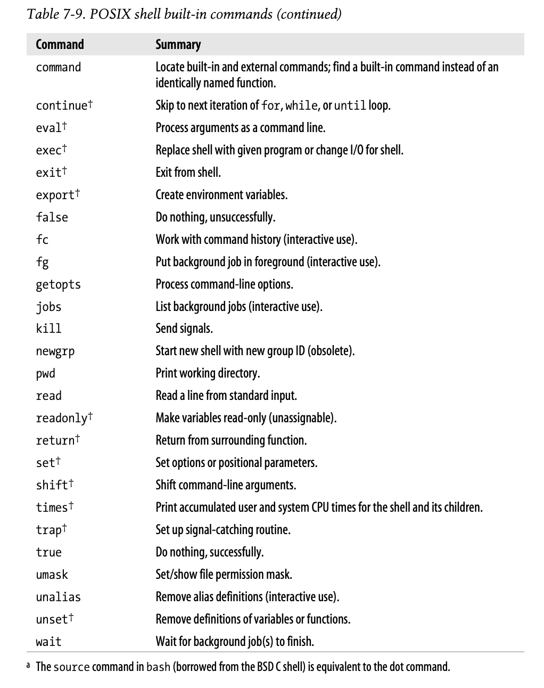

## sec6
### readonly, export

The readonly command makes variables read-only; assignments to them become forbidden. This is a good way to create symbolic constants in a shell program;

```sh
$ hours_per_day=24
$ readonly hours_per_day
```

### export 
Much more commanly used is the export command, which puts variables into the *environment*.

POSIX standard allows you to do the assignment and command together:

### parameter expansion
- ${varname:-word}
  - If varname exists and isn't null, return its value: otherwise, return word
  - Purpuse: To return a default value if the variable is undefined.
- ${varname:=word}
  - if varname exists and isn't null, return its value; otherwise, **set it** to word and then return its value
- ${varname:?message}
  - purpose: To catch errors that result from variables being undefined.
  - ${count:?"undefined!"}

POSIX "wildcard patterns"

- ${variable#pattern}
  - ${path#/*/}
- ${variable%pattern}
  - ${path%.*}
- ${#variable}
  - return the length of the variable

### Positional parameters
For historical reasons, you have to enclose the number in braces if it's grater than nine:

```sh
$ filename=${1:-/dev/tty}

while [ $# != 0 ]
do
    case $1 in
    ...
    esac
    shift
done
```

### Special variables
POSIX built-in shell variables

- \#
  - Number of arguments givecuen to current process.
- @
  - Command-line arguments to current process. Inside double quotes, expands to individual arguments.
- \*
  - Command-line arguments to current process. Inside double quotes, expands to single arguments.
- \-(hyphen)
  - Options given to shell on invocation.
- ?
  - Exit status of previous command.
- $
  - Process ID of shell process.
- 0 (zero)
  - The name of the shell program
- !
  - Process ID of last background command.
- ENV
  - Used only by interactive shells upon invocation; the *value* of $ENV is parameter-expanded. The result should be a full pathname for a file to be read and executed at start up.
- HOME
  - Home (login) directory.
- IFS
  - Internal field separator; i.e., the list of characters that act as word separators.
- LANG
  - Default name of current locale; overridden by the othe LC_* variables.
- LC_ALL
  - Name of current locale; overrides LANG and the other LC_* variables.
- LC_COLLATE
  - Name of current locale for character collation (sorting) purposes.
- LC_CTYPE
  - Name of current locale for character class determination during pattern matching.
- LC_MESSAGES
  - Name of current language for output messages.
- LINENO
  - Line number in script of function of the line that just ran.
- NLSPATH
  - The location of message catalogs for messages in the language given by $LC_MESSAGES (XSI).
- PATH
  - Search path for commands.
- PPID
  - Process ID of parent process.
- PS1
  - Primary command prompt string. Default is "$".
- PS2
  - Prompt string for line continuations. Default is "> ".
- PS4
  - Prompt string for execution tracing with set -x.Default is "+ ".
- PWD
  - Current working directory.

The special variable $$ is useful in scripting for creating unique (usually temporary) filenames based on the shell's process ID number.


### Options
```sh
# set flag vars to empty
file= verbose= quiet= long=

while [ $# -gt 0 ]
do
  case $1 in
  -f) file=$2
      shift
      ;;
  -v) verbose=true
      quiet=
      ;;
  -q) quiet=true
      verbose=
      ;;
  -l) long=true
      ;;
  --) shift   # by convention, -- ends optins
      break
      ;;
  -*) echo $0: $1: unrecognized optin >&2
      ;;
  *)  break
      ;;
  esac

  shift
done
```

## sec 7

### File
file descriptors 0, 1, and 2 correspond to standarrd input, standard output, and standard error, respectively.

```sh
$ make 1> results 2> ERRS
$ make > results 2> ERRS  # default descriptor is 1

# &1 means, "wherever file descriptor 1 is.
$ make > results 2>&1
$ make 2>&1 | results   # you can send error down the pipeline
```

exec command may be used to change the **shell's own I/O**

```sh
$ exec 2> /tmp/$0.log       # Use only in a script!!
$ exec 3< /some/file        # Open new file descriptor 3
$ read name rank serno <&3  # Read from that file
```

Other use of exec
```sh
# When used this way, exec is a one-way operation.
# Never returns to the script!!!
exec real-app -q "$qargs" -f "$fargs" "$@"
echo real-app failed, get help! 1>&2    # Emergency message
```

### printf
print format specifiers

| Item | Description |
| --- | --- |
| %b | Th ecorresponding arguments is treated as a string containing escape sequences to be processed. |
| %c | ASCII character. Print the first character of the corresponding argument |
| %d,%i | Decimal integer |
| %e | Floating-point format([-]d.presitione[+-]dd) |
| %E | Floating-point format([-]d.presitionE[+-]dd) |
| %f | Floating-point fomrmat([-]ddd.precision) |
| %g | %e or %f conversion, whichever is shorter, with trailing zeros removed |
| %G | %E or %f conversion, whichever is shorter, with trailing zeros removed |
| %o | Unsigned octal value |
| %s | String |
| %u | Unsigned decimal value |
| %x | Unsigned hexadecimal number. Use a-f for 10-15 |
| %X | Unsigned hexadecimal number. Use A-F for 10-15 |
| %% | Literal% |

you can specify field width

```sh
# string
$ printf "|%10s|\n" hello
|     hello|
$ printf "|%-10s|\n" hello
|hello     |

# number
$ printf "%5d\n" 15
   15
$ printf "%.5d\n" 15
00015
$ printf "%.2f\n" 123.4567
123.46
$ printf "%2f\n" 123.4567   # ?
123.456700
```

Flags for printf
| Character | Description |
| --- | --- |
| - | Left-justify the formatted value within the field.|
| space | Prefix positive values with a space and negative values with a minus |
| + | Always prefix numeric values with a sign, even if the value is positive |
| # | Use an alternate form:%o has a preceding O; 
| 0 (zero) | Pad output with zeros, not spaces. This happens only when the width is wider than the converted result |

```sh
$ printf "|% d| |% d|\n" 15 -15
| 15| |-15|
$ printf "|%+d| |%+d|\n" 15 -15
|+15| |-15|
$ printf "%x %#x\n" 15 15   # # flag
f 0xf
$ printf "%05d\n" 15
00015
```

### Wildcarding
Basic wildcards

| wildcard | Matches |
| ? | Any single character |
| * | Any string of charatcters | 
| [set] | Any character in set |
| [!set] | Any character *not* in set |

### Command Substitution
Command substitution is the process by which the shell runs a command and replaces the command substitution with the output of the executed command.

```sh
# There are two ways

$ echo `ls`

$ echo $(ls)
```

### Subshells and Code Blocks
A subshell is a group of commands enclosed in parentheses. The commands a re run in a separate process.

```sh
$ tar -cf - . | (cd /newdir; tar -xpf -)
```

A code block is conceptually similar to a subshell, but it does not create a new process. Commands in a code block are enclosed in braces, and do affect the main script's state.

| Construct | Delimiters | Recognized where | Separate process |
| -- | --- | --- | --- |
| Subshell | () | Anywhere on the line | Yes |
| Code block | {} | After newline, semicolon, or keyword | No |

You should use a subshell when you want the enclosed commands to run without affecting the main script.

### POSIX shell built-in commands





## sec 8
One of the insidious ways that shell scripts can be attacked is by manipulating the input field separator, IFS, which influences how the shell subsequently interprets its input. (HOW??)

Another comman way to break security is to trick software into executing unintended commands.

Exhaustive testing is tedious!

Because undocumented software is likely to be unusable software, and because few books describe how to write manual pages, we develop a manual page for pathfind in Appendix A.

troff was one of the earliest successful attempts at computer-based typesetting.

Because Unix runs so many different platforms, it is common practice to build software package from source code, rather than installing binary distributions.


## Memo

### To search
- expr

### words
- caveats
  - a warning to consider something before taking any more action, or a statement that limits a more general statement:
- sloppy
  - not taking care or making an effort:
  - Spelling mistakes always look sloppy in a formal letter.
- sanity check
  - a basic test to quickly evaluate whether a claim or the result of a calculation can possibly be true.
