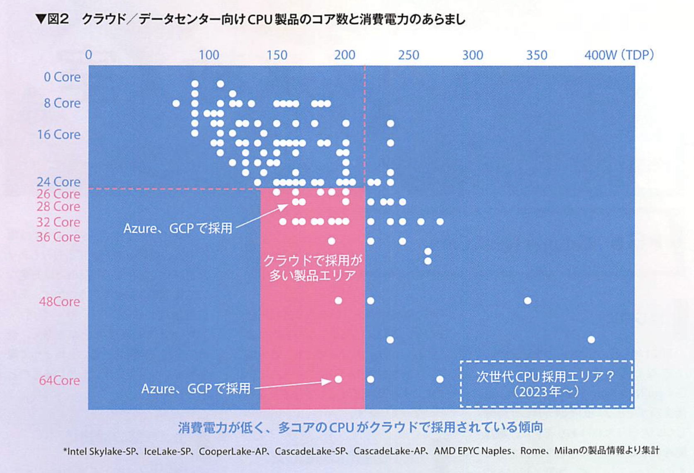
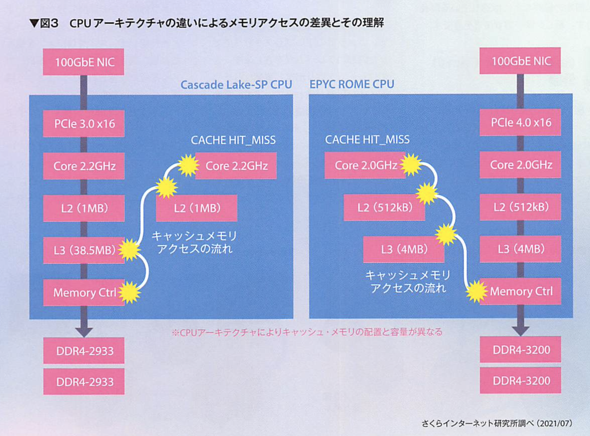
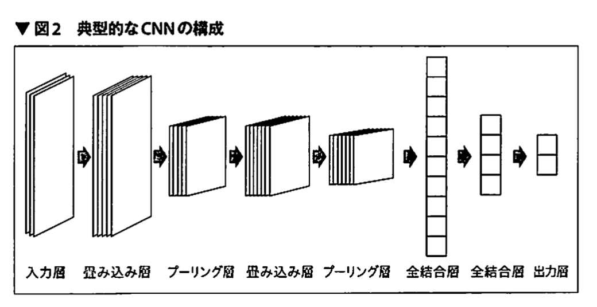
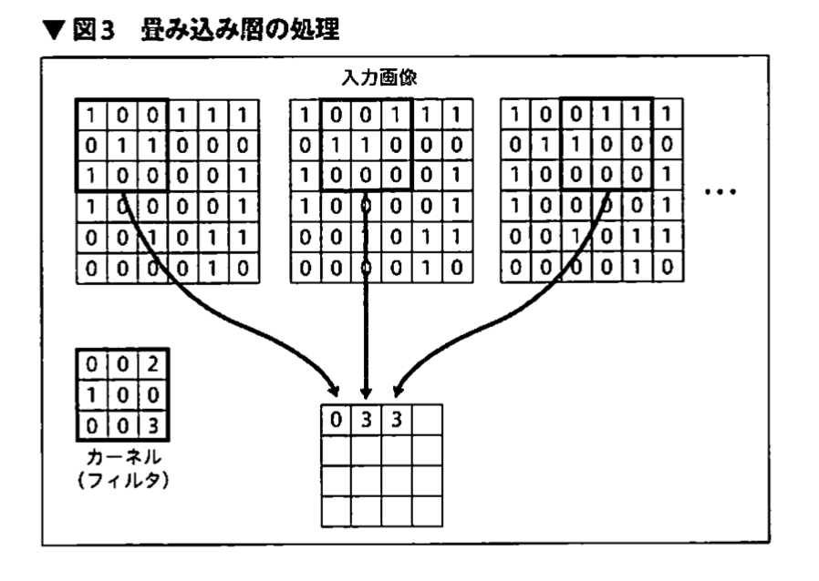

## 何か

### BYOD
- 業務を行う際に、会社から支給されるデバイスではなく、個人所有のデバイスを使用すること
- Bring Your Own Device
- リモートデスクトップ
- コストのかかっている何かを、相手に用意してもらう
  - この流れは他にもある

### CPU の見える化
サーバー等における、CPU の消費電力は無視できない

多コアかつ消費電力の低い CPU が採用される

## Kaggle

### 自然言語処理
BERT

Masked Language Modeling (MLM)

## DeepLearning

### CNN

プーリング層では、畳み込み層で局所的に抽出された特徴を圧縮し、代表値を抽出する処理を行う。つまり、特徴量として重要ではないと思われる部分を削ぎ落としている。

### AlexNet
NN への問題点への対策が施されたもの

- 勾配消失対策として、ReLU を活性化関数に
- 局所最適化と過学習対策として、ドロップアウトを

## Unix text

### SQL memo
- <>: not equal
  - p.city <> 'Paris'

## ドミノタイリング

### 二部マッチング問題
二部グラフ上のマッチング問題

- インターネット広告配信
- レコメンドシステム
- マッチングアプリ
- シフトスケジューリング

など、２カテゴリ間の関係性を考える分野全般に応用がある
