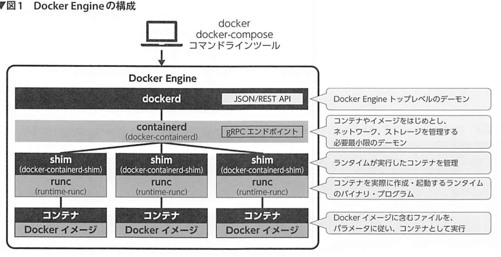
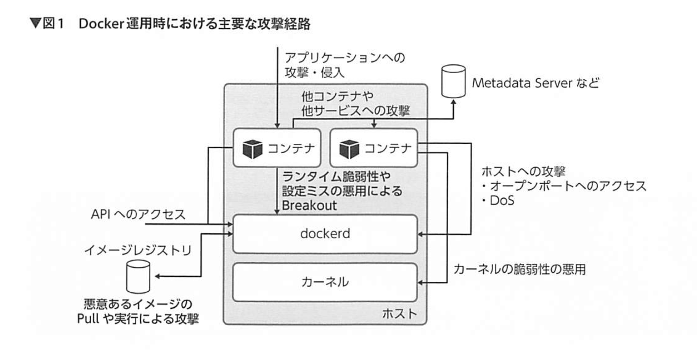

## Docker

### Docker とコンテナの基本
CNCF はアプリケーションをクラウドネイティブに対応させる第一歩として、「コンテナ化」が挙げられる

アプリケーションを「コンテナ」と呼ばれる最小単位で扱う仕組みとして、Docker は開発された。

Docker が実現したのは以下の点

- アプリケーションを実行するために必要な全てを「Dockerイメージ」に入れられる
- 「Dockerイメージ」に含むアプリケーションを、「Dockerコンテナ」として実行できる
- 「Dockerコンテナ」は、マシン上の他のプロセスやコンテナの影響を受けず実行できる
- 「Dockerイメージ」は、他のコンピュータに移動できる

クラウド上に素早く、かつ確実にアプリケーションをデプロイする課題を解決したい！

#### 輸送コンテナからヒントを得たDocker
輸送コンテナからヒントを得ている

「Build ,Share ,Run」のプラットフォーム

Docker はコンテナを指すのではなく、プラットフォーム全体を指すという点。アプリケーションを扱う手段として、Docker はコンテナ化を利用している。

#### Dockerのエコシステムとアーキテクチャ
「Dockerを使う」という言葉が指し示すのは、「Linux上で動作するDocker Engine というデーモンで、アプリケーションを扱う」ということ
この Docker Engine が、Linux カーネルを制御し、アプリケーションをコンテナとして扱えるようにしている。

Docker Engine を操作するコマンドラインツールも docker という名称。
Docker Engine は Docker イメージを使ってアプリケーションを実行したり、ほかのサーバや PC に移動できるポータビリティを確保したりする。Docker イメージを共有するにあたって中心的な役割を担うのが、Docker Hub である。Docker Hub は docker コマンドで操作できる、標準のレジストリ。

- Docker コンテナ
  - **Linux 上の特別な状態のプロセス**であり、いわゆるコンテナとして起動するアプリケーション（実態はプロセス）。Docker コンテナの実行には Docker Engine が必要
- Docker イメージ
  - Docker コンテナを起動する際に必要となる、ファイルシステム止めた情報を含む抽象的な概念
  - Docker イメージは、ISO イメージファイルのような単一のファイルではない
  - Docker が動作するホスト上にある複数のファイルやディレクトリを、Docker コンテナ内からは１つのファイルシステムとしてmに得るように扱う、抽象的な単位
- Docker ネットワーク
  - Docker コンテナの相互通信や、コンテナの外部との通信時に利用する LAN のような内部ネットワーク
- Docker Engine
  - Docker のサーバ機能を担うプログラムやライブラリ群（dockerd, containered, runc）
  - dockerdはCLIからの命令を受け付けるAPIエンドポイントを持つ
  - containerd は内部での API 処理を行う
  - runc はデフォルトのコンテナランタイム
    - Linux カーネルの機能を利用する
  - **Docker Engine がデーモンとして起動していないと、docker コマンドを実行しても操作できない**
- Docker CLI
  - docker run や docker build など、docker から始まるコマンド群で構成される CLI ツール
  - Docker Engine に対してコンテナやイメージを操作する命令を送信する
- Docker Compose
  - Docker CLI の１つ
- Docker Desktop
  - 開発用の PC 上で Docker を簡単に利用できるよう、各 OS の仮想化機能を使う
  - 開発者は仮想的な Linux の環境を意識する必要がない

#### Docker コンテナとは
Docker とはアプリケーションをコンテナとして扱うためのツールで、プラットフォーム全体を指す。
Docker コンテナとは仮想化技術ではなく、OCI が定めるコンテナ基準に則り、**Linux 上のプロセスを特別な状態で**実行できるようにする技術のこと。
特別な状態とは、Docker では「isolate」とよばれるもの。

##### コンテナとは
**コンテナとは、Linux カーネルが提供するプロセスの隔離「機能」である**。Linux カーネル内部の機能を用いているので、Docker を使わなくてもよい
Docker は、これらコンテナの状態を操作し、管理するために、Docker コンテナや Docker イメージといった「実装」を行っている

**つまり、汎用的な「コンテナ」と呼ばれるものを、Docker では「アプリケーション」として隔離し、アプリケーション実際に必要とするファイルやディレクトリを、Docker イメージと呼ばれる単位でひとまとめに扱えるようにしたのが「Docker コンテナ」**

コンテナという名前がついているが、Solarisコンテナや LXC の概念とは異なる（OSI 以外とは互換性がない）

Docker がコンテナを扱えるのは、仮想化技術によるものではなく、Linux カーネルの機能や、さまざまな技術の組み合わせによるもの

#### Linux カーネル機能
通常、Linux 上で起動するプロセスとは、ホスト上の全てのプロセスが見え、権限を持つファイルやディレクトリに対してアクセス可能なもの。これを Linux カーネルの機能を使うことで、Docker を通して起動するプロセスしか存在しないプロセス空間を作成できる。
さらに、そのプロセス空間が、特定のホスト上のディレクトリで chroot を行ったかのように起動する。結果として、いわゆる「コンテナ」と呼ぶプロセス空間やファイルシステムだけでなく、ネットワークなども隔離した、**特別なプロセス**が実行できる。この特別なプロセスを「Docker コンテナ」という。また、Docker コンテナから見えるファイルシステムを構成するのが、Docker イメージと呼ぶ抽象的なファイルシステム。

- namespace
- cgroup
- capability
- aufs ドライバ


### コンテナとイメージ


#### アーキテクチャ
- Docker Engine
  - Docker サーバの中心的な存在
  - Linux 上で Docker をデーモンとして管理する対象全体が Docker Engine
  - これらのまとめ役が、dockerd デーモン
  - CLI からの API エンドポイントを受け付け、処理内容を containerd に伝える
- containerd
  - 内部 API のエンドポイントをもち、複数の Docker コンテナや Docker イメージ群を管理する役割
  - dockerd-shim プロセスを通してコンテナタイムを操作
- runc
  - Docker Engine のデフォルトのコンテナランタイム
  - Linux カーネルと通信する機能を担う

#### Rootless モード
- Docker 20.10 から GA (General Availability)となった機能
- 従来の Docker Engine は、Linux 上で root として実行する必要があった
  - セキュリティリスクの増加
  - システム要件によって Docker Engine を利用できなかったりする場合も
  - Docker デーモンを root 権限で実行するのではなく、Docker デーモンと Docker コンテナをユーザ名前空間で実行
  - 一般ユーザでコンテナを扱えるようにする技術のため、root 権限は不要

#### Docker イメージ
- Docker とは、アプリケーションを動かすために必要な依存関係をパッケージ化するもの
  - このパッケージ化されたものを Docker イメージと呼ぶ
- イメージレイヤ
  - Docker イメージはファイルではなく、ファイルシステムを扱うための抽象的な概念
  - 実態としてのファイルやディレクトリは、抽象的なイメージレイヤの積み重ねで構成される

#### 例
```
FROM scratch
ADD alpine-minirootfs-3.14.2-x86_64.tar.gz /
CMDd ["/bin/sh"]
```

- FROM
  - 下となるイメージメイトタグ
  - scratch は空
- ADD
  - DOcker イメージないのファイルシステムに、ファイルを追加
- CMD
  - Docker コンテナの実行時、デフォルトで実行するコマンドを指定するメタ情報

> CoW(Copy on Write): 書き込む前にコピーする方式

- Docker イメージが１つあれば、ホスト上で Docker アプリケーションを複数、互いに影響を与えずに実行できる

#### CentOS Linux の Docker イメージの起動？
- centos:8 イメージを実行するとは？
  - CentOS 8 の Docker イメージを使い、その中の`/bin/bash`を PID1 として動作するコンテナを起動する
  - Docker は CentOS 8 の仮想マシンを起動しているわけではない
  - CentOS 8 のファイルシステムに含まれる`/bin/bash`をコンテナとして起動しているのみ！
  - `/bin/bash`をホスト上で起動しているが、コンテナないの PID 名前空間では`/bin/sh`のプロセスしか存在しないように見える

#### Docker ボリューム
- 以下の三種類
  - 名前付き
  - 名前なし
  - ホストのマウント（bind mount）
- いずれも、Copy on Write を経由せず、ダイレクトにホスト上のファイルシステムとアクセス可能な機能を提供する
  - そのため読み書き性能は劣化しない！

#### Docker コンテナのネットワーク
- デフォルトではネットワークも隔離
- bridge ネットワーク
  - Docker コンテナ実行時デフォルトで適応されるもの
  - ユーザー定義 bridge ネットワーク
    - 複数のコンテナ間での通信に欠かせない、コンテナ名（サービス名）での名前解決

#### Cloud Native
[Cloud Native Trailmap (CNCF: Cloud Native Computing Foundation)](https://github.com/cncf/trailmap)

クラウドのインフラを活用し、アプリケーションを柔軟に開発し、重要性に応じた自在なシステムの拡張や入れ替え、スケールを実現できるようにするもの

次のステップで始める

1. コンテナ化
2. CI/CD の導入
3. オーケストレーション & アプリケーション定義


### 攻撃に強いコンテナイメージの作り方/使い方
イミュータブルが故に、イメージを放置してしまうとインストールされたパッケージが古いままとなってしまう

``` sh
$ cat Dockerfile
FROM ubuntu:20.10
RUN apt-get update
RUN apt-get install nginx
CMD ["nginx", "-g", "daemon off;"]

$ docker build -t my-nginx:latest .
```

Dockerfile の革命例ごとに変更の差分である「レイヤ」を作成する。つまり、Dockerfile を編集し、再ビルドしても、一から構築し直すのではなく、変更されたレイヤだけが再構築される

#### コンテナイメージのセキュリティ
1. イメージに含まれるパッケージの脆弱性
2. 安全な秘密情報の管理
3. イメージレジストリとイメージの改ざん

##### イメージの脆弱性
- コンテナイメージの脆弱性スキャナを利用するといいかも？
  - ご検知が少ないかどうか
  - CI/CD パイプラインに組み込めるか
  - 等を基準に決めると良い
- Trivy
  - 豊富な脆弱性データソース
  - CI/CD パイプラインに入れやすい
  - 検知結果を SARIF フォーマットとして出力できる
  - Github Code Scanning の結果として確認できる

##### 安全な秘密情報の管理
迂闊に扱うと、イメージレイヤに秘匿すべきデータが残ってしまう

防ぐ方法等

- マルチステージビルド
- squash オプション
- Buildkit
  - クレデンシャルのマウント
  - コンテナイメージを高速かつセキュアにビルド
  - docker build 実行時にクレデンシャルを含むファイルを、イメージに残さずにマウントできる
  - `DOCKER_BUILDKIT=1`
  - クレデンシャルファイルのマウント`--secret`

``` sh
$ cat Dockerfile
FROM ubuntu:20.04
RUN --mount=type=secret,id=id_rsa cat /run/secrets/id_rsa
RUN --mount=type=secret,id=id,dst=/root/.ssh/id_rsa mount -l | grep id_rsa

$ DOCKER_BUILDKIT=1 docker build -t test --secret id=id_rsa,src=./id_rsa --progress=plain --no-cache
```

##### イメージレジストリとイメージの改ざん
- 利用者側の対策
  - イメージ利用時にダイジェストを指定
  - Docker Content Trust を使用


### Docker を安全に運用する
コンテナはホスト上で動作しているものという認識を持つべし。この認識が薄れ運用が疎かになると、ホストの安全を脅かす。

Docker に限らず多くのコンテナランタイムはホストと適切に分離することで、セキュアなサンドボックスを作り上げている。この分離レベルが緩いとコンテナからホスト側に影響を及ぼしてしまう。

#### 攻撃経路
コンテナイメージのビルドやコンテナの実行に利用している docker コマンドは、UNIX ソケットもしくは HTTP API を使って Docker デーモン（dockerd）と通信している。




## anything

### NFT
- Non-Fungible Token (非代替性トークン)
- 一点もののトークン
- NFT とブロックチェーン
  - ブロックチェーン上で管理されているのは、NFT の識別 ID と所有者のペア
  - デジタルアートの画像データのようなコンテンツそのものがブロックチェーン上で直接管理されているわけではない。
  - コンテンツそのものは IPFS と呼ばれる分散ストレージなどに保存
  - そこへのリンクがメタデータとして tokenID と関連付けされる

### k 近傍法
- 

### git
``` sh
$ git diff master add-e-text
$ git diff ae256a3..HEAD ./a.txt
```

