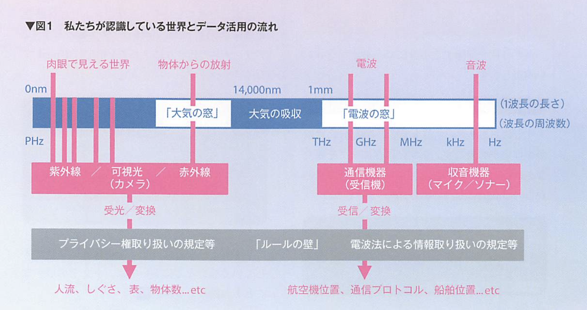
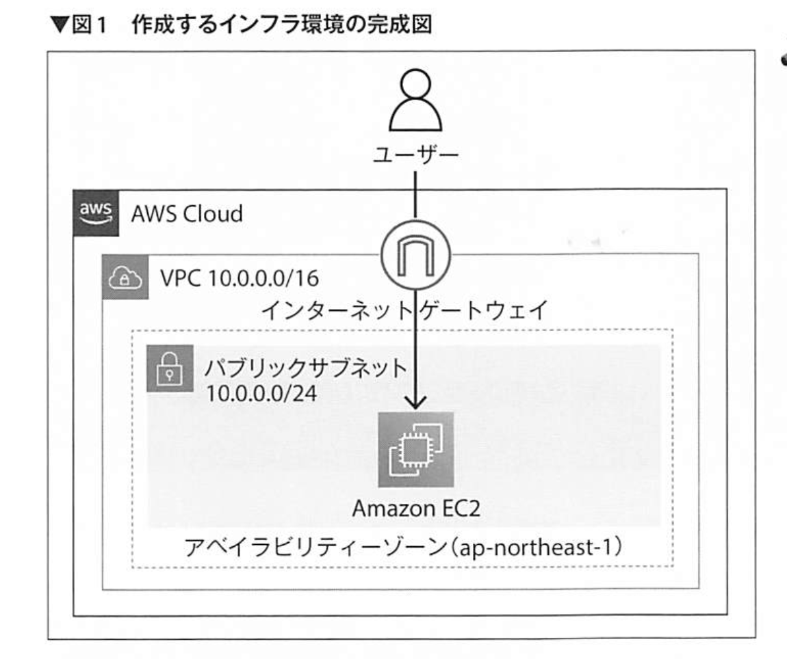
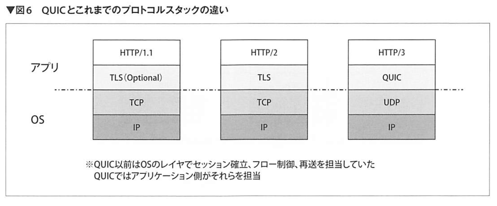

## 何か

### NewSQL
- 新しい形のデータベースマネジメントシステム（DBMS）
- RDBMSとNoSQLのハイブリッドを目指す

#### 2000 年代中盤まで RDMS 全盛期
- 仕組みが単純で扱いやすい
- データの整合性に関して堅牢
- エンタープライズシステムと親和性が高い
- ACIDトランザクション
  - Atomicity
  - Consistency
  - Isolation
  - Duration

#### 2000 年代後半
クラウドサービスが登場し、複数のノードを使った水平方向の拡張性が低い、というRDBMSの問題が顕在化し始める
NoSQLでは、ノードの追加や削除が柔軟に行え、クラウド上で高い拡張性を実現。その一方で、ACIDトランザクションをサポートしておらず、全体としてデータの一貫性が厳密に保証はされない。金融取引などの厳密なデータ一貫性を求められるシステムで採用されない

NewSQLの登場。RDBMSのようなACID取らなくションをサポートし厳密なデータ一貫性を保証する一方で、分散システムを活用した水平方向の高い拡張性も実現！

#### 主な NewSQL製品
- VoltDB
- NuoDB
- Cloud Spanner
- CockroachDB
- YugabyteDB
- TiDB

VoltDBやNuoDBは比較的初期に登場したNewSQL,インメモリ技術やクラスタ内のノード間でデータを共有しない「シェアードナッシング」という技術


### コンテキストスイッチ
コンテキストスイッチとは、**OSがプロセスを切り替えるときに起こす処理**を表すコンピュータサイエンス用語。コンテキストスイッチは、文脈を切り替えるという意味の英語

コンテキストスイッチという用語は広い意味を持っており、プロセスの切り替えに使われる場合もあるし、スレッドの切り替えに使われる場合もある

一定の時間が来るごとにプロセスを切り替えるタイムスライスで起きる場合もある。これは複数のプログラムを同時並行で動かすために必要となる。

プロセスがデバイスの動作完了待ち（I/O待ち）に入るタイミングで起きる場合もある。

#### 処理内容
1. 現在動いているプロセスが持つコンテキストを保持する
2. プロセスを切り替える
3. 新たに動くプロセスのコンテキストを復元する

#### コンテキストとは
ここでの**コンテキスト**とは、次に実行するプログラムカウンタ、スタックポインタ、演算レジスタなどCPUが持っている情報と、OSがプロセスに割り当てている情報を合わせたもの！

コンテキストはプロセスが動作するために必須の足場

#### コンテキストスイッチの重要性
何らかのタイミングでコンテキストの保存や復元を失敗したら、ほぼ確実にプロセスはクラッシュする。

また、コンテキストスイッチは、多数のプログラムが動作するコンピュータシステムのパフォーマンスを大きく左右する。
そのため、OSの設計者は、どのようにプロセスをスケジューリングするかを考え、コンテキストスイッチでの時間ロスを防ぐために心血を注ぐ

### 計算機



## Terraform
宣言的なコードでインフラを構築・管理できるオープンソースの Infrastructure as Code(IaC) ツール。

2021/6 に ver1.0, 2014/7 初回リリース

### Terraform の世界へ！
Terraform の利点として、変更前に何が起きるか確認できることがある。

[公式ドキュメント](https://www.terraform.io/docs)

#### Terraform のワークフロー
Terraform は AWS, Google Cloud Platform, Azure などの主要パブリッククラウドに対応している。

次のようなワークフローでインフラストラクチャを管理する

1. コードを書く
2. 変更内容を確認する
3. 実環境へ変更を反映する

``` sh
$ brew install hashicorp/tap/terraform
$ terraform --version
```

#### クレデンシャルの設定
- [AWS CLI](https://docs.aws.amazon.com/ja_jp/cli/latest/userguide/cli-chap-welcome.html)
- [IAM](https://docs.aws.amazon.com/ja_jp/IAM/latest/UserGuide/introduction.html)
  - Identity and Access Management (IAM)


``` sh
$ pip install awscli --upgrade
$ aws --version
aws-cli/1.22.24 Python/3.10.0 Darwin/20.6.0 botocore/1.23.24
```

administratorAccess ポリシーがアタッチされたアクセスキーの権限は強力！
流出しないように注意する。

``` sh
$ aws configure
# このコマンドでエラーにならなければ設定は正しい
$ aws sts get-caller-identity
```

#### コードの実装
.tf ファイルを作成

HCL(HashiCorp Configration Language)という言語

HCLでは構築手順ではなく、構築したいものは何かを記述する。構築手順はTerraformが自動的に調整し、正しい手順で実行してくれる（ほえ？）

AMI(Amazon Machine Image)

providerブロックは、常に記述することがおすすめされる。そうすると実行環境に依存せずリソースを操作でき、余計なトラブルを防止できる

`aws init`: AWSの操作に必要なバイナリファイルをダウンロードする

``` sh
# 変更前に色々と確認できる
$ terraform plan
...
Plan: 1 to add, 0 to change, 0 to destroy.

$ terraform apply
```

- [EC2コンソール](https://us-east-2.console.aws.amazon.com/ec2/v2/home?region=us-east-2#Home:)
  - [実行中インスタンス](https://ap-northeast-1.console.aws.amazon.com/ec2/v2/home?region=ap-northeast-1#Instances:instanceState=running)
  - リージョンを合わせることを忘れない
- [AWSマネジメントコンソール](https://us-east-2.console.aws.amazon.com/console/home?region=us-east-2)

```
resource "aws_instance" "hello" {
    ami           = "ami-0701e21c502689c31"
    instance_type = "t2.micro"
}

provider "aws" {
    region = "ap-northeast-1"
}
```

変更を加えたときは、Terraform は先ほど作成したEC2インスタンスを正しく認識し、コードと実環境の状態を比較して、差分のみ変更する。

| | |
| --- | --- |
| Ubuntu | ami-0df99b3a8349462c6 |
| Amazon Linux 2 | ami-0701e21c502689c31 |

-マークがついたときは注意する。リソース削除されるということは、システムの構成次第ではサービスダウンを引き起こす

> terraform plan コマンド実行時に、最後に出力される「N to destory」のNがゼロ以外なら、要チェック！

#### リソースの削除

``` sh
$ terraform destroy
```

#### コードを整える
コードフォーマット機能が標準提供されている

``` sh
# recursiveをつけてれば、サブディレクトリ配下もフォーマットされる
$ terraform fmt -recursive
```

#### クレデンシャルを守る
[git-secrets](https://github.com/awslabs/git-secrets)

``` sh
$ brew install git-secrets
$ git secrets --install
$ git secrets --register-aws
```


### Terraform で作る AWS 環境


[provider 公式ドキュメント](https://registry.terraform.io/providers/hashicorp/aws/latest/docs)

#### VPC
ネットワークの基盤となるVPC

[aws_vpc](https://registry.terraform.io/providers/hashicorp/aws/latest/docs) を使う

#### VPC の作成を確認
``` sh
$ aws ec2 describe-vpcs --filter "Name=tag-value, Values=example-vpc"
```

どうやってマネジメントコンソールから確認する？？

#### パブリックサブネット
リソース種別 aws_subnet で作成する。cidr_block と vpc_id が必須。
cidr_block には　VPC と同様に作成する IPアドレスの範囲を指定する

#### インターネットゲートウェイ
VPCが外部のネットワークと通信するためのインターネットゲートウェイを設定する。

インターネットゲートウェイを配置する vpc_id は必須。

#### ルートテーブル
VPC 内部から外部向けの通信をインターネットゲートウェイに向けるためのルートテーブル！

ルートテーブルを配置する VPC の vpc_id は必須。

#### ルート
ルートテーブルはルートを配置する枠のみとなるため、関連付けする実際のルート情報を設定する。

ルートを登録するルートテーブルの route_table_id は必須。

#### セキュリティグループ
Web サーバとして EC2 インスタンスを設置するにあたり、外部との通信を許可するためにファイアウォールとしても機能するセキュリティグループの設定を行う。

現状、インラインの記述と個別のルールは、共存できない仕様となっている

#### EC2インスタンス
AMI イメージは常にバージョンアップされるので、マネジメントコンソールより確認する。

**EC2インスタンスへアクセスして確認するために**、インスタンスのパブリックDNS名を取得する必要があるため、outputs.tf ファイルを新規に作成して output ブロックを記載する


### チームでの Terraform - CI/CD

#### version 管理
Terraform の動作バージョンを指定する上で次のようなツールがある

- tfenv
- asdf
  - こっちの方がチョット勢いある

#### プロバイダバージョンの固定
.terraform.lock.hcl というファイルをリポジトリ管理対象としておけば、チーム内で使用するプロバイダーのバージョンを固定できる。

#### Docker を用いる
これらを全て Docker に梱包して配布するのも良さそう。

Docker は環境のコード化

#### state の管理
state ファイルが存在するため、Terraform は前回変更時の構成を記憶できる。state は json なので人間の確認にzっかんがかかる、他のメンバーが terraform apply した結果はコードリポジトリに state がアップロードされるまで分からない、など

Terraform にはこういったチーム管理のため、state の保存場所を変更できる設定がある。

```
terraform {
  backend "保存先" {保存先の設定など}
}
```

backend にはさまざまな場所を設定でき、Amazon S3 などがメジャーどころ

#### Terraform を CI/CD で使う
どこで実行するか

- AWS CodeBuild, AWS CodePipeline
  - AWS には通称 Code サービス群と呼ばれる、アプリケーションのコード管理からテスト、デプロイまで、さらにはそれらを自動化する仕組みをサポートするサービス群が提供されている
  - [buildspec document](https://docs.aws.amazon.com/ja_jp/codebuild/latest/userguide/build-spec-ref.html)
- Terraform Cloud
  - HashiCorp 社が提供している SaaS
  - もっとも手軽かもしれない
  - [Github 連携等 CI/CD チュートリアル](https://learn.hashicorp.com/collections/terraform/cloud-get-started)
- GitHub Actions
  - これまでは IAM アクセスキーを環境変数に追加する必要があったが、OpenID Conenct(OIDC)をサポートし、IAM アクセスキーを使わずに認証ができるようになった！
    - [Article](https://github.blog/changelog/2021-10-27-github-actions-secure-cloud-deployments-with-openid-connect/)
    - [設定方法(github)](https://github.com/aws-actions/configure-aws-credentials)

### Terraform 運用の Tips とハマりどころ

#### local 変数
何度も出てくる同じ設定はローカル値を使う

#### count ループ
複数リソースの作成は count でループ処理する

#### 環境依存の値は変数で定義する
staging といった文字列や、VPC やサブネット id, EC2 インスタンスのタイプやディスクサイズなど、環境やプロジェクトによって変更されうる値は、variable として別に定義する。


### MEMO-Terraform
- 不要なリソースは放置しない！
- `git secrets`


## Python で自動化スクリプト

### シェルスクリプトではなく Python を使う

#### Python を使う利点
- 便利なデータ構造やクラスの存在
- 実装に個人差が出にくい
- Linux の知識は不要

#### path
os.path より、Path.pathlib の方が良さそう

#### file, dir
``` python
import os

for dir, subDir, file in os.walk('test'):
    print(dir)
    print(subDir)
    print(file)
```

#### 管理者権限の確認
``` python
import os

os.geteuid() == 0
os.getuid() == 0
```

#### コマンドの実行
"shell=True" とすると、コマンドをリスト形式ではなく、文字列として渡せる。

"text=True" とすると、出力内容をバイト型データではなく文字列として扱える。

stdout=PIPE とすることで、出力内容を Python スクリプト内で取得できる

- subprocess.run() はコマンド実行完了を待つ同期処理。
- 非同期で行うには、subprocess.Popen() と Popen.communicate() を使う

``` python
#!/usr/bin/env pytnon3
import subprocess
from subprocess import PIPE

cmd = "cat " + __file__ + " | sed -n 2P | tr -d '\n'"
proc = subprocess.run(cmd, shell=True, stdout=PIPE, stderr=PIPE, text=True)
print(proc.stdout)
print(proc.returncode)
```

### コマンドラインツール作成
コマンドを作成する際、次の点を検討する

1. オプションの設計
2. ユーザーからの入力有無
3. デバッグ用のログ設計
4. 設定ファイルの必要性
5. 国際化対応（i18n）
6. ドキュメンテーション
7. 配布方法（パッケージング）

#### オプションの役割
より良い UI とは、ユーザーの期待を裏切らない挙動をするもの。

##### オプションの書式
- POSIX方式
  - ショートオプション
- GNU拡張方式
  - POSIX方式に加えて、ロングオプションをサポートしている
  - --output=option_argument

``` python
import arguparse

parser = argparse.ArgumentParse()
parser.add_argument(
    "-t",
    "--test",
    dest="test_arg",    # オプション引数にアクセスするための変数
    type=str,
    required=True,
    default="TEST",
    help="test option")

args = parser.parse_args()
print(args.test_arg)
```

フラグオプションの追加例

``` python
parser.add_argument('-f', action='store_true')
```

#### ユーザー入力の取得
ユーザー入力は、「処理の継続を判断する場合」や「何らかの設定を行う場合」などに必要となる。

なお、**コマンドを使用する想定ユーザーにはヒトだけでなく、シェルや他コマンドも可能な限り含めるのが望ましい**
言い換えると、Yes/No クエスチョンのような対話的インターフェースが少ない設計にすべき。

#### ログローテーション
「ログファイルが一定サイズを超えた場合」や「ログファイル作成から一定期間が経過した場合」などの条件を満たした時に、今までのログファイルをバックアップして、別のログファイルに書き込みを開始する。バックアップファイルが一定数溜まった後、古いバックアップファイルを削除する。

#### 設定ファイル
設定ファイルとは、コマンドの動作条件を記述したいファル。

- "/etc/"以下: システム全体
- "~/.config/": ユーザー用

前提として、「**プログラマー以外も設定ファイルを編集する可能性がある**」と考える。

#### toml 設定ファイル
軽量かつ読み書きしやすい設定ファイル。人に考慮した設計

``` sh
$ pip install toml
```

watchdog で監視する

### Web API の活用

#### JSON
Web API を扱うえでJSONはかかせない。

JSONは構造データオブジェクトを表現するテキストのフォーマット。

``` python
import json

mt_json = '{"Name": "takao", "State": "Tokyo"}'

mt_data = json.loads(mt_json)
```

日本語がアスキーにエスケープされる！

json.dumps の引数で、ensure_ascii を False に指定すると、エスケープされるのを防げる！

``` python
json.dumps(xxx, indent=2, ensure_ascii=False)
```


## Crypress
E2Eテストの自動化を手助けするツールの１つ

### 特徴
- Web アプリケーションのテストを自動化する
- 非同期処理に強い
- 環境設定が楽
  - ブラウザやドライバの別途インストールは必要ない
- スクリーンショットやビデオ出力、タイムトラベルなどに対応
- CI/CD に組み込んだ実行も可能

``` sh
$ npm install crypress
```


## リアルタイム通信

### 高度化するリアルタイム通信への要求
- WebSocket の登場により、クライアントとサーバの通信をステートフルに利用できるTCPコネクションを用いた双方向通信が身近になった
- WebRTC の登場により、ビデオ通話のようなより細かな頻度で順次大きいデータを送受信する必要のあるサービスも当たり前になった
  - UDP を使用
  - Head-of-line blocking は発生しない

### より効率の良い通信プロトコルを求めて
次世代HTTPのための「QUIC」

HTTP/3 のデータ転送を担うプロトコル




## NN の高速か
自然言語処理

### Transformer
RNN では時系列データを１つずつ読み込んで状態更新を行うことで、文脈情報を内部状態に埋め込んでいく。この処理は逐次処理であり、並列化が難しい。これに対し、attention 機構から文脈を把握し、並列処理を可能にしたものが Transformer

### BERT
Google が 2018 に発表した言語モデル。2019 からGoogle検索にも用いられている

#### 学習ステップの改善
ラベルのない文章で言語モデルを訓練し、少量の教師データを用いて個々のタスクに特化した言語モデルを微調整する、という２段階の学習を行う。

前者を事前学習、後者をファインチューニングという。

#### MLM (Masked Language Modeling)
事前学習はMLMと呼ばれる方法で行う。これは自己教師あり学習の一部。文章の一部をマスクして、そのマスクを正解ラベルとして扱う。

#### モデル軽量化
- 枝刈り
  - ニューロン間の重みパラメータを、ある基準に基づいて削除
- 知識蒸留
  - 教師モデルによって、生徒モデル（パラメータ数を減らしたもの）を訓練する方法


## 量子プログラミング

量子アニーリング: 汎用近似解法

量子コンピュータの紹介では計算速度ばかりが強調されがちですが、実際には計算条件のカスタマイズや変更に対応しやすいといった汎用性が期待されていたりする。
これまでも汎用性のある計算手法は研究されてきたが、量子コンピュータというハードウェアの進化によって、汎用的でありながら実用に耐える計算速度の両立が期待されている。

## Python モダンか

### Datadog
Datadog は、監視対象のホストで「エージェント」と呼ばれるサービスを動かしておき、それらエージェントから送られる情報を可視化するプラットフォーム。エージェントは、CPU使用率や、ApacheやNginxから得られる統計情報といったホストの情報を集めるだけでなく、アプリケーションのトレース情報や、独自のメトリックやイベントも送信できる。


## おうちクラウド
[GitHub](https://github.com/tanzu-japan/ouchi-cloud/tree/main/vol3)

