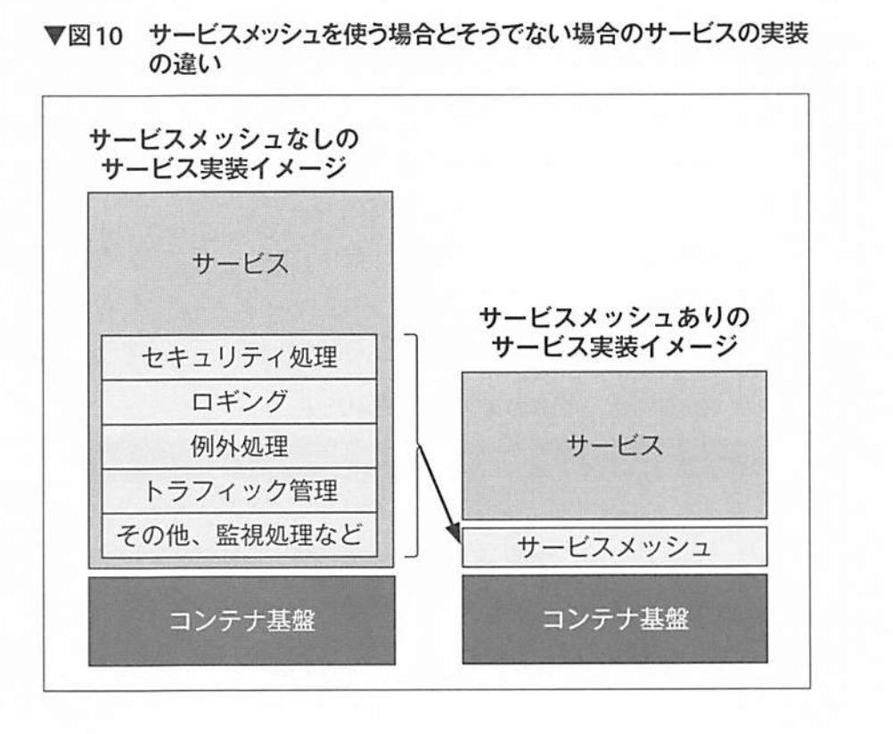
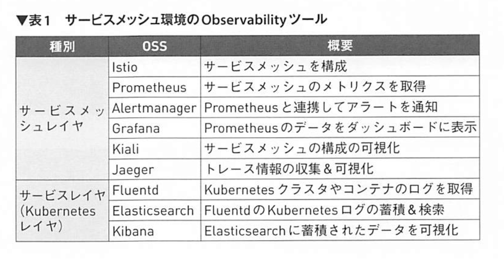

## なんでも

### 使える AI

ニューロシンボリック AI: シンボリック AI とディープラーニングの長所と組み合わせたハイブリッド型であり、「解釈性」の向上が期待されている！

「AI の価値」と「プロダクトの価値」。「AI を格納したプロダクト」という位置段階上位の観点での、ユーザーへの価値の検証。

#### ニューロシンボリック AI

人間の思考プロセスに則って AI が判断。解釈性の向上による、活用シーンの増加。
また、少ない学習データでも高い精度を測定できたり、ドメイン間での再活用が強み。

通常のソフトウェアとは異なり、AI は開発前の準備期間が長いため、特に設計部分が大事になる。

### サーバエンジニア

``` sh
sudo tcpdump port 80
```

#### Arkime(アルキメ)

- 指定したインターフェースをフルキャプチャー
- Elasticsearch ふうに検索
- コネクションツリーの表示
- 詳細な分析内容
- 対象パケットのダウンロード

### systemd-resolved

システム全体に対してのみならず、ネットワーク内のリンク（Ethernet, Wi-Fi, VLAN, PPP, VPN）ごとに DNS サーバと検索対象のドメインを構成できる。
名前解決時には、複数リンクそれぞれの DNS サーバへ並行してクエリを送る。

``` sh
resolvectl

resolvectl domain
```


## マイクロサービス

### サービス分割

- 戦略的モデリングと戦術的モデリング
- マイクロサービスへの分割では、戦略的モデリング
  - 分割したある程度の大きさのビジネスをドメイン

#### イベントストリーミング

ユーザー体験を各イベントの流れに沿って定義する。

イベントストリーミングでは、コアドメインを炙り出す。

#### DRY

コアドメインとそうではないものには決定的な差がある。
そういったものに DRY を適応させてしまうと、互いに影響しあってしまい、アプリケーションの変更がしにくくなってしまう。
つまり、DRY 原則を無秩序に適応すると、マイクロサービスに分割して最も重要な意義を失ってしまう！

マイクロサービスへの分割を考えている段階では同じに見えるかもしれない処理でも、ビジネスが進化する過程で描くドメインのゴールは違う方向をいくであろうことを念頭に置くことが大切。


### 通信パターン

大きく分けて、RPI (Remote Procedure Protocol) と Messaging。

#### RPI

リクエスト/レスポンス & 同期型の代表的な通信パターン。
RPI の技術として、REST や gRPC。シンプルでわかりやすく汎用的。

一方、スケーラビリティに課題があり、複雑で時間を要する処理は不得意。

#### Messaging

プロデューサ（送信側）とコンシューマ（受信側）がイベント（メッセージ）を媒介にしてやり取りをする通信パターン。
メッセージ指向ミドルウェア（MOM）やメッセージブローカーの仲介により、**非同期的な通信**を実現。
プロデューサーがイベントを発行する際、必ずしもコンシューマーが稼働している必要はない！

大業的なのは、Apacke Kafka, ActiveMQ, RabbitMQ など。

#### Messaging の美点

少ないサーバで大きなスループットの実現。処理時間の予測や関連するタイムアウト調整なども最小限の考慮ですむ。
またコンシューマ側は、Messaging による**バッファ**により、スパイクアクセスが発生しても高負荷状態になることなく、安定して処理が可能。

また、サービスから発行されるメッセージが Kafka のトピックに保存されていることで、障害やエラーによっても処理の中途状態は失われることがない。障害に陥っても、復旧後にメッセージが処理される際には、データの不整合や二重処理なども回避できる。
このため処理途中でサーバが落ちることに対する影響も小さくなり、サーバに過度な信頼性を求める必要がなくなる！

**クライアントからの受け口は REST で作り、バックエンド間のサービス連携には Messaging による非同期連携がよい！**

#### 冪等性

マイクロサービスでは、システムに障害が発生することを前提として設計を行う。
従って、サービスやメッセージブローカーの間でメッセージが失われないようにするため、リトライ処理など。

重複配信時のデータ不整合を防ぎ、冪等性を担保するための通信パターンが **Idempotent Consumer**
これは、注文 ID のように、メッセージにユニークなトランザクション ID を割り当て、その ID に紐づくメッセージが処理されたのかを確認することで、同一メッセージの重複実行を防ぐ。

#### DB の同期

マイクロサービスでは、基本的には各サービスとデータベースは 1:1 とするモデルが推奨される。
そのため、サービス間のデータベースの同期を取る仕組みについて考慮が必要。

Transactional Outbox と Transaction log tailing がある。

Debezium とかは、Kafka と組み合わせて使える。

#### CQRS

更新系の処理と参照系の処理で、それぞれ専用のコードとデータストアを用意しよう！という役割の分離。

#### サービスメッシュ

コンテナ基盤上において、共通のインフラレイヤを提供し、分散システムの課題を解決するために考えられたアーキテクチャパターン。
セキュリティやメトリクス & トレーシング、障害対応処理、トラフィック制御などの実装はサービスメッシュのレイヤに任せ、全てのサービス間の通信はそのプロキシを介して行うようにする。



Istio とか。
また、アプリケーションがサービスメッシュと通信を行う場合には、メッシュの一部であるゲートウェイプロキシを経由。


### 運用視点

マイクロサービスが持つ本来のメリットである、イノベーションの加速を最大化させつつ、いかに顧客が満足できるレベルの信頼性を担保できるのか！

#### Observability

サービスの状態を取得し、可視化することを「**Observability を確保する**」という。

Observability の3つの柱として、メトリクス、ログ、トレース！
この3つを総称し、「テレメトリー」と呼んだり。

- メトリクス
  - 一定の期間におけるリソースやサービスの状態を示す数値データ
- ログ
  - どのように動いたか、を記録するテキストデータ
  - アプリケーションログ、監査ログ、スケーリングログ
- トレース
  - 1つのリクエストにおけるサービス間のつながりを可視化するためのデータ

[CNCF による Observability の概要](https://github.com/cncf/tag-observability/blob/main/whitepaper.md)

サービスメッシュと組み合わせて効率的にやる！




[Istio の BookInfo](https://istio.io/latest/docs/examples/bookinfo/)


## OSS

[hub command](https://github.com/github/hub) でフォークしたリポジトリの、remote を設定する？

``` sh
hub fork
```

