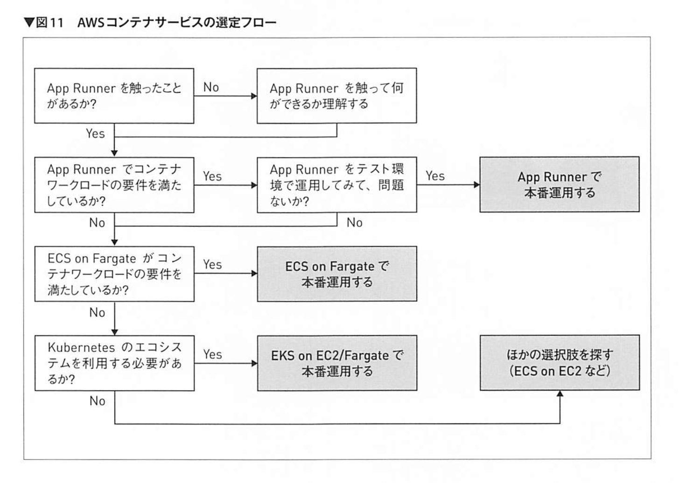

## なんでも

- バックグラウンドプロセス
  - フォアグラウンドプロセス
- 身体が動きを覚える動作は、フォアグラウンドプロセスをバックグラウンドプロセスに切り替える練習とも言える
- 長期的な計画は、バックグラウンドプロセスで定期的に実行する

## Docker

### Why Docker

マルチプロセスは 1 つの環境上で動作するが、セキュリティの面で課題ともなる。

例えば特権ユーザー（Linux では root）は 1 つの環境で 1 つだけ。そのため、root 権限を取得すると、すべてのプロセスに対して特権ユーザーとしてアクセスできてしまう。

**環境の経年劣化**が起こってしまう。

#### サーバー仮想化技術やクラウド

- 解決
  - 物理的な PC の台数削減
  - 環境維持が少し楽に！
    - スナップショット
- 残ったままの課題
  - OS のインストールだけでも数百 MB の容量が必要で、鈍重のまま
  - 複数のコンパクトな API 用 Web アプリケーションサーバーの実行が辛い
    - マイクロサービスアーキテクチャなど

#### コンテナ化仮想技術

Docker 2014, Kubenetes 2015,

2016 年ごろまでは開発目的での利用がメインで想定されていた。

#### コンテナと仮想マシン

- 仮想マシンは論理的なコンピュータ
  - 1 つの巨大なプロセスの上で、仮想マシンが立ち上がり、その中に OS カーネルがある階層構造
- コンテナは単なるプロセス
  - マルチプロセスの処理に少しだけ細工を加え、各プロセスがあたかも別々のシステムとして動作しているかのように見せている！

コンテナは **Linux カーネルの持つ namespaces と cgroups を利用**して、動作している各プロセスをシステム上隔離している！

コンテナごとに異なるファイルシステムを持たせる overlayfs によって、イメージサイズを小さくしている。

#### コンテナの解決するところ

- 軽量で迅速なアプリケーションの実行
- 隔離されたアプリケーションの実行
- 自動化された環境構築
- ポータビリティの確保！

コンテナオーケストレーションツール

- Docker Compose/Swarm
- Kubernetes

### When Docker

以下に当てはまれば、コンテナ移行するメリットあり

- 複数環境で利用する
- 頻繁に変更する
- 負荷に応じてスケールする

#### AWS コンテナ関連サービス

大まかに 3 つの分類

- コンテナレジストリ
  - ECR
- コンテナオーケストレーション（コントロールプレーン）
  - ECS, EKS
- コンピューティングオプション（データプレーン）
  - EC2, Fargate
  - AWS App Runner
    - VPN を含む多くのサービスが隠蔽される

## Jamstack

一体化したシステムから次の 2 つを分離する

- サイトを生成するプロセス（ビルドプロセス）
- サイトをホスティング・配信（ホスティングプロセス）

Algolia の API で検索機能を実装。

jamstack のメリット

- セキュリティ
- スケール
- パフォーマンス
- mentenansusei
- ポータビリティ
- 開発体験

jamstack は特定の技術ではなく、アーキテクチャ。

SPA は元のソースからビルドし静的な HTML となり js から API にアクセスするため、「分離」という点は jamstack と同じ。

事前に HTML を書き出すかどうかの違い。

jamstack はヘッドレス CMS と相性が良い。

Netlify,

Jamstack のホスティングサービスを正しく使い、Git リポジトリと連携したら、それは jamstack の条件を満たしてる場合が多い。

ビルドプロセスでしか動かないことで、**バグや脆弱性の影響を最小化できる！**

Astro + cloudflare
