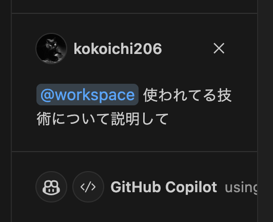

## なんでも

- KubeVirt
  - k8s 上で仮想マシンをコンテナとして管理できるようにするプラットフォーム
- 開発者体験
  - 改善により？
    - エンゲージメント向上
    - 組織の壁がなくなる！
    - 新しい挑戦、最高の仲間
  - いいループを回す！
- db
  - テーブルの責務を明確にし、適切な粒度でテーブルを追加する
  - アンチパターン
    - クエリに `*` を使ってしまっている
      - インプリシットカラム
    - **INSERT INTO のところにも！**
      - カラム名を省略しない！
- SRE
  - 目標
    - スピード
    - 高い柔軟性
    - 質の高いサービス
  - Cloudflare
    - CDN 事業者の役割の広がり
      - Caching, LB..
      - Edge Cloud/Edge Computing, Security
    - **Edge であることを生かした、さまざまなサービス！**
    - コネクティビティクラウド
- Go
  - GC
    - チャネルは対象
    - goroutine は対象**ではない**
      - 開発者が責任を持って return する必要がある
    - **ゴルーチンリークについて**
- VPC
  - VPC Reachability Analyzer
    - 通信ができない時、原因の切り分けに使える

## VSCode



- Why VSCode
  - LSP: Language Server Protocol
    - **言語サーバとクライアントの間をやり取りするためのプロトコル**
  - 言語サーバ
    - 補完などに使う
- LSP
  - 2016/6 Microsoft
  - LSP 実装の例
    - typescript:
      - tsserver
    - Python
      - Pylance
    - Go
      - gopls
- IntelliSense
  - 変数、関数、クラス名など、候補を上げてくれる！
  - 言語サーバによって強化されている
  - **補完候補の絞り込みテクニック**
    - **キャメルケースフィルタリング**
      - fromValue -> fV でいける
- VSCode
  - マルチコアプロセスアーキテクチャ
  - ツールのコア機能をメインプロセス
  - 拡張にあたる部分を分離して別プロセスで
- **独自スニペット**
  - タブストップ
    - `$1` からスタート, `$0` は最終カーソルを表す
  - プレースホルダー
    - `${1:foo}`
  - 選択肢
    - `${1|one,two,three|}`

`go.code-snippets`

``` json
{
    "For loop": {
        "prefix": [
            "for",
            "fori"
        ],
        "body": [
            "for (int i = 0; i < ${1:items}.length; i++) {",
            "\t${2:item} := ${1:items}[i]",
            "\t$0",
            "}"
        ],
        "description": "for loop"
    }
}
```

``` json
// go.code-snippets
{
  "Main": {
    "scope": "go",
    "prefix": "main",
    "body": ["package main\n\nfunc main() {\n\t$1\n}"],
    "description": "main function"
  },
  "choice": {
    "scope": "go",
    "prefix": "fuck",
    "body": ["${1|fuck,mf,pien|}"],
    "description": "fucker"
  },
}
```

- コードアクション
  - リファクタリング、クイックフィックスの提案など

## PostgreSQL 16

- データベースかんり
  - 初期化パラメータ
    - **サーバー規模に合わせたパフォーマ調整**
    - postgresql.conf
    - デフォルトでは小規模なサーバ環境に合わせた設定が採用されている
- 大規模システムへの挑戦
  - 論理レプリケーション
    - 特定のテーブルのみ！などの、狙った単位で軽量・高速に複製できる
- 業務アプリケーション開発とデータベース管理
  - **非構造・半構造化データに対する需要の高まり**
    - → JSON データを簡単に扱うためのデータ型・演算子の拡充
- COPY FROM 文のデフォルトオプション
- FDW: Foreign Data Wrapper
  - https://www.postgresql.jp/docs/9.4/postgres-fdw.html
- WAL
- ユーティリティと拡張モジュールの改善
- psql の改善
  - `\! /bin/ls postgresql.conf`
  - `\g`, `\o`, `\w`,
  - `\watch` メタコマンドの拡張
  - `\bind` メタコマンド

``` sql
SELECT $1, $2 \bind 'pi' 'pa' \g


test-db=# CREATE ROLE demo1;
CREATE ROLE demo2;
CREATE ROLE
CREATE ROLE
test-db=# GRANT pg_checkpoint TO demo1 WITH INHERIT FALSE;
GRANT pg_checkpoint TO demo2 WITH SET FALSE;
GRANT ROLE
GRANT ROLE
test-db=# \drg
              List of role grants
 Role name |   Member of   | Options | Grantor  
-----------+---------------+---------+----------
 demo1     | pg_checkpoint | SET     | postgres
 demo2     | pg_checkpoint | INHERIT | postgres
(2 rows)


test-db=# \! /bin/ls /var
backups  lib    lock  mail  run    tmp
cache    local  log   opt   spool
test-db=# \echo :SHELL_ERROR
false
test-db=# \echo :SHELL_EXIT_CODE
0
```

- あちーとこ
  - 論理レプリケーション
  - パラレルクエリ

## Links

- [Snippets in Visual Studio Code](https://code.visualstudio.com/docs/editor/userdefinedsnippets)
- [DATADOG Security Labs](https://securitylabs.datadoghq.com/)
  - https://securitylabs.datadoghq.com/rss/feed.xml
- [Hacking The Cloud](https://hackingthe.cloud/)
  - https://hackingthe.cloud/feed_rss_created.xml
- [Stratus Red Team](https://stratus-red-team.cloud/)
