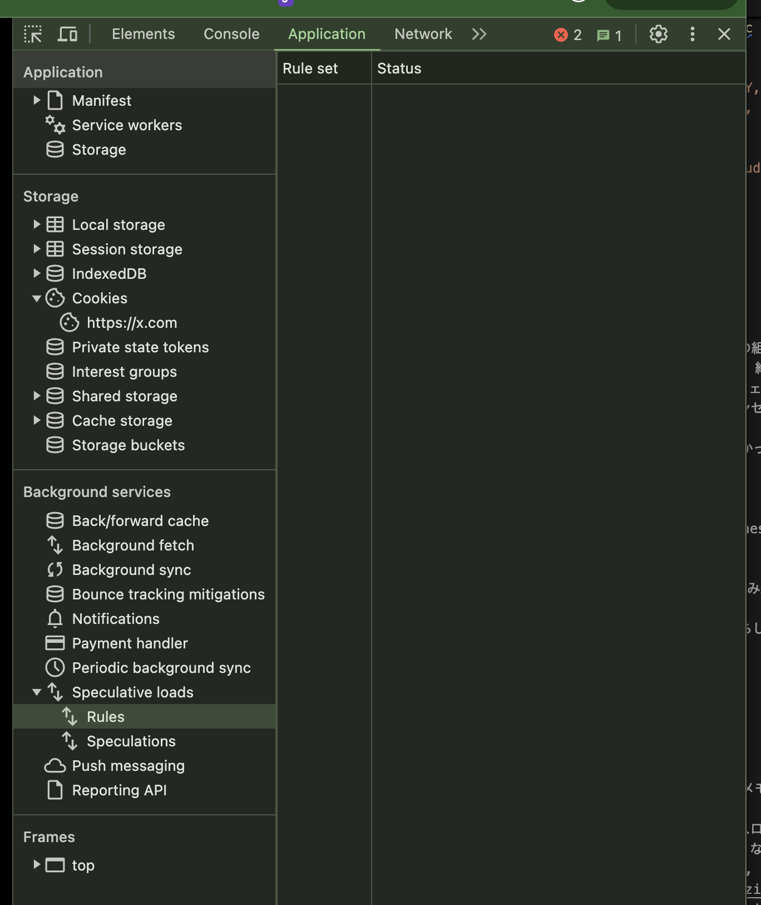

## なんでも

- [Supabase](https://github.com/supabase/supabase)
  - **Firebase の代替**を目指す BaaS
    - **OpenSource** による！
    - 2024/04 に正式サービス開始！
  - 強み
    - PostgreSQL が使える
    - 自前ホスティング可能
    - エッジ関数
    - S3 互換
- DNS
  - CDN 設定時
  - **ネガティブキャッシュ**
    - 『名前解決した FQDN の設定値がない』ということがキャッシュサーバへキャッシュされる
    - PC などで設定しているキャッシュサーバのことも多いので, Wi-Fi 接続されていないスマホからアクセスするなども有効
  - **反映が即時ではないこと**
    - まず『設定がどこまで反映されているか』を確認する

``` sh
# dig を普通に使うとキャッシュサーバへの問い合わせが返答される！
dig example.com A

# +norec (not recursive)
# 非再起問い合わせで名前解決結果を確認する。
# 権威サーバの設定変更反映を確認するときなど。
dig +norec example.com A @ns1.dns.ne.jp

# 名前解決するサーバの指定, デフォルトでは再帰問い合わせする！
dig +norec example.com A @8.8.8.8

# 権威サーバの設定。
dig example.jp NS

dig +trace example.jp NS

dig example.com @件サーバーのFQDN SOA
```

``` sh
# 1624 が TTL
❯ dig +norec example.com A @8.8.8.8


; <<>> DiG 9.10.6 <<>> +norec example.com A @8.8.8.8
;; global options: +cmd
;; Got answer:
;; ->>HEADER<<- opcode: QUERY, status: NOERROR, id: 9315
;; flags: qr ra ad; QUERY: 1, ANSWER: 1, AUTHORITY: 0, ADDITIONAL: 1

;; OPT PSEUDOSECTION:
; EDNS: version: 0, flags:; udp: 512
;; QUESTION SECTION:
;example.com.                   IN      A

;; ANSWER SECTION:
example.com.            1624    IN      A       93.184.215.14
```

- インターネットの正体
  - 全体を保有・管理している単一の組織・団体は存在しない
    - 各地に存在する無数の組織が、絶妙なバランスでつながり合わさっている！
  - PC - ルータ - ホームゲートウェイ（ONU, VDSL モデル） - 光コンセント
    - ホームゲートウェイ - 光コンセントは、**光ファイバーケーブル**が使われている
  - ISP 同士がつながっている
    - コレって、どんな経路辿ったかって見れるの？
- ZOZO
  - DB の負荷が高い
    - DynamoDB
    - 暫定的な対応に Amazon Kinesis Data Stream (KDS)
      - キューを挟んだ感じ
  - ページラッチ
    - DynamoDB では書き込みと読み込みのスループットがそう後に依存しないため発生しない
  - Rate Limit
    - Istio での Rate Limit らしい
- Chrome
  - omnibox (URL bar)
  - Web ページを表示するまで
    - DNS による名前解決
    - ホストとの通信確率
    - フェッチ
    - ロード
      - リソースをデコードして、メモリ上に展開
    - レンダー
  - ブラウザによる投機的なリソースローディング
    - `<link rel="">` の rel など
      - prefetch, preconnect, ...
      - https://developer.mozilla.org/ja/docs/Web/HTML/Attributes/rel/prefetch
      - https://developer.mozilla.org/ja/docs/Web/HTML/Attributes/rel
    - Chrome の言葉では **Speculative Loading** と呼んでいる
  - **supeculationrules API**
    - https://developer.mozilla.org/ja/docs/Web/API/Speculation_Rules_API
    - 
- データに基づく意思決定
  - ユーザーの行動ログデータ
    - クライアントサイドから GA でイベントを送り、それが BQ に自動転送される、とか

## GraphQL

### とは

- Facebook によって開発された API のためのクエリ言語
- 2015 の公開以降、急速に発展している
- **発展の背景**
  - モバイル端末の普及
    - 限られた帯域幅で効率的にデータを取得する必要
    - クライアントごとに必要なデータを柔軟に取得
- 特徴・利点
  - クライアントが必要なデータを宣言できる
    - オーバーフェッチング・アンダーフェッチングの解決
- **Fragment**
  - 自律分散したデータの取得の管理
  - **各コンポーネントで宣言された Fragment は最終的に1つのクエリにまとめられて API 通信がなされる**
    - しかも、**各コンポーネントが Fragment から直接データを取得するようにプログラムもかける！**
  - **パフォーマンスを犠牲にせずに凝集度の高いコンポーネント設計が可能！**
- イントロスペクション
  - サーバーに対してクエリすることでスキーマデータを取得可能

### 導入

- GraphQL
  - クエリ
  - スキーマ
- クエリインジェクション
- ディレクティブ
  - 標準
    - deprecated
    - include
    - skip
  - 独自
    - constraint 
- リゾルバー
  - default resolver
- DataLoader
  - Batch による非同期
  - Cache によるデータのメモ化
- クライアント
  - urql
    - デフォルトがドキュメントキャッシュ（正規化キャッシュではない）
- Fragment Colocation
- モニタリング
  - GraphQL サーバライブラリのいくつかは、エラー・成功の双方で status 200 を返す
  - partial response もあり、わかりにくい
    - 失敗したフィールドだけ null
  - Datadog APM
    -  SLO
      - Success Rate
      - Response Time
- 外部公開 GraphQL API の場合
  - Depth limiting

## Go error

- プログラミングにおけるエラーとは、**状態であり表現方法**
- 高度なエラー処理を提供する言語では、なるべく多くのエラーチェックをプログラマーに実装させない仕組みがある
  - Go では愚直にやってる
- **Error がフィールドではなくメソッド**
  - メッセージが必要になったタイミングまでこの文字列化にかかるコストを低減させられる
    - **？？？**
- cf. Java
  - **例外オブジェクトと大域ジャンプでの状態表現**
  - **検査例外**がある
    - 例外を捕捉する側に catch の実装漏れをさせない
- cf. Rust
  - Result 型
    - 正常終了の戻り値・異常発生時のエラー情報をまとめたもの
    - ? 演算子による early return
- 関数内部で `errors.New()` の使用は避ける
  - 関数が呼び出されるたびに新たなエラーが異なるポインタ値で作成されるため、エラーの比較ができなくなる場合がある！
- スタックトレース
  - 内部のスタックトレースに関心があるのは、ライブラリの実装者のみ？
  - 利用者の関心は、私は引数が妥当だったか、実行時に通信エラーなどの想定外のことが起きたか、など
    - テキストの多さが親切というわけではない！
  - スタックトレースには引数の情報などのコンテキストが乗ってないことも
  - スタックトレースにはパフォーマンスの問題もある
- **エラーログ**
  - 入力パラメータ
  - 結果に影響を与える外部状態
    - 日時、乱数、ファイル、データベースの読み込み、など
- アラート
  - クラウドネイティブなアプリの場合、標準出力・エラー出力のエラーをコレクターが収集してログ集約基盤に送る
  - **実際のアラートはそのログ収集基盤が行う！！**
- OpenTelemetry
  - このライブラリにはエラーを通知できるメソッドもあるらしい
- 並列処理でのエラーハンドリング
  - 関連する並列処理を停止
    - ループ、何かしらの中断ポイントでコンテキストの Done メソッドを確認
  - 呼び出し元へのエラーの通知

## Cloudflare Workers

- Hyperdrive
  - Cloudflare 組み込みではない PostgreSQL のデータベースなどを使用したいケース
    - 単純に tcp コネクションを db に貼るのではなく、パフォーマンスの向上を図る
  - **CF workers/ Pages と PostgreSQL データベースの通信を仲介するサービス**
    - 有料プランでのみ可能
- 機能
  - コネクションプールの提供
  - クエリ結果のキャッシュ
- connect()
- Hyperdrive
  - Cloudflare Workers を利用する時に発生する、地理的な問題を解決するため
- PostgreSQL
  - Neon, Supabase
