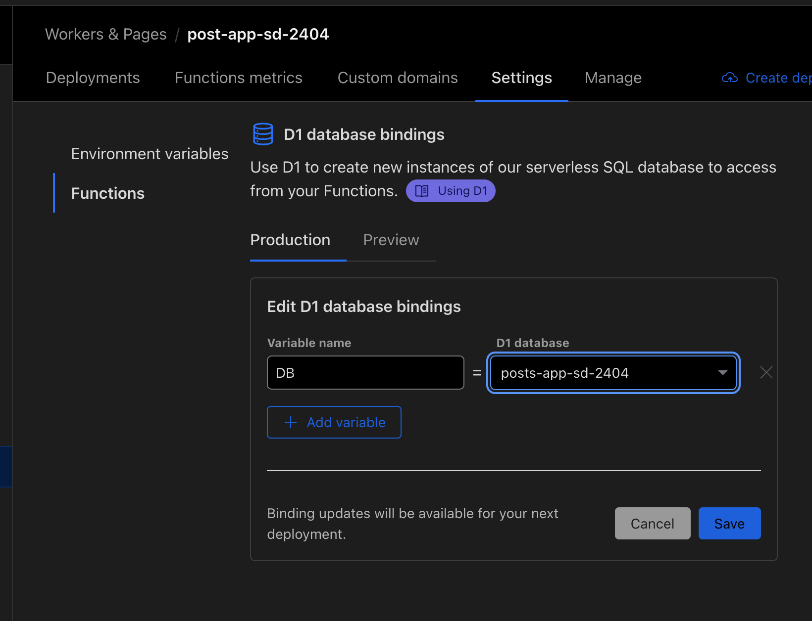

``` sh
✔ Which template do you want to use? › cloudflare-pages
✔ Do you want to install project dependencies? … yes
✔ Which package manager do you want to use? › pnpm
✔ Installed project dependencies
✔ Copied project files
Get started with: cd cf-workers-sd24-04


npx wrangler d1 create posts-app-sd-2404

# migration
npx wrangler d1 execute posts-app-sd-2404 --local --file=./schema.sql
npx wrangler d1 execute posts-app-sd-2404 --remote --file=./schema.sql

ni zod @hono/zod-validator
```

``` sh
ni

# ローカル起動
nr dev
```

``` sh
npm run deploy
```

## d1

### Remote で binding


