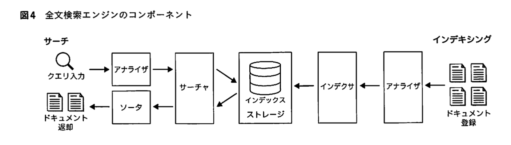
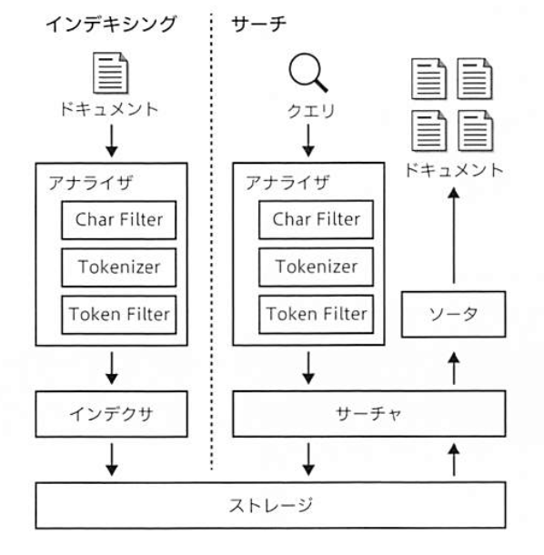

## 何か

### ああっ女神さまっ
- インシデントに対して常に真摯に対応し、困難に対してはベストな解決法を探し足掻く姿
- 一生懸命で正直な人はそれだけで才能と言える
- 好きこそ物の上手なれ
- Grit(やり抜く力)とResilience(しなやかに乗り越える力)

### GraphQL
- クライアント側が欲しい情報を取得するクエリを発行し、レスポンスを返す
    - 宣言的UIに代表されるリアクティブプログラミングとの相性が良い
- クライアント側での開発効率が上がる！
- Apollo Client のようなキャッシュを便利にするライブラリ
- バックエンドの開発コスト？
    - ほとんど変わらない印象
    - クライアントのビュー仕様に依存してWeb APIを変えないといけないというコミュニケーションがなくなった！
- 何が取得できるかをスキーマとして定義
- クライアントが使わないなら、そもそもデータを送らない
- クライアントが画面構成を変えやすくなるメリット
- REST API では、APIのエンドポイントの組み合わせに設計意図が反映される
- GraphQLではクエリそのものに設計意図が反映できる
- 宣言的UIとGraphQLの相性
    - ボイラーコードの大部分をGraphQLのクライアントとリアクティブシステムが隠蔽してくれる

### ジェネリクス
型をパラメータ化するもの。型安全性を保障しつつ、記述を共通化するために導入されたものが、ジェネリクス。

型パラメータ T, S など

型をパラメータ化することで、型ごとにクラスやメソッドを作成することなく、型安全なクラスやメソッドを作成できる。

型安全性を保つためには、配列ではなくリストなどのジェネリクスを使用したコレクションを使用すべき。

## コンテナ活用

### アプリケーション開発者のためのコンテナ技術

#### アプリケーション開発者が抱える課題
- 頻繁なリリースと迅速なデプロイ
- 道具、環境の多様化
- 役割分割とコラボレーション

#### コンテナ memo

##### 概要と特徴
- 分離しやすい
    - アプリケーションやプロセス単位での分離は、コンテナではむしろ推奨されている
- 再現しやすいい
- デプロイが早い、容易

##### Build/Share/Run

#### 新たに生み出した/複雑化した課題
- 学習コスト
- 一時的な不具合から回復するリトライなど
- 役割分割とコラボレーション
    - Kubernetesのマニフェスト
    - CI/CDパイプラインに代表されるワークフローの構築と維持

### コンテナを活用したアプリケーション開発の体験
- [vscode dev continaer examples(microsoft)](https://github.com/microsoft/vscode-dev-containers)
- [Hands on](https://github.com/ToruMakabe/wdp-container-handson-part2)

#### ワークフローにもコンテナを組み込める
コンテナ特有のタスクとして代表的なのは、脆弱性の検出を目的とした、ベースイメージを含めたイメージのスキャン

### Kubernetes

#### なぜ今クラウドネイティブアプリケーション開発？
クラウドネイティブアプリケーションは、クラウドのような分散システムで動こに適したアプリケーション
コンテナアプリケーションは実行に必要なモジュールを「コンテナ」という単位でパッケージングしてデプロイするので、クラウドネイティブアプリケーションでよく利用される

##### Web3層アプリケーション
Webシステムの構成要素をプレゼンテーション層/アプリケーション層/データ層に分割し、独立したモジュールとして設計するアプリケーション

##### 悩み
Web3層アプリケーションはモノリスになりやすく、規模が大きくなればなるほど、システムに変更を加えるのが難しくなる

OS／ミドルウェアのバージョンアップやパッチ適応、構成管理、スケーリングや障害対応など運用保守に工数がかかり、ソフトウェアを頻繁に更新してビジネス価値を上げていきたいというユーザーのニーズを満たすのが難しくなる

Lift & Shift で開発運用体制を維持したままクラウドに移行しても、持ち味を生かしきれない

##### [Twelve-Factor App](https://12factor.net/ja/)
Webアプリケーションを作るための指針を１２のベストプラクティスにまとめたもの

##### Kubernetesを使ったコンテナアプリケーション
コンテナを等号管理するためのOSS。

Kubernetesは複数のNodeを束ねたクラスタ上でアプリケーションを動かす。各Nodeに役割分担ではなく、フロントエンド／バックエンドなど異なるアプリケーションが同じNodeで実行される。Kubernetesではアプリケーションがデプロイされると、クラスタ内の空いているNodeに自動配置される。

クラスタのあるべき姿を定義し、クラスタの状態とあるべきすたがを比較し、両者で差分があれば自動で復旧する**宣言的設定**

##### Design for Failure/Resilience
Web3層システムの多くは、ソフトウェアの開発と運用が明確に分かれていた。

一方のクラウドネイティブなシステムの場合、自分たちが実装したソフトウェアだけでなく、ネットワーク、ロードバランサ、監視、CDN、キャッシュ、ファイアウォール、DNSなどクラウドのマネージドサービスを組み合わせて使うケースが多い。

そのため、システム障害復旧、タイムアウト処理、バージョンアップ方式などについて「開発者の責務」と「運用者の責務」を明確に線引きすることが現実的でない。

クラウドに限らず分散システムでは障害をゼロにするのは不可能なため、「**障害が発生するという事実を受け入れ、素早くシステムを回復させるにはどうすればよいか**」を考え、アプリケーション実装やシステム運用、組織体制に反映して落とし込む必要がある！

#### 体験
クラウドネイティブなアプリケーションを開発する際の注意点

- リトライ処理
- 環境依存値の外部化
- アプリケーションの安全な終了
- 正常性プローブの設定
- ログの標準出力

##### リトライ処理
オンプレ環境の場合、frontendとbackendのサーバーは近くにあり、ネットワークによる遅延も大きくないだろう。

一方クラウドでは、どのサーバにデプロイされるかを知ることはできない。プラットフォームのメンテも不定期。ネットワーク遅延も考えられる。そのため、アプリケーションがわでリトライ処理を検討すると良い。

##### リトライ処理のタイミング
同じタイミングでみんなが一斉に送ってしまうと、通信先サービスは多数のリクエストを受け取り、過剰な負荷がかかる。さらにこれらのリトライストームでカスケード障害（局所的な障害がシステム全体へと波及する現象のこと）を引き起こす可能性もある。

感覚については**Exponential backoff**というアルゴリズムがヒントになる。

##### 環境依存値の外部化
application.properties, @ConfigurationProperties アノテーションを使い、DIコンテナに自動的にインジェクションされる。

##### ログの標準出力
オンプレミスの環境では、ログファイルは永続的なファイルシステム上に存在し、マシンに固定のIPアドレスやホスト名が割り当てられているため、障害児にはサーバにログインしてログファイルを調査できる

しかしKubernetesで動くコンテナの場合は、頻繁に起動・終了される可能瀬があり、コンテナのIPアドレスやホスト名は一定ではない。

そのため、アプリケーションログはstdoutに出力する実装にして、分散トレーシングの仕組みで監視する。各ベンダーが提供するモニタリング機能を使うのが良い。

#### コンテナイメージの作成とレジストリでの共有
Kubernetesで動かすためには、アプリケーションをコンテナ化する必要がある。[Cloud Native Buildpacks](https://buildpacks.io/)を使うと便利。コンテナ

### マネージドサービスでのより簡単なコンテナのホスティング
Azureが提供するWeb App for Containersを例に取李、マネージドサービスを活用することで、可能な限り実行環境の構築や運用を意識せずすむようにする。

コンテナホストまで基盤側が責任を持つPaas製品の一つ

スケールアップとスケールアウトの設定

正常性チェック

#### 組み込みの認証機能
Google, TwitterなどさまざまなIDプロバイダ（IdP）に対応した組み込みの認証機能がある。これは、**アプリケーションとは別のコンテナで認証を行う**ことで実現されている。

## iOS15開発最前線

### 新機能
- SharePlay
- [ShazamKit](https://developer.apple.com/shazamkit/)は特定の音声識別機能をサードパーティ製のアプリでも利用にしたフレームワーク。**Androidにも提供されている。**
- Object Capture

### Swift5.5
- Swift Concurrency
- async/await
- Actor, Sendable

## 検索エンジンのしくみ
- [Code](https://github.com/kotaroooo0/stalefish)

### 検索エンジンの全体像

#### 全文検索エンジン
検索の機能を全てをRDBだけで実現しようとすると、多くの場合機能的にも非機能的にも制約が大きい。そのため、検索機能を開発する際には、検索に特化したデータベースである検索エンジンを用いることが

> 検索エンジンとは、ドキュメントの集合からクエリに適するドキュメントを返すシステム

Googleは、クローラと呼ばれるものでWebページのリンクを巡回してドキュメントを収集する。

##### 全文検索とは
全文検索とは、複数のドキュメントから特定の文字列を検索すること。全文検索ではない検索には、ジャンルごと、カテゴリごとの検索などがある。

Grep型とインデックス型の二種類がある

検索キーワードとドキュメントの類似度にはTF-IDFというアルゴリズム

### アナライザ
1. 文章からトークンへの分割
    * 日本語においては、形態素分析による分割とNgramによる分割がよく使われる
2. 表記揺れ吸収
    * 「スマホ」の検索クエリで「スマートフォン」
    * 「Pen」の検索クエリで「pens」

#### アナライザのコンポーネント
* Char Filter (0個以上)
* Tokenizer (1つ)
* Token Filter (0個以上)

### インでくさ

#### 転置インデックス
ある単語がどのドキュメントに含まれているか、場合によってはどのドキュメントのど、この位置に含まれているかを格納するための索引構造

### go memo
- gomock
- makefile

