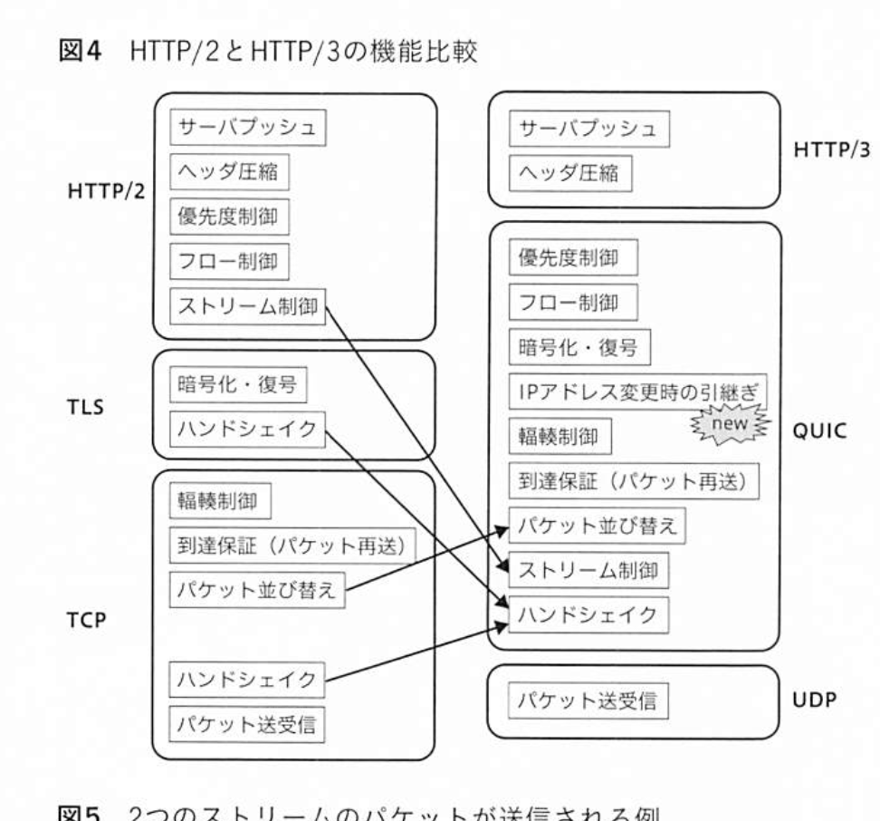

## テストについて

### テストサイズ

自動テストの分類が、**テストサイズ**！

自動テストに使用されるリソースの量や実行場所、実行時間に着目する。

- 単一のプロセス内で動作するものを Small
  - 非常に高速、スケール
  - 単一プロセスなので、外部リソースは使えない
  - プロセス外の通信はテスタぶる（mock, stub, fake）で置き換える
- 単一マシンに閉じた環境であれば外部リソースの利用を許可するものを Medium
  - コンテナを使ったりして、単一マシンで DB, Web サーバなどを立ち上げて通信したり
- 自動テストからリモートマシンへのネットワークアクセスなどを許容するテストを Large

Small は単一プロセス、Medium は単一のマシン上、Large は制約なし。

この考え方は CI との親和性が高い！  
実行しているテスト環境が本物の挙動を反映している度合いを忠実性（fidelity）という。**テストサイズは「速度および決定性」と「忠実性」のトレードオフを意識したテストの設計・分類法！**

基本的には、Small テストの比率を上げ、Large テストの比率を可能な限り下げることが、高速で安定した開発を支える！

コードに問題がなく、実行が不安定なだけというようなテストは信頼不能テスト（flaky test）と呼ばれ、偽陽性を招いてしまう。。。

## Elixir

- パターンマッチをサポートする拡張型言語
- 拡張性・保守性に優れた開発が可能。

値を列挙する際に途中経過のリストを作らずに、値を処理する列挙型をストリーム

遅延処理を lazy, 通常の先行処理は eager と呼ばれる。

無限長のリストを扱う場合など、不要な計算を減らしたい場合は stream を使う。

## HTTP/3

2022/6/6 に正式勧告。

- HTTP/1.1 の問題
  - リクエストの多重化が課題
  - Chrome の同時発行リクエストが 6 個だったり
- HTTP/2
  - 特徴
    - ストリーム
    - ヘッダ圧縮
      - よく扱うフィールドを辞書に登録
    - バイナリフォーマット
    - 暗号化がデフォルト
    - サーバープッシュ

UDP では、バラバラなパケットをそのまま扱う！  
送りたいデータを分割したり組み立てたりするのは、全てアプリケーションの仕事！（cf. TCP では OS が担当）

syslog, DNS, ビデオ会議、動画配信.

TLS のハンドシェイク、TCP の 3 ウェイハンドシェイク、重複があるよね？的な考え。

また、TCP では前のパケットが届いてない場合、待機時間が発生する。

HTTP/2 では、パケットの並び替えは TCP, ストリーム制御は HTTP/2 が分担してた。そのため、届かないパケットがあると、その先の処理に影響が発生していた。  
一方 HTTP/3 では、ストリーム制御とパケットの並び替えを、共に QUIC の役割としたことで、そこの連携がスムーズになる！

**QUIC のすごいところ**

- あるストリームのパケットの到着が遅れても、他のストリームに影響しない
- 接続と同時に暗号化が始まる
- IP アドレスが変わっても接続が維持できる

### ヘッダ圧縮と QPACK

HTTP/3 では QPACK というヘッダ圧縮。  
肝は、文字列圧縮（ハフマン符号化）と辞書の使用の 2 つ！

ハフマン符号は、圧縮は容易だけど、展開作業は意外に骨が折れる。ハフマン木という２分木を構築し、そのノードを使って展開を行う。

### そのほか

- バージョンネゴシエーションパケット
- Retry パケット
- [bay server](https://baykit.yokohama/about-bayserver/)

## 障害との向き合い方

- 利用している技術について
  - 言語の GC の挙動
  - RDBMS のインデックスやトランザクション、ロック
  - Docker, Kubernetes などのコンテナ関連の挙動
  - HTTP, TLS, DNS など、ネットワークプロトコルの挙動
- 自分たちのサービスについて
  - どの API、どのお客様に影響があるのか
  - kill してもいいクエリなのか
  - デプロイ手順とロールバック手順
  - アプリケーションのログやアクセスログはどこに保存されているか
  - システム構成図はどこにある？
  - 新人が来た時のオンボーディング時や、チームメンバーからの質問を集めて、質問集とその回答を充実させていく！
- 障害対応について
