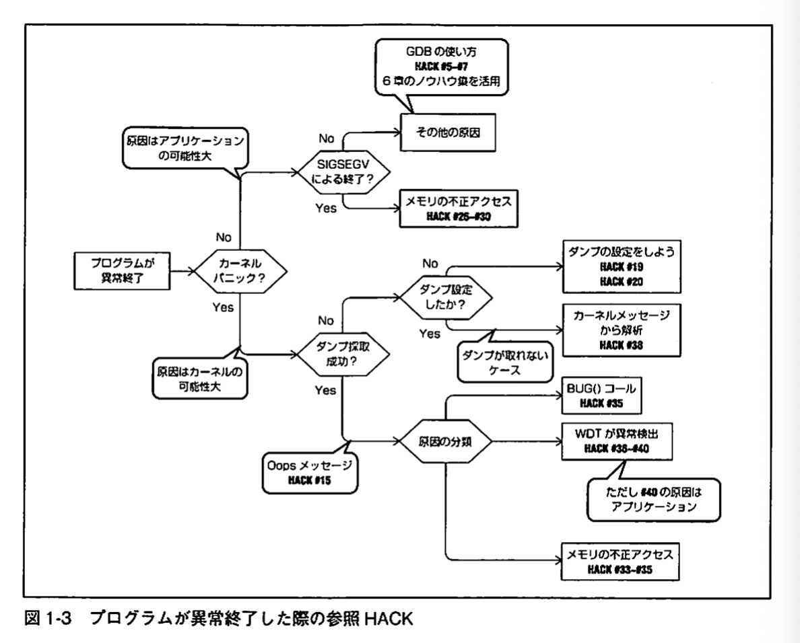
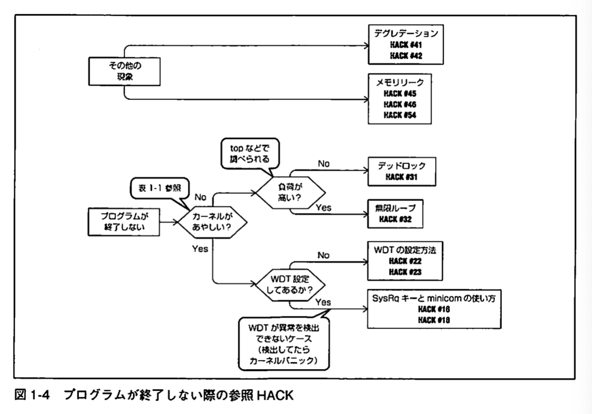
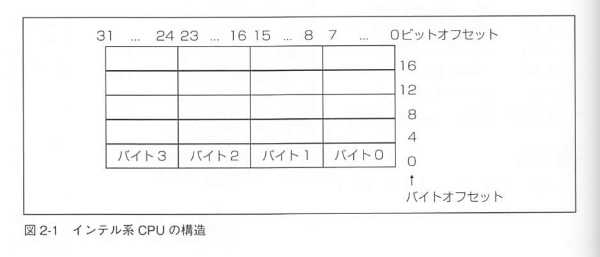
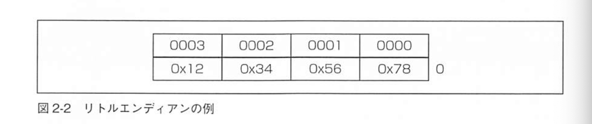
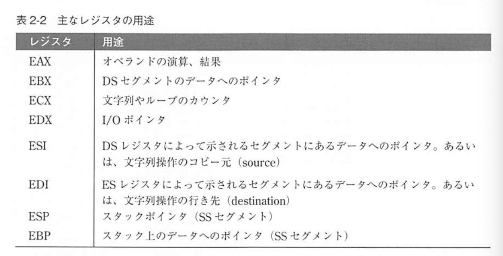
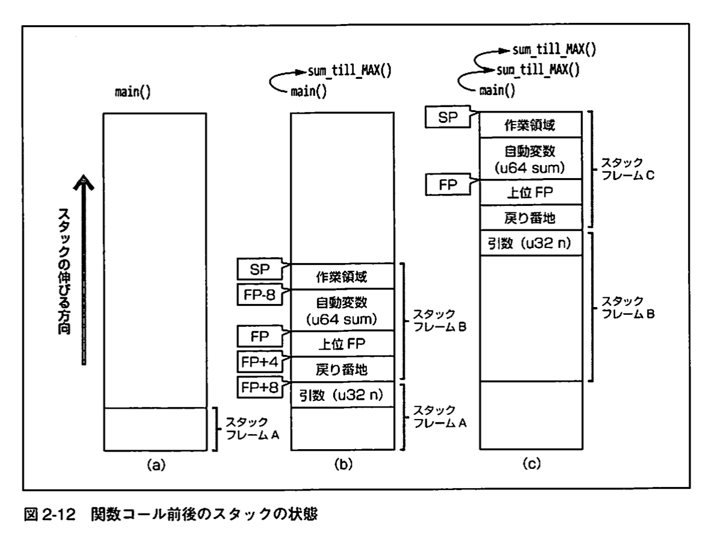

## sec 1
心構え

### デバッグとは
起動できるか確かめた後、テストとデバッグの作業がはじます。

テストというのは、プログラムの動作が使用通りであるかを確認する作業。動作が期待する動作と異なる時、それをバグと呼ぶことにします。テストはプログラムのバグを探すプロセス。

デバッグは、なんらかの方法で発見されたバグを修正するプロセスであり、テストとは全く目的が違う。

バグを見つけたテストのことを、成功したテストという立場がある。

TDDとは、テストとプログラミングそしてデバッグを表裏一体化した開発方法と言える。

### デバッグプロセス
0. テストでバグを見つける！
1. バグの再現
2. デバッグ
3. 動作の確認（テスト）
4. 期待する動作の場合は終了。そうでなければ 2 へ

### Debug Hacks マップ




**カーネルがあやしいと思われる現象**
| 切り分け方法 | 結果 |
| --- | --- |
| ps | 表示が途中で止まる</br>ステータスがD |
| ping | 応答が返らない |
| キーボード | キー入力できない |
| kill -9 | 終了させられない |
| strace | アタッチできない |
| gdb | アタッチできない |
| カーネルメッセージを見る | softlockupなどの出力 |

### 心得

#### 再現させる前の心得
環境構築：バグが発生した環境と揃える。ハードウェアもソフトウエアも！

例：パラーメタオプション、NIC、H/Wメーカー、設定ファイル

#### 再現させた後の心得
- 現象の確認。
  - 再現したものが本当に本当に同じ現象か確認する。
- 再現率、時間の確認

#### 解析時における心得
- 現象を目で確認
- できるだけ範囲を狭める
- バージョンによる問題の切り分け

#### 問題の原因が不明であるときの心得
- ハードウェアを疑う
- 過去にあった同じようなバグの修正を見つける


## sec 2

### コアダンプを採取する
プログラムのコアダンプを採取することの１番の利点は、問題が発生した時の状態を保存できること。

コアダンプを有効化する

```sh
# 現在コアダンプが有効化どうか確認する
$ ulimit -c
0  # 正確にはコアファイルのサイズ制限

# 以下のコマンドで有効化（無制限）
$ ulimit -c unlimited
# 1GB
$ ulimit -c 1073741824
```

作成したコアファイルでGDBでデバッグする

```sh
$ gdb -c core.XXX ./a.out
```

### GDBの使い方
Linux環境の定番デバッガ

。。。

デーモンプロセスのように既に起動しているプロセスをデバッグしたい場合や、プログラムが無限ループにはいてツィマテt、端末に制御が入らない等のデバッグをしたい場合は、`attach`コマンドを利用する

```sh
(gdb) attach pid
# back trace（スタックフレーム）
(bdg) bt
```


### Intelアーキテクチャ

#### エンディアン
他バイトのデータをどのようにメモリに配置するかの方法を示したもの。

下位データを下位メモリから配置する方法をリトルエンディアンと呼び、Intel アーキテクチャが採用している方法（下図）。逆に上位データを下位メモリから配置する方法をビックエンディアンと呼び、SPARC や MIPS アーキテクチャが採用している。





#### ビット環境におけるレジスタ
> レジスタとは、マイクロプロセッサ（MPU/CPU）内部にある、演算や実行状態の保持に用いる記憶素子。 最も高速な記憶装置だが、一般的なCPU製品で数個から数十個（容量に換算して数十バイト程度）と数が限られる。

汎用レジスタには、以下の8種類がある。



64ビット環境とは、アドレス空間$2^{64}$バイトまでサポートしているもの。


### スタックの基礎知識
- スタックとはプログラムがデータを格納するためのメモリ領域のひとつ
- LIFO（Last In First Out）のデータ構造



### アセンブリ言語
アセンブリ言語を理解するには、CPUのレジスタとマシン語を理解する必要がある。

```sh
$ gcc  -Wall -O0 assemble.c -o assemble
$ objdump -d --no-show-raw-insn assemble
```

push命令などでスタックフレームを作成


## sec 4
SIGSEGV でアプリケーションが異常終了した

アプリケーションプログラムが不正なメモリアクセスなどをした場合、 SIGSEGVという例外を発生し異常終了する。

発生するケースとして、NULLポインタによるアクセス、ポインタ破壊などによる不正アドレスへのアクセス、スッタクオーバーフローなどにより確保したアドレス領域を超えてのアクセう、などがある


