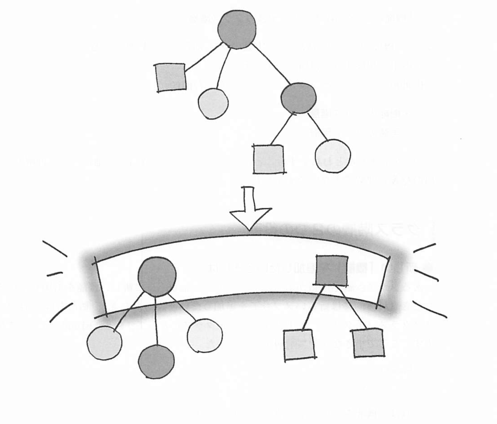

# Bridge
機能の階層と実装の階層を分ける

## クラス階層の２つの役割

### 新しい「機能」を追加したいとき
あるクラス Something に対して、新たな機能（メソッド）を追加したいと思ったとき、Something のサブクラスとして、SomethingGood クラスを作る。ここで小さなクラス階層ができた。

### 新しい「実装」を追加したいときは
抽象クラスから具体クラスへの継承は、新たなメソッドが増えているわけではない。これは「機能」追加で見られた上のサブクラス関係とは異なる。

- スーパークラスは抽象メソッドによってそのインタフェース（API）を規定している
- サブクラスは具象メソッドによってそのインタフェース（API）を実装する

というクラス階層が使われている。このクラス階層を「実装のクラス階層」と呼ぶことにする。

### クラス階層の分離
機能を追加しようとしてるのか、実装を行おうとしているのか、を明確に意識する。そして、「機能のクラス階層」と「実装のクラス階層」を２つの独立したクラス階層に分けてしまう。単に分けただけではバラバラになってしまうので、その２つのクラス階層の間に橋渡しをする。そのようなデザインパターンが、Bridge パターン

