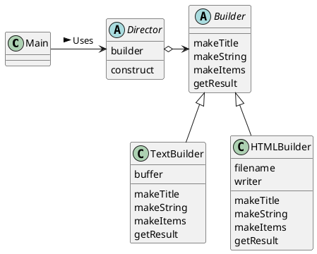
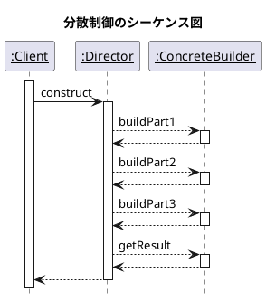

# Builder
複雑なインスタンスを組み立てる

## サンプルプログラム
次のような「文章」を作成するプログラムを作ってみる

- タイトルを１つ含む
- 文字列をいくつか含む
- 箇条書きの項目をいくつか含む

Builder クラスでは、文章を構成するためのメソッドを定める。そして、Director keysルアすがそのメソッドを使って、具体的な１つの文章を作る。



### Builder クラス
「文章」を作るメソッドたちを宣言している抽象クラス。

```java
public abstract class Builder {
    public abstract void makeTitle(String title);
    public abstract void makeString(String str);
    public abstract void makeItems(String[] items);
    public abstract void close();
}
```

### Director クラス
Builder クラスで宣言されているメソッドを使って文章を作る。

Director クラスのコンストラクタの引数は Builder 型。しかし、実際には Builder クラスのインスタンスが引数として与えられることはない。なぜなら、**Builder クラスは抽象クラスなので、インスタンスを作れないから。**Director のコンストラクタに実際に渡されるのは、Builder クラスのサブクラスのインスタンスである。

construct メソッドは、文章を作るメソッド。このメソッドを呼ぶと、文章を作って、その結果を返す。

```java
public class Director {
    private Builder builder;
    public Director(Builder builder) {
        this.builder = builder;
    }
    public void construct() { 
        builder.makeTitle("Greeting");
        builder.makeString("stringggg");
        builder.makeItems(new String[]{
            "item1",
            "item2",
        });
        builder.makeString("string"); 
        builder.makeItems(new String[]{
            "hello",
            "see y",
            "good bye",
        });
        builder.close();
    }
}
```

### TextBuilder クラス
Builder クラスのサブkeysルアす。

```java
public class TextBuilder extends Builder {
    private StringBuffer buffer = new StringBuffer();
    public void makeTitle(String title) {
        buffer.append("==============================\n");
        buffer.append("『" + title + "』\n");
        buffer.append("\n");
    }
    public void makeString(String str) {
        buffer.append('■' + str + "\n");
        buffer.append("\n");
    }
    public void makeItems(String[] items) {
        for (int i = 0; i < items.length; i++) {
            buffer.append("  ・" + items[i] + "\n");
        }
        buffer.append("\n");
    }
    public void close() {
        buffer.append("==============================\n");
    }
    public String getResult() {
        return buffer.toString();
    }
}
```

### HTMLBuilder クラス
```java
import java.io.*;

public class HTMLBuilder extends Builder {
    private String filename;
    private PrintWriter writer;
    public void makeTitle(String title) {
        filename = title + ".html";
        try {
            writer = new PrintWriter(new FileWriter(filename));
        } catch (IOException e) {
            e.printStackTrace();
        }
        writer.println("<html><head><title>" + title + "</title></head><body>");
        writer.println("<h1>" + title + "</h1>");
    }
    public void makeString(String str) {
        writer.println("<p>" + str + "</p>");
    }
    public void makeItems(String[] items) {
        writer.println("<ul>");
        for (int i = 0; i < items.length; i++) {
            writer.println("<li>" + items[i] + "</li>");
        }
        writer.println("</ul>");
    }
    public void close() {
        writer.println("</body></html>");
        writer.close();
    }
    public String getResult() {
        return filename;
    }
}
```

### Main クラス
以下のように、コマンドラインで指定した形式に応じた文章を作る

- `java Main plain`
- `java Main html`

Director は、Builder のメソッドのみを使って文章を作っている。Builder のメソッドのみを使うということは、**Director は、実際に動いているのが TextBuilder なのか HTMLBuilder なのかを意識していない**事になる

### シーケンス図


### 変更
他のメソッドが呼ばれる前に、一度だけ makeTitle が呼ばれるようにする

```java
public abstract class Builder {
    private boolean initialized = false;
    public void makeTitle(String title) {
        if (!initialized) {
            buildTitle(title);
            initialized = true;
        }
    }
    public void makeString(String str) {
        if (initialized) {
            buildString(str);
        }
    }
    public void makeItems(String[] items) {
        if (initialized) {
            buildItems(items);
        }
    }
    public void close() {
        if (initialized) {
            buildDone();
        }
    }
    protected abstract void buildTitle(String title);
    protected abstract void buildString(String str);
    protected abstract void buildItems(String[] items);
    protected abstract void buildDone();
}
```

