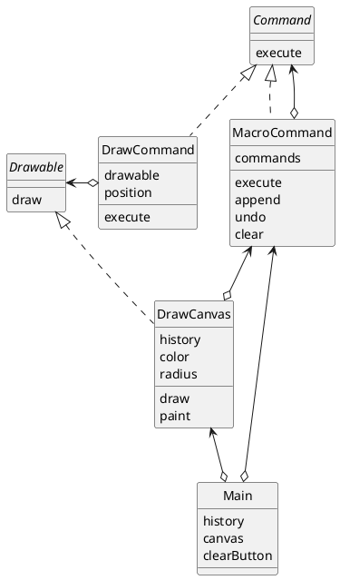
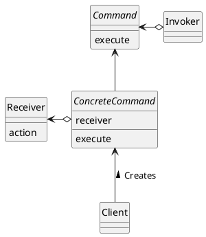

# Command
命令をクラスにする

## Command パターン
メソッドなどが行った結果は、状態には反映されるであろうが、仕事の履歴はどこにも残らない。

こんな時、「この仕事を行いなさい」という「命令」を表現するクラスがあれば良さそう。行いたい仕事を「メソッドを呼び出す」という**動的な処理として表現するのではなく、命令を表すクラスのインスタンスという一個の「もの」として表現することができる**から！履歴を管理したい時には、そのインスタンスの集まりを管理すれば良い。

Command は、Event と呼ばれる場合もある。「イベント駆動プログラミング」で使われる「イベント」と同じ意味。GUI に関わるプログラミングでは、よくこの「イベント」が登場する

## サンプルプログラム
GUI を使った、簡単なお絵かきソフトを作る。

### クラス図


### Command インタフェース
「命令」を表現するためのもの。execute メソッドを呼び出したときに具体的に何が起こるかは、Command インタフェースを実装したクラスが定める。

```java
package command;

public interface Command {
    public abstract void execute();
}
```

### MacroCommand クラス
「複数の命令をまとめた命令」を表す。

commands フィールドは、java.util.Stack 型で、複数の Command（を実装したクラスのインスタンス）を集めておくためのもの。java.util.Vector を使っても良いが、undo メソッドを楽に実装するために、Stack にしている。

```java
package command;

import java.util.Stack;
import java.util.Iterator;

public class MacroCommand implements Command {
    private Stack commands = new Stack();
    public void execute() {
        Iterator it = commands.iterator();
        while (it.hasNext()) {
            ((Command)it.next()).execute();
        }
    }
    public void append(Command cmd) {
        if (cmd != this) {
            commands.push(cmd);
        }
    }
    public void undo() {
        if (!commands.empty()) {
            commands.pop();
        }
    }
    public void clear() {
        commands.clear();
    }
}
```


### DrawCommand クラス　
「点の描画命令」を表現したもの。

```java
package command;

import java.util.Stack;
import java.util.Iterator;

public class MacroCommand implements Command {
    private Stack commands = new Stack();
    public void execute() {
        Iterator it = commands.iterator();
        while (it.hasNext()) {
            ((Command)it.next()).execute();
        }
    }
    public void append(Command cmd) {
        if (cmd != this) {
            commands.push(cmd);
        }
    }
    public void undo() {
        if (!commands.empty()) {
            commands.pop();
        }
    }
    public void clear() {
        commands.clear();
    }
}
```

### Drawable インタフェース
```java
package drawer;

public interface Drawable {
    public abstract void draw(int x, int y);
}
```

### DrawCanvas クラス
paint メソッドは、この DrawCanvas を再描画する必要が生じた時、Java 処理系から（java.awt のフレームワークから）呼び出されるメソッドである。行う処理は、history.execute を呼び出すだけ。

```java
package drawer;

import command.*;

import java.util.*;
import java.awt.*;
import java.awt.event.*;
import javax.swing.*;

public class DrawCanvas extends Canvas implements Drawable {
    private Color color = Color.red;
    private int radius = 6;
    private MacroCommand history;
    public DrawCanvas(int width, int height, MacroCommand history) {
        setSize(width, height);
        setBackground(Color.white);
        this.history = history;
    }
    public void paint(Graphics g) {
        history.execute();
    }
    public void draw(int x, int y) {
        Graphics g = getGraphics();
        g.setColor(color);
        g.fillOval(x - radius, y - radius, radius * 2, radius * 2);
    }
}
```

### Main クラス
history フィールドは、描画履歴を保持する。これは、後で DrawCanvas のインスタンスに渡すものと同じ。

```java
import command.*;
import drawer.*;

import java.awt.*;
import java.awt.event.*;
import javax.swing.*;

public class Main extends JFrame implements ActionListener, MouseMotionListener, WindowListener {
    private MacroCommand history = new MacroCommand();
    private DrawCanvas canvas = new DrawCanvas(400, 400, history);
    private JButton clearButton  = new JButton("clear");

    public Main(String title) {
        super(title);

        this.addWindowListener(this);
        canvas.addMouseMotionListener(this);
        clearButton.addActionListener(this);

        Box buttonBox = new Box(BoxLayout.X_AXIS);
        buttonBox.add(clearButton);
        Box mainBox = new Box(BoxLayout.Y_AXIS);
        mainBox.add(buttonBox);
        mainBox.add(canvas);
        getContentPane().add(mainBox);

        pack();
        show();
    }

    public void actionPerformed(ActionEvent e) {
        if (e.getSource() == clearButton) {
            history.clear();
            canvas.repaint();
        }
    }

    public void mouseMoved(MouseEvent e) {
    }
    public void mouseDragged(MouseEvent e) {
        Command cmd = new DrawCommand(canvas, e.getPoint());
        history.append(cmd);
        cmd.execute();
    }

    // WindowListener��
    public void windowClosing(WindowEvent e) {
        System.exit(0);
    }
    public void windowActivated(WindowEvent e) {}
    public void windowClosed(WindowEvent e) {}
    public void windowDeactivated(WindowEvent e) {}
    public void windowDeiconified(WindowEvent e) {}
    public void windowIconified(WindowEvent e) {}
    public void windowOpened(WindowEvent e) {}

    public static void main(String[] args) {
        new Main("Command Pattern Sample");
    }
}
```

## Command パターンの登場人物

### Command（命令）の役
命令のインタフェース（API）を定義する役。Command インタフェースがこの役をつとめる。

### ConcreteCommand（具体的命令）の役
Command 役のインタフェース（API）を実際に実装している役。MacroCommand クラスと DrawCommand クラス

### Receiver（受信者）の役
Command 役が命令を実行するときに対象となる役。命令の受け取りて。DrawCommand の命令を受け取っているのは、DrawCanvas クラス

### Client（依頼者）の役
ConcreteCommand 役を生成し、その際に Receiver 役を割り当てる役。Main クラス。Main クラスでは、マウスのドラッグに合わせて DrawCommand のインスタンスを生成しているが、その際に Receiver 役として DrawCanvas のインスタンスをコンストラクタに渡している。

### Invoker（起動者）の役
命令の実行を開始する役。Command 役で定義されているインタフェース（API）を呼び出す役になる。

### クラス図


## ヒント

### 命令が持つべき情報は
「命令」にどれだけの情報を持たせるべきかは、目的によって異なる。

### アダプター
Java のインナークラス（inner class）という機構と組み合わせてアダプターを使うと、スマートにプログラムを記述することができる。
