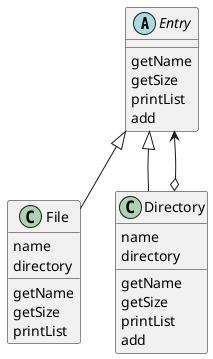

# Composite
容器と中身の同一視

## Composite パターン
ディレクトリとファイルのどちらも「ディレクトリの中に入れることができるもの」という性質がある。その２つをまとめて、「ディレクトリエントリ」と呼ぶこともある。つまり、ディレクトリエントリという名前によって、ディレクトリとファイルを同じ種類のものであると同一視している事になる。

このように、**容器と中身を同一視し、再起的な構造を作る**デザインパターンを、Composite パターンという。

## サンプルプログラム

### クラス図


### Entry クラス
Entry クラスは抽象クラスで、ディレクトリエントリを表現するもの。

```java
public abstract class Entry {
    public abstract String getName();
    public abstract int getSize();
    public Entry add(Entry entry) throws FileTreatmentException {
        throw new FileTreatmentException();
    }
    public void printList() {
        printList("");
    }
    protected abstract void printList(Strring prefix);
    public String toString() {
        return getName() + " (" + getSize() + ")";
    }
}
```

### FileTreatmentException クラス
```java
public class FileTreatmentException extends RuntimeException {
    public FileTreatmentException() {
    }
    public FileTreatmentException(String msg) {
        super(msg);
    }
}
```

### File クラス
Entry クラスのサブクラス

`"/" + this`のように、**文字列とオブジェクトを加えると、自動的にそのオブジェクトの toString メソッドが呼ばれる**。これは Java 言語の仕様。つまり、以下の式は全て同じ。

- prefix + "/" + this
- prefix + "/" + this.toString()
- prefix + "/" + toString()

```java
public class File extends Entry {
    private String name;
    private int size;
    public File(String name, int size) {
        this.name = name;
        this.size = size;
    }
    public String getName() {
        return name;
    }
    public int getSize() {
        return size;
    }
    protected void printList(String prefix) {
        System.out.println(prefix + "/" + this);
    }
}
```

### Directory クラス
directory のフィールドは、Vector として定義されている。この directory がディレクトリエントリを保持しておくためのフィールドである。

**Composite パターンの再帰的構造が、そのまま getSize というメソッドの再帰的呼び出しに対応している。**

```java
import java.util.Iterator;
import java.util.ArrayList;

public class Directory extends Entry {
    private String name;
    private ArrayList directory = new ArrayList();
    public Directory(String name) {
        this.name = name;
    }
    public String getName() {
        return name;
    }
    public int getSize() {
        int size = 0;
        Iterator it = directory.iterator();
        while (it.hasNext()) {
            Entry entry = (Entry)it.next();
            size += entry.getSize();
        }
        return size;
    }
    public Entry add(Entry entry) {
        directory.add(entry);
        return this;
    }
    protected void printList(String prefix) {
        System.out.println(prefix + "/" + this);
        Iterator it = directory.iterator();
        while (it.hasNext()) {
            Entry entry = (Entry)it.next();
            entry.printList(prefix + "/" + name);
        }
    }
}
```

### Main クラス
```java
public class Main {
    public static void main(String[] args) {
        try {
            System.out.println("Making root entries...");
            Directory rootdir = new Directory("root");
            Directory bindir = new Directory("bin");
            Directory tmpdir = new Directory("tmp");
            Directory usrdir = new Directory("usr");
            rootdir.add(bindir);
            rootdir.add(tmpdir);
            rootdir.add(usrdir);
            bindir.add(new File("vi", 10000));
            bindir.add(new File("latex", 20000));
            rootdir.printList();

            System.out.println("");
            System.out.println("Making user entries...");
            Directory yuki = new Directory("yuki");
            Directory hanako = new Directory("hanako");
            Directory tomura = new Directory("tomura");
            usrdir.add(yuki);
            usrdir.add(hanako);
            usrdir.add(tomura);
            yuki.add(new File("diary.html", 100));
            yuki.add(new File("Composite.java", 200));
            hanako.add(new File("memo.tex", 300));
            tomura.add(new File("game.doc", 400));
            tomura.add(new File("junk.mail", 500));
            rootdir.printList();
        } catch (FileTreatmentException e) {
            e.printStackTrace();
        }
    }
}
```

## ヒント

### 単数と複数の同一視
Composite パターンは容器と中身の同一視を行うパターンですが、これを**複数と単数の同一視**と呼ぶこともできる。

### 再意的構造はあらゆる場面で登場する
例えば、**ウインドウシステム**ではウインドウの中に子ウインドウを持たせますが、それは Composite パターンの典型である。また、文章の**箇条書き**の各項目の中にさらに箇条書きが含まれるのも、再帰的な構造と言える。コンピュータに対するコマンドをまとめた**マクロコマンド**を作るとき、そのマクロコマンドを再起的な構造として実現すると、マクロコマンドのマクロコマンドを作ることもできる。

> 一般に、木構造になるデータ構造は Composite パターンに当てはまる！

### 関連しているパターン
- Command パターン
  - Commande パターんで「マクロコマンド」を作るとき、Composite pata-nnが使われている。
- Visitor パターン
  - Visitor パターンは、Comosite をめぐりながら処理をする
- Decorator パターン
  - 飾りと中身を同一視するもの
