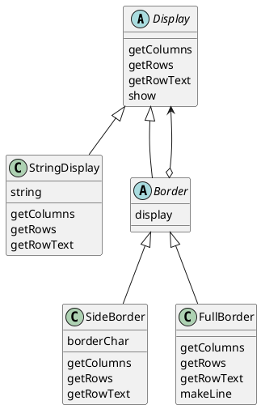

# Decorator
飾り枠と中身の同一視

## Decorator パターン
スポンジケーキが１つあったとする。クリームを塗れば、ショートケーキが出来上がる。そこにイチゴを並べれば、ストロベリーショートケーキになる。さらに板チョコを乗せて、ホワイトチョコレートで名前を書き、年齢の数だけキャンドルを立てれば、バースディケーキが出来上がる。

オブジェクトも、このようなケーキと似ていることがある。まず、中心となるスポンジケーキのようなオブジェクトがある。それに飾り付けとなる機能を一皮一皮かぶせていって、より目的にあったオブジェクトに仕上げていく。

このような、**オブジェクトにどんどんデコレーションをほどこしていくようなデザインパターン**を、Decorator パターンと呼ぶ。

## サンプルプログラム

### クラス図


### Display クラス
複数行からなる文字列を表示するための抽象クラス

```java
public abstract class Display {
    public abstract int getColumns();
    public abstract int getRows();
    public abstract String getRowText(int row);
    public void show() {
        for (int i = 0; i < getRows(); i++) {
            System.out.println(getRowText(i));
        }
    }
}
```

### StringDisplay クラス
１行の文字列を表示するクラス。

```java
public class StringDisplay extends Display {
    private String string;
    public StringDisplay(String string) {
        this.string = string;
    }
    public int getColumns() {
        return string.getBytes().length;
    }
    public int getRows() {
        return 1;
    }
    public String getRowText(int row) {
        if (row == 0) {
            return string;
        } else {
            return null;
        }
    }
}
```

### border クラス
```java
public abstract class Border extends Display {
    // この飾り枠が包んでいる「中身」をさす
    protected Display display;
    protected Border(Display display) {
        this.display = display;
    }
}
```

### SideBorder クラス
具体的な飾り枠の一種で、Border クラスのサブクラスである。

この SideBorder は抽象クラスではない。なぜなら、スーパークラスで宣言されていた抽象メソッドが、全てここで実装されているから。

```java
public class SideBorder extends Border {
    private char borderChar;
    public SideBorder(Display display, char ch) {
        super(display);
        this.borderChar = ch;
    }
    public int getColumns() {
        return 1 + display.getColumns() + 1;
    }
    public int getRows() {
        return display.getRows();
    }
    public String getRowText(int row) {
        return borderChar + display.getRowText(row) + borderChar
    }
}
```

### FullBorder クラス
```java
public class FullBorder extends Border {
    public FullBorder(Display display) {
        super(display);
    }
    public int getColumns() {
        return 1 + display.getColumns() + 1;
    }
    public int getRows() {
        return 1 + display.getRows() + 1;
    }
    public String getRowText(int row) {
        if (row == 0) {
            return "+" + makeLine('-', display.getColumns()) + "+";
        } else if (row == display.getRows() + 1) {
            return "+" + makeLine('-', display.getColumns()) + "+";
        } else {
            return "|" + display.getRowText(row - 1) + "|";
        }
    }
    private String makeLine(char ch, int count) {
        StringBuffer buf = new StringBuffer();
        for (int i = 0; i < count; i++) {
            buf.append(ch);
        }
        return buf.toString();
    }
}
```

### Main クラス
```java
public class Main {
    public static void main(String[] args) {
        Display b1 = new StringDisplay("Hello, world.");
        Display b2 = new SideBorder(b1, '#');
        Display b3 = new FullBorder(b2);
        b1.show();
        b2.show();
        b3.show();
        Display b4 = 
                    new SideBorder(
                        new FullBorder(
                            new FullBorder(
                                new SideBorder(
                                    new FullBorder(
                                        new StringDisplay("����ˤ��ϡ�")
                                    ),
                                    '*'
                                )
                            )
                        ),
                        '/'
                    );
        b4.show();
    }
}
```


