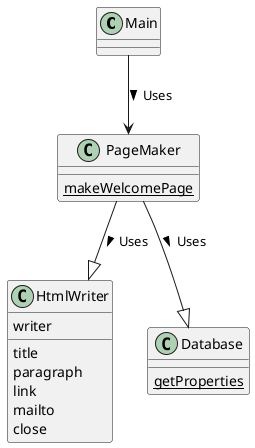

# Facade
シンプルな窓口

## Facade パターン
プログラムというのは、だんだん大きくなっていく傾向がある。大きなプログラムを使って処理を行うためには、**関係しあっているたくさんのクラスを適切に制御していく必要がある**。だとすると、その処理を行うための「窓口」を用意しておくと良い。そうすれば、たくさんのクラスを個別に制御しなくても、その「窓口」に対して要求を出すだけで仕事がすむことになる。

そのような「窓口」が、この章で学ぶ、Facade（ファサード）パターンである。

facade はフランス語を語源とする単語で、「建物の正面」という意味。

Facade パターンは、複雑に絡み合ってごちゃごちゃした詳細をまとめ、こうレベルのインタフェース（API）を提供する。

## サンプルプログラム
ここで作るサンプルプログラムは、ユーザの Web ページを作成するもの。

### クラス図


### Database クラス
Database クラスは、データベース名を指定して、それに対応した properties を作成するクラス。このクラスでは、インスタンスを作らず、getProperties という static メソッドを介して Properties のインスタンスを得る。

```java
package pagemaker;

import java.io.FileInputStream;
import java.io.IOException;
import java.util.Properties;

public class Database {
    private Database() {
        // new でインスタンス生成させないために private
    }
    public static Properties getProperties(String dbname) {
        String filename = dbname + ".txt";
        Properties prop = new Properties();
        try {
            prop.load(new FileInputStream(filename));
        } catch (IOException e) {
            System.out.println("Warning: " + filename + " is not found.");
        }
        return prop;
    }
}
```

### HtmlWriter クラス
簡単な Web ページを作成するもの。インスタンス生成時に Writer を与えておき、その Writer に対して HTML を出力する。

```java
package pagemaker;

import java.io.Writer;
import java.io.IOException;

public class HtmlWriter {
    private Writer writer;
    public HtmlWriter(Writer writer) {
        this.writer = writer;
    }
    public void title(String title) throws IOException {
        writer.write("<html>");
        writer.write("<head>");
        writer.write("<title>" + title + "</title>");
        writer.write("</head>");
        writer.write("<body>\n");
        writer.write("<h1>" + title + "</h1>\n");
    }
    public void paragraph(String msg) throws IOException {
        writer.write("<p>" + msg + "</p>\n");
    }
    public void link(String href, String caption) throws IOException {
        paragraph("<a href=\"" + href + "\">" + caption + "</a>");
    }
    public void mailto(String mailaddr, String username) throws IOException {
        link("mailto:" + mailaddr, username);
    }
    public void close() throws IOException {
        writer.write("</body>");
        writer.write("</html>\n");
        writer.close();
    }
}
```

### PageMaker クラス
PageMaker クラスは、Database クラスと HtmlWriter クラスを組み合わせて、指定したユーザの Web ページを作成するためのもの。

このクラスで定義されている public メソッドは makeWelcomePage だけ。このメソッドにメールアドレスと出力ファイル名を指定するだけで、Web ページが作成される。

HtmlWriter クラスのメソッドをごちゃごちゃ呼ぶところは、**この PageMaker クラスが一手に引き受け、外部に対してはたった１つの makeWelcomePage メソッドだけを見せている**。ここがシンプルな窓口になっている。

```java
package pagemaker;

import java.io.FileWriter;
import java.io.IOException;
import java.util.Properties;

public class PageMaker {
    private PageMaker() {
    }
    public static void makeWelcomePage(String mailaddr, String filename) {
        try {
            Properties mailprop = Database.getProperties("maildata");
            String username = mailprop.getProperty(mailaddr);
            HtmlWriter writer = new HtmlWriter(new FileWriter(filename));
            writer.title("Welcome to " + username + "'s page!");
            writer.paragraph(username + "のページへようこそ。");
            writer.paragraph("メールまっていますね。");
            writer.mailto(mailaddr, username);
            writer.close();
            System.out.println(filename + " is created for " + mailaddr + " (" + username + ")");
        } catch (IOException e) {
            e.printStackTrace();
        }
    }
}
```

### Main クラス
pagemaker パッケージの PageMaker クラスを利用する。

以下のようにたった一文だけで良い。

```java
import pagemaker.PageMaker;

public class Main {
    public static void main(String[] args) {
        PageMaker.makeWelcomePage("hyuki@hyuki.com", "welcome.html");
    }
}
```


## Facade パターンの登場人物

### Facade（正面）の役
Facade 役は、システムを構成しているその他おおぜいの役の「シンプルな窓口」となる。Facade 役は、高レベルでシンプルなインタフェース（API）をシステム外部に提供する。サンプルプログラムでは、PageMaker クラスがこの役をつとめている。

### システムを構成しているその他おおぜいの役
それぞれの仕事を行なっているが、Facade 役のことは意識していない。Facade 役から呼び出されて仕事を行うが、その他おおぜいの役から Facade 役を呼び出すことはない。Database クラスと HtmlWriter クラスがこの役をつとめる。

### Client（依頼人）の役
Facade パターンを利用する役。Client 役は Facade パターンの中には含まれていない。サンプルプログラムでは、Main クラスがこの役をつとめている。


## ヒント

### Facade 役がやっていることはなんだろう
複雑なものを単純に見せること。Facade 役は、その複雑さを意識しないで済むように気を遣う。

ここでのポイントは**インタフェース（API）を少なくすること**。クラスやメソッドがたくさん見えていると、迷わせてしまう...。

インタフェース（API）の数が少ないというのは、外部との結合が疎である、とも表現できる。これは、パッケージを部品として再利用しやすくしている。

### プログラマが Facade を作らない理由
あるプログラマが、「「ああ、このクラスを呼ぶ前にはこっちを呼ぶんだよ。こっちのメソッドの呼び出し前には、このクラスに登録しておく必要があるんだぜ」といった話を「得意げに」語るときには、Facade 役を導入する必要があることを示唆している。

**はっきりと言葉で表現できるノウハウは、プログラマの頭の中に隠しておくべきものではなく、コードとして表現しておくべきもの！**
