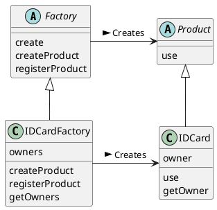

# Factory Method
インスタンス生成をサブクラスに任せる

Template Method の応用

## Factory Method パターン
Template Method パターンでは、スーパークラスがわで処理の骨組みを作り、サブクラス側で具体的な処理の肉付けを行った。このパターンをインスタンス生成の場面に適応したものが、Factory Method パターンである。

Factory Method パターンでは、インスタンスの作り方をスーパークラスの側で定めますが、具体的なクラス名までは定めません。具体的な肉付けは、全てサブクラスの側で行う。




```java
package framework;

// template method のように、ロジックのみ記述
public abstract class Factory {
    public final product create(String owner) {
        Product p = createProduct(owner);
        registerProduct(p);
        return p;
    }
    protected abstract Product createProduct(String owner);
    protected abstract void registerProduct(Product product);
}
```

次は肉付けする側

```java
package idcard;
import framework.*;

public class IDCard extends Product {
    private String owner;
    IDCard(String string) {
        this.owner = owner;
    }
    public void use() {
        // Use
    }
    public String getOwner() {
        return owner;
    }
}
```

```java
package idcard;
import framework.*;
import java.util.*;

public class IDCardFactory extends Factory {
    private Vector owners = new Vector();
    protected Product createProduct(String owner) {
        return new IDCard(owner);
    }
    protected void registerProduct(Product product) {
        owners.add(((IDCard)product).getOwner());
    }
    public Vector getOwners() {
        return owners;
    }
}
```

```java
import framework.*;
import idcard.*;

public class Main {
    public static void main(String[] args) {
        Factory factory = new IDCardFactory();
        Prodct card1 = factory.create("ほげ");
        Prodct card2 = factory.create("とむら");
        Prodct card3 = factory.create("ほげえ");
        card1.use();
    }
}
```

## 登場人物

### Creator(作成者)の役
フレームワーク側の話。Product 役を生成する抽象クラス。具体的な内容は、サブクラスが定める。
Creator 役は、実際に生成する ConcreteProduct 役については何も知らない。Creator 役が知っているのは、Product 役とインスタンス生成のメソッドを呼び出せば、Product が生成されるということだけ。**new による実際のインスタンス生成を、インスタンス生成のためのメソッド呼び出しに代えることで、具体的なクラス名による束縛からスーパークラスを解放している**

## インスタンス生成
createProduct メソッドの実施方法には、次の３通りが考えられる

### 抽象メソッドにする
抽象メソッドにすると、サブクラスは必ずこのメソッドを実装しなければならなくなる。

### デフォルトの実装を用意しておく
```java
class Factory {
    public Product createProduct(String name) {
        return new Product(name);
    }
    ...
}
```

ただし、この場合には Product クラスに対して直接 new しているので、Product クラスを抽象クラスにしておくことはできない

あれ、**抽象クラスにできる条件ってなんだっけ**

### エラーにする
```java
class Factory {
    public Product createProduct(String name) {
        throw new FactoryMethodRuntimeException();
    }
    ...
}
```
