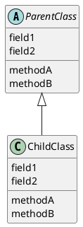
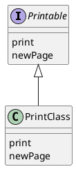
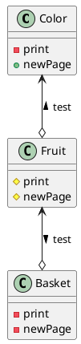
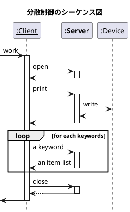

## GoF
Gang of Four

https://www.hyuki.com/dp/

## UML
- システムを視覚化したり、仕様書や設計を文章化したりするための表現方法。
- Unified Modeling Language

### クラスと階層関係
Class Diagram

クラスやインスタンスなどの、静的な関係を表したもの。クラス以外のものも表す。矢印は、サブクラスからスーパークラスに向かう



サブクラス側からスーパークラスに矢印が伸びる。サブクラスはスーパークラスの中身を知っているが、逆は成り立たない。よって、この向きに伸びていると思ったらしっくりくるのではなかろうか。

### インタフェースと実装


### 集約
「持っている」という関係性を「集約」(aggregation)と呼ぶ。インスタンスを持っていれば、個数に関わらずその関係は集約。

白抜きのひし形は、集約を表す。



uml では、フィールドやメソッドの頭にアクセス修飾子を表すための文字をつける

- +: public
- -: private
- #: protected

通常では、勝手に変換される（上図）。この機能は、次の一文できることができる。


### シーケンス図
Sequence Diagram

どのメソッドがどういう順番で実行されるか、どのような事象がどういう順番で起きるかを表現したもの。

クラス図は、「時間によって変化しないもの（静的な関係）」を表すのに対し、シーケンス図は、「時間に従って変化するもの（動的な振る舞い）」を表す。



下線はインスタンス？

インスタンスから下方向に伸びたヤジすりは、**ライフライン**という。

ライフラインの途中の細長い長方形の部分は、オブジェクトが活動中であることを表す。


```plantuml
actor "user" as user
actor "system" as system

user -> system: search
system --> user: result
```


