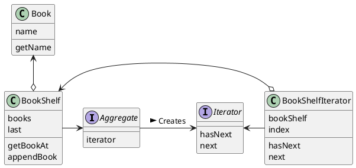

# Iterator パターン
- 変数 i の働きを抽象化したもの。
- 何かがたくさん集まっているときに、ソレを順番に指し示していき、全体をスキャンしていく処理を行うもの。




```java
public interface Aggregate {
    public abstract Iterator iterator();
}

public interface Iterator {
    public abstract boolean hasNext();
    public abstract Object next();
}

// Book.java
public class Book {
    private String name = "";
    public book(String name) {
        this.name = name;
    }
    public String getName() {
        return name;
    }
}

// BookShelf.java
public class BookShelf implements Aggregate {
    private Book[] books;
    private int last = 0;
    public BookShelf(int maxsize) {
        this.books = new Book[maxsize];
    }
    public Book getBookAt(int index) {
        return books[index];
    }
    public void appendBook(Book book) {
        this.books[last] = book;
        last++;
    }
    public int getLength() {
        return last;
    }
    public Iterator iterator() {
        return new BookShelfIterator(this);
    }
}

// ConcreteIterator
// BookShelfIterator.java
public class BookShelfIterator implements Iterator {
    private BookShelf bookShelf;
    private int index;
    public BookShelfIterator(BookShelf bookShelf) {
        this.bookShelf = bookShelf;
        this.index = 0;
    }
    public boolean hasNext() {
        if (index < bookShelf.getLentgh()) {
            return true;
        } else {
            return false;
        }
    }
    public Object next() {
        Book book = bookShelf.getBookAt(index);
        index++;
        return book;
    }
}
```

具体的なクラスだけを使うと、クラス間の結合が強くなってしまい、部品として再利用することが難しくなる。結合を弱め、クラスを部分として再利用しやすくするために、抽象クラスやインタフェースが導入される。

Java では、使われなくなったインスタンスは自動的に削除される（ガベージコレクション）。


