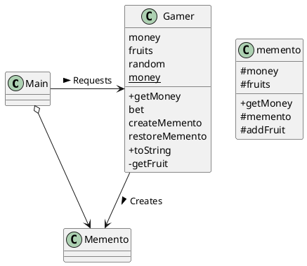
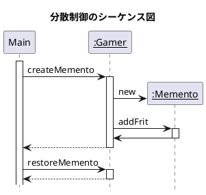

# memento
状態を保存する

## memento パターン
undo 作業ににたことをオブジェクト指向のプログラムで行うには、インスタンスの状態を保存しておく必要がある。ただし、保存しておくだけではなく、保存しておいた情報からインスタンスを元の状態に戻す必要がある。

インスタンスを復元させるためには、インスタンス内部の情報に自由にアクセスできる必要がある。ところが、不用意にアクセスを許すと、その**クラスの内部構造に依存したコードがプログラムのあちこちに散らばり**、クラスの修正がしにくくなってしまう。これを**カプセル化の破壊**という

> インスタンスの状態を表す役割を導入して、カプセル化の破壊におちいることなく保存と復元を行うのが、memento パターンである

memento パターンを利用すると、プログラムに対して、

- undo
- redo
- history
- snapshot

などを行うことができます。


## サンプルプログラム
フルーツを集めていくサイコロゲーム

### クラス図

- +: public
- -: private
- #: protected



### memento クラス

memento クラスのコンストラクタは public になっていないので、このインスタンスは誰でも卓っるわけではなく、同じパッケージ（ここでは game パッケージ）に属してるクラスから使う必要がある。

また、addFruit メソッドも同様。**game パッケージの外からは、memento の内部を変更することはできない！**

```java
package game;
import java.util.Vector;

public class memento {
    int money;
    Vector fruits;
    public int getMoney() {
        return money;
    }
    memento(int money) {
        this.money = money;
        this.fruits = new Vector();
    }
    void addFruit(String fruit) {
        fruits.add(fruit);
    }
}
```

### Gamer クラス
ゲームの中心となるメソッドは、bet。このメソッドは、もしも主人公が破産してなかったら、サイコロを振り、その目に従って所持金やフルーツの個数を変化させる。

```java
package game;
import java.util.Vector;
import java.util.Iterator;
import java.util.Random;

public class Gamer {
    private int money;
    private Vector fruits = new Vector();
    private Random random - new Random();
    private static String[] fruitsname = {
        "リンゴ", "ぶどう", "バナナ", "みかん",
    };
    public Gamer(int money) {
        this.money = money;
    }
    public int getMoney() {
        return money;
    }
    public void bet() {
        int dice = random.nextInt(6) + 1;
        if (dice == 1) {
            money += 100;
            System.out.println("所持金が増えました");
        } else if (dice == 2) {
            money /=2;
            System.out.println("所持金が半分になりました");
        } else if (dice == 6) {
            String f= getFruit();
            System.out.println("フルーツ（" + f + "）をもらいました。");
            fruits.add(f);
        } else {
            System.out.println("何も起こりませんでした");
        }
    }
    // スナップショットを撮る
    public memento creatememento() {
        memento m = new memento(money);
        Iterator it = fruits.iterator();
        while (it.hasNext()) {
            String f = (String) it.next();
            if (f.startsWith("おいしい")) {
                m.addFruit(f);
            }
        }
        return m;
    }
    // undo
    public void restorememento(memento memento) {
        this.money = memento.money;
        this.fruits = memento.fruits;
    }
    public String toString() {
        return "money = " + money + ", fruits = " + fruits + "]";
    }

    private String getFruit() {
        String prefix = "";
        if (random.nextBoolean()) {
            prefix = "おいしい";
        }
        return prefix + fruitsname[random.nextInt(fruitsname.length)];
    }
}
```

### Main クラス
```java
import game.Mement;
import game.Gamer;

public class Main {
    public static void main(String[] args) {
        Gamer gamer = new Gamer(100);
        Memento memento = gamer.createMemento();
        for (int i = 0; i < 100; i++) {
            System.out.println("=== " + i);
            System.out.println("現状:" + gamer);

            gamer.bet();

            System.println("所持金は" + gamer.getMoney() + "円になりました。");

            // Memento の取扱の決定
            if (gamer.getMoney() > memento.getMoney()) {
                System.out.println("  (だいぶ増えたので、現在の状態を保存しておこう)");
                memento = gamer.createMemento();
            } else if (gamer.getMoney < memento.getMoney() / 2) {
                System.out.println("  （だいぶ減ったので、以前の状態に復帰しよう）");
                gamer.restoreMemento(memento);
            }

            // 時間待ち
            try {
                Thread.sleep(1000);
            } catch (InterruptedException e) {

            }
            System.out.println("");
        }
    }
}
```

### シーケンス図



## Memento パターンの登場人物

### Originator（作成者）の役
Originator 役は、自分の現在の状態を保存したいときに Memento 役を作る。Originator 役はまた、以前の Memento 役を渡されると、その Memento 役がつくった時点の状態に戻る処理を行う。

### Memento（記念品）の役
Originator 役の内部情報をまとめる。Memento 役は、Originator 役の内部情報を持っていますが、その情報を誰にでも公開するわけではない。

次の2種類のインタフェース（API）を持つ

- wide interface
  - オブジェクトの状態を元に戻すために必要な情報が全て得られるメソッドの集合。Memento 役の内部状態をさらけ出しているので、これを使えるのは Originator 役だけ
- narrow interface
  - 外部の Caretaker 役に見せるためのもの。できることには限りがあり、内部状態が外部に公開されるのを防ぐ。

**この2種類のインタフェース（API）を使い分けることで、オブジェクトのカプセル化の破壊を防ぐ！**

### Caretaker（世話をする人）の役
現在の Originator 役の状態を保存したいときに、そのことを Originator 役に伝える。Originator 役はそれを受けて Memento 役を作り、Caretaker 役に渡す。
