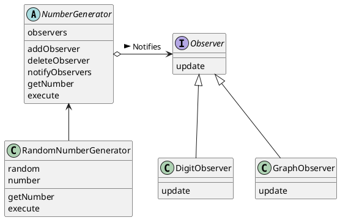

# Observer
状態の変化を通知する

## Observer パターン
Observer パターンでは、観察対象の状態が変化すると、観察者に対して通知される。Observer パターンは、状態変化に応じた処理を記述するときに有効。

## サンプルプログラム

### クラス図


### Observer インタフェース
Observer インタフェースは、「観察者」を表現するインタフェースである。具体的な観察者は、このインタフェースを実装する。このサンプルは、java.util.Observer とは異なっている。

```java
public interface Observer {
    public abstract void update(NumberGenerator generator);
}
```

### NumberGenerator クラス
NumberGenerator クラスは、数を生成する抽象クラスである。実際の数の生成（execute）と、数を取得する部分（getNumber）はサブkeysルアすが実装することを期待して、抽象メソッドとしている。

observers フィールドは、NumberGenerator を観察している Observer たちを保存しているフィールドである。

notifyObservers メソッドは、Observer 全員に対して「私の内容が更新されたので、あなたの表示を更新してください」と伝えるもの。このメソッドの中では、observers の中の Observer たち1人1人の update メソッドを呼び出している。

```java
import java.util.ArrayList;
import java.util.Iterator;

public abstract class NumberGenerator {
    private ArrayList observers = new ArrayList();
    public void addObserver(Observer observer) {
        observers.add(observer);
    }
    public void deleteObserver(Observer observer) {
        observers.remove(observer);
    }
    // Observer へ通知
    public void notifyObservers() {
        Iterator it = observers.iterator();
        while (it.hasNext()) {
            Observer o = (Observer)it.next();
            o.update(this);
        }
    }
    public abstract int getNumber();
    public abstract void execute();
}
```

### RandomNumberGenerator クラス
乱数を生成するもの。random フィールドには、java.util.Random クラスのインスタンスが保持され、number フィールドには現在の現在の乱数値が保持される。

```java
import java.util.Random;

public class RandomNumberGenerator extends NumberGenerator {
    private Random random = new Random();
    private int number;
    public int getNumber() {
        return number;
    }
    public void execute() {
        for (int i = 0; i < 20; i++) {
            number = random.nextInt(50);
            notifyObservers();
        }
    }
}
```

### DigitObserver クラス
DigitObserver クラスは、Observer インタフェースを実装しているクラスで、観察した数を「数字」で表現するためのもの。

```java
public class DigitObserver implements Observer {
    public void update(NumberGenerator generator) {
        System.out.println("DigitObserver:" + generator.getNumber());
        try {
            Thread.sleep(100);
        } catch (InterruptedException e) {
        }
    }
}
```

### GraphObserver クラス

```java
public class GraphObserver implements Observer {
    public void update(NumberGenerator generator) {
        System.out.print("GraphObserver:");
        int count = generator.getNumber();
        for (int i = 0; i < count; i++) {
            System.out.print("*");
        }
        System.out.println("");
        try {
            Thread.sleep(100);
        } catch (InterruptedException e) {
        }
    }
}
```

### Main クラス
```java
public class Main {
    public static void main(String[] args) {
        NumberGenerator generator = new RandomNumberGenerator();
        Observer observer1 = new DigitObserver();
        Observer observer2 = new GraphObserver();
        generator.addObserver(observer1);
        generator.addObserver(observer2);
        generator.execute();
    }
}
```


## ヒント

### Observer の順序
先に登録した Observer の update メソッドが先に呼び出されることになる。一般に、ConcreteObserver 役のクラスを設計するときには、update メソッドが呼び出される順番が変わっても問題が起きないようにする必要がある。（最も、各クラスの独立性がきちんと保たれていれば、あまり依存性の混乱は起きない）

### 「観察」よりも「通知」になっている
observer という言葉は本来の意味は「観察者」ですが、実際には Observer 役は能動的に「観察」するのではなく、Subject 役から「通知」されるのを受動的に待っていることになる。Observer パターンは、**Publish-Subscribe**パターンと呼ばれることもある。

### Model/View/Controller (MVC)
MVC の中の Model と View の関係は、Observer パターンの Subject 役と Observer 役の関係に対応する！

Model は、「表示形式に依存しない内部モデル」を操作する部分のこと。また、View は Model を「どのように見せるか」を管理している部分。一般に、１つの Model に複数の View が対応する。


## java.util.Observer インタフェース
JDK に登場する java.util.Observer インタフェースと java.util.Observer クラスは、Observer パターンの一種

java.util.Observer インタフェースは、以下のメソッドを持つ。

`public void update(Observable obj, Object arg)`

update メソッドでは、引数に

- 観測される側（Subject 役）として、Observable クラスのインスタンス
- 付加情報として、Object クラスのインスタンス

が与えられる。

しかし、このインタフェースとクラスは使いにくい。理由は、 java.util.Observer インタフェースで渡す Subject 役には、java.util.Observer クラスを使う必要があるから...

Coad 本ではこの問題について取り扱っている。

