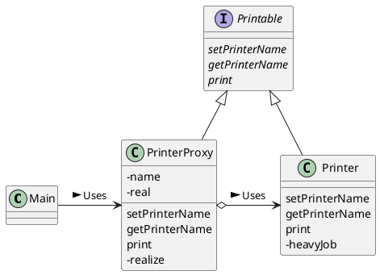
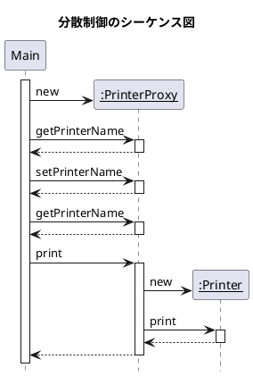
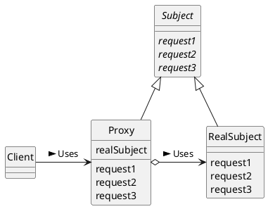

# Proxy
必要になってから作る

## サンプルプログラム
「名前付きのプリンタ」を作る（プリンタといっても、実際には画面に文字列を表示するだけ）。

名前の設定と取得などの部分は、他のクラスが代理で行う。最後に print メソッドを呼び出して、**実際にプリントを行う段階になって初めて、PrintProxy クラスは Printer クラスのインスタンスを生成**する。

ここでは、Printer クラスのインスタンス生成にとても時間がかかるという前提で、プログラムを作る。

### クラス図


### シーケンス図


### Printer クラス
Printer クラスは、「本人」を表すクラス。

コンストラクタでは、ダミーの「重い仕事」heavyJob を行っている。

```java
public class Printer implements Printable {
    private String name;
    public Printer() {
        heavyJob("Printer のインスタンスを作成中");
    }
    public Printer(String name) {
        this.name = name;
        heavyJob("Printerのインスタンス(" + name + ")を作成中");
    }
    public void setPrinterName(String name) {
        this.name = name;
    }
    public String getPrinterName() {
        return name;
    }
    public void print(String string) {
        System.out.println("=== " + name + " ===");
        System.out.println(string);
    }
    private void heavyJob(String msg) {
        System.out.print(msg);
        for (int i = 0; i < 5; i++) {
            try {
                Thread.sleep(1000);
            } catch (InterruptedException e) {
            }
            System.out.print(".");
        }
        System.out.println("完了");
    }
}
```

### Printable インタフェース
Printable インタフェースは、PrinterProxy クラスと Printer クラスを同一視するためのもの。

```java
public interface Printable {
    public abstract void setPrinterName(String name);
    public abstract String getPrinterName();
    public abstract void print(String string);
}
```

### PrinterProxy クラス
代理人の役割を果たすクラス。

コンストラクタでは、名前を設定する（この時点では、まだ「本人」は作られない）。

Printer のインスタンスが生成されるのは、「本人」が必要になったときのみ。**本人が生成されているかどうかは、PrinterProxy の利用者には全くわからない**し、気にする必要もない。

また、**Printer クラスは PrinterProxy の存在を知らない！**自分が PrinterProxy 経由で呼ばれているのか、それとも直接呼ばれているのか、Printer クラスは知らないということ。

```java
public class PrinterProxy implements Printable {
    private String name;
    private Printer real;
    public PrinterProxy() {
    }
    public PrinterProxy(String name) {
        this.name = name;
    }
    public synchronized void setPrinterName(String name) {
        if (real != null) {
            real.setPrinterName(name);
        }
        this.name = name;
    }
    public String getPrinterName() {
        return name;
    }
    public void print(String string) {
        realize();
        real.print(string);
    }
    private synchronized void realize() {
        if (real == null) {
            real = new Printer(name);
        }
    }
}
```

### Main クラス
```java
public class Main {
    public static void main(String[] args) {
        Printable p = new PrinterProxy("Alice");
        System.out.println("名前は現在" + p.getPrinterName() + "です");
        p.setPrinterName("Bob");
        System.out.println("名前は現在" + p.getPrinterName() + "です");
        p.print("Hello, world.");
    }
}
```


## Proxy パターンの登場人物

### Subject（主役）の役
Proxy 役と RealSubject 役を同一視するためのインタフェース（API）を定める。このおかげで、Client 役は、Proxy 役と RealSubject 役の違いを意識する必要がない。

### Proxy（代理人）の役
Proxy 役は Client 役からの要求をできるだけ処理する。もしも、自分だけで処理できそうになかったら、Proxy 役は RealSubject 役に仕事を任せる。

### RealSubject（実際の主体）の役
「代理人」の Proxy では手に負えなくなった時に登場するもの

### Client（依頼人）の役
Proxy パターンを利用する役。Main がこの役を務める

### クラス図


## ヒント

### 代理人を使ってスピードアップ
初期化に時間がかかる機能がたくさん存在するような大きなシステムの場合、実際にその機能を使う段階になって初めて初期化した方が、ユーザーに与えるストレスは少なくなる。

### 透過的ということ
Printer を直接利用しても、間に PrinterProxy が入っても、問題なく使用できる。

このようなとき、PrinterProxy クラスは「透過的」であるといえる。

### HTTP プロキシー
HTTP サーバと HTTP クライアントの間に入って、Web ページのキャッシングなどを行うソフトウェア。

例えば、キャッシング（caching）について。Web ブラウザがある Web ページを表示する時、いちいち遠隔地にある Web サーバにアクセスして、そのページを取得するのではなく、HTTP プロキシーがキャッシュしてあるページを代わりに取得する。最新情報が必要になったときやページの有効期限が切れた時にはじめて、Web サーバに Web ページを取りに行く。

### さまざまな Proxy
- Virtual Proxy
- Remote Proxy
- Access Proxy
