# Singleton
たった１つのインスタンス

## Singleton パターン
プログラムを動かすとき、普通はたくさんのインスタンスが生成される。例えば、文字列を表す java.lang.String クラスのインスタンスは、文字列１個に対して１個生成されるので、文字列が1,000個登場するプログラムなら、1,000個のインスタンスが作られる。

しかし、「このクラスのインスタンスはたった１つしか作らないし、作りたくない」というときもある。それは、システムの中に１個しか存在しないものをプログラムで表現したいとき。

- 指定したクラスのインスタンスが**絶対に**１個しか存在しないことを**保証**したい
- インスタンスが一個しか存在しないことを**プログラム上で表現したい**

このようなパターンを、**Singletonパターン**と呼ぶ。

```plantuml
@startuml
hide circle
skinparam classAttributeIconSize 0

class Singleton {
  {field} -singleton
  {method} -Singleton
  {method} <u>+getInstance</u>
}
@enduml
```




**コンストラクタが private**である。よって、Singleton が外から`new Singleton()`で作ることができない。これがあったとしても、コンパイル時のエラーになる。

```java
// Singleton.java
public class Singleton {
    private static Singleton singleton = new Singleton();
    private Singleton() {
        System.out.println("インスタンスを生成しました");
    }
    public static Singleton getInstance() {
        return singleton;
    }
}

// Main.java
public class Main {
    public static void main(String[] args) {
        System.out.println("Start");
        Singleton obj1 = Singleton.getInstance();
        Singleton obj2 = Singleton.getInstance();
        if (obj1 == obj2) {
            System.out.println("ここくる！");
        }
        System.out.println("End");
    }
}
```

## Singleton パターンの登場人物

### Singleton の役
唯一のインスタンスを得るための static メソッドを持っていて、いつも同じインスタンスを返す。

コンストラクタには、private をつけるだけで、特に何も記述しない！

### 唯一のインスタンスはいつ生成されるのか
プログラムの実行開始後、最初に getInstance メソッドを呼び出したときに、Singleton クラスは初期化される。そして、そのときに static フィールドの初期化が行われ、唯一のインスタンスが作られる！


### synchronized をつけれるようになりたい
下の例を参考に、**synchronized**などを使えるようになりたい。

```java
public class TiketMaker {
    private int ticket = 1000;
    private static TicketMaker singleton = new TicketMaker();
    private TiketMaker() {}
    public static TicketMaker getInstance() {
        return singleton;
    }
    public synchronized int getNextTicketNumber() {
        return ticket++;
    }
}
```

### 以下のような例は、シングルトンではない。
マルチスレッドが関連している

```java
public class Singleton {
    private static Singleton singleton = null;
    private Singleton() {
        System.out.println("hoge");
        slowdown();                             
    }
    public static Singleton getInstance() {
        if (singleton == null) {
            singleton = new Singleton();
        }
        return singleton;
    }
    private void slowdown() {
        try {  
            Thread.sleep(1000);
        } catch (InterruptedException e) {
        }
    }
}
```
