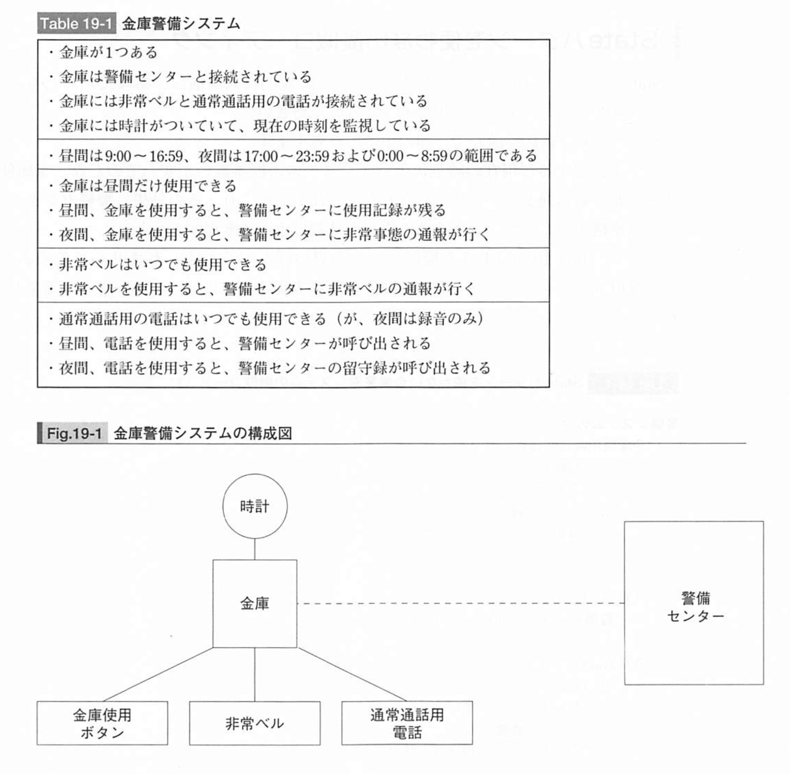
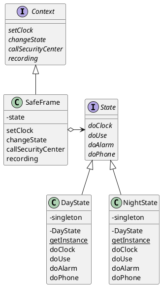

# State
状態をクラスとして表現する

## State パターン
**オブジェクト指向プログラミングでは、プログラムする対象を「クラス」として表現する。どのようなものをクラスとして表現するかは、設計をする人が考えることになる**。

「状態」というものをクラスとして表現するパターンを、State パターンという。

## サンプルプログラム
金庫警備システム。



### クラス図


### State インタフェース
- 時刻が設定されたとき
- 金庫が使用されたとき
- 非常ベルが押されたとき
- 通常通話を行うとき

という出来事に対応して呼び出されるインタフェース（API）を規定

```java
public interface State {
    public abstract void doClock(COntext context, int hour);
    public abstract void doUse(Context contet);
    public abstract void doAlarm(Context contet);
    public abstract void doPhone(Context contet);
}
```

### DayState クラス
昼間の状態を表すクラス。

状態を表すクラスは、**１つずつしかインスタンスを作らないことにする。状態が変化するたびに新しいインスタンスを作っていては、メモリと時間の無駄だから**。そのため、Singleton パターンを使っている。

```java
public class DayState implements State {
    private static DayState singleton = new DayState();
    private DayState() {
    }
    public static State getInstance() {
        return singleton;
    }
    public void doClock(Context context, int hour) {
        if (hour < 9 || 17 <= hour) {
            context.changeState(NightState.getInstance());
        }
    }
    public void doUse(Context context) {
        context.recordLog("金庫使用(昼間)");
    }
    public void doAlarm(Context context) {
        context.callSecurityCenter("非常ベル(昼間)");
    }
    public void doPhone(Context context) {
        context.callSecurityCenter("通常の会話(昼間)");
    }
    public String toString() {
        return "[昼間]";
    }
}
```


### NightState
```java
public class NightState implements State {
    private static NightState singleton = new NightState();
    private NightState() {
    }
    public static State getInstance() {
        return singleton;
    }
    public void doClock(Context context, int hour) {
        if (9 <= hour && hour < 17) {
            context.changeState(DayState.getInstance());
        }
    }
    public void doUse(Context context) {
        context.callSecurityCenter("非常：夜間の金庫使用！");
    }
    public void doAlarm(Context context) {
        context.callSecurityCenter("非常ベル(夜間)");
    }
    public void doPhone(Context context) {
        context.recordLog("夜間の通話録音");
    }
    public String toString() {
        return "[夜間]";
    }
}
```

### Context インタフェース
Context インタフェースは、状態を管理したり、警備センターの呼び出しを行ったりするもの。

```java
public itnerface Context {
    public abstract void setClock(int hour);
    public abstract void changeState(State state);
    public abstract void callSecurityCenter(String msg);
    public abstract void recordLog(String msg);
}
```

### SafeFrame クラス
GUI を使って金庫警備システムを実現するもの。

```java
import java.awt.Frame;
import java.awt.Label;
import java.awt.Color;
import java.awt.Button;
import java.awt.TextField;
import java.awt.TextArea;
import java.awt.Panel;
import java.awt.BorderLayout;
import java.awt.event.ActionListener;
import java.awt.event.ActionEvent;

public class SafeFrame extends Frame implements ActionListener, Context {
    private TextField textClock = new TextField(60);
    private TextArea textScreen = new TextArea(10, 60);
    private Button buttonUse = new Button("金庫使用");
    private Button buttonAlarm = new Button("非常ベル");
    private Button buttonPhone = new Button("通常通話");
    private Button buttonExit = new Button("終了");

    private State state = DayState.getInstance();

    public SafeFrame(String title) {
        super(title);
        setBackground(Color.lightGray);
        setLayout(new BorderLayout());
        add(textClock, BorderLayout.NORTH);
        textClock.setEditable(false);
        add(textScreen, BorderLayout.CENTER);
        textScreen.setEditable(false);
        Panel panel = new Panel();
        panel.add(buttonUse);
        panel.add(buttonAlarm);
        panel.add(buttonPhone);
        panel.add(buttonExit);
        add(panel, BorderLayout.SOUTH);
        pack();
        show();
        buttonUse.addActionListener(this);
        buttonAlarm.addActionListener(this);
        buttonPhone.addActionListener(this);
        buttonExit.addActionListener(this);
    }
    public void actionPerformed(ActionEvent e) {
        System.out.println(e.toString());
        if (e.getSource() == buttonUse) {
            state.doUse(this);
        } else if (e.getSource() == buttonAlarm) {
            state.doAlarm(this);
        } else if (e.getSource() == buttonPhone) {
            state.doPhone(this);
        } else if (e.getSource() == buttonExit) {
            System.exit(0);
        } else {
            System.out.println("?");
        }
    }
    public void setClock(int hour) {
        String clockstring = "現在時刻は";
        if (hour < 10) {
            clockstring += "0" + hour + ":00";
        } else {
            clockstring += hour + ":00";
        }
        System.out.println(clockstring);
        textClock.setText(clockstring);
        state.doClock(this, hour);
    }
    public void changeState(State state) {
        System.out.println(this.state + "から" + state + "へ状態が変化しました");
        this.state = state;
    }
    public void callSecurityCenter(String msg) {
        textScreen.append("call! " + msg + "\n");
    }
    public void recordLog(String msg) {
        textScreen.append("record ... " + msg + "\n");
    }
}
```

### Main クラス
Main クラスでは、SafeFrame のインスタンスを１つ作り、そのインスタンスに対して setClock で定期的に時刻を設定する。

```java
public class Main {
    public static void main(String[] args) {
        SafeFrame frame = new SafeFrame("State Sample");
        while (true) {
            for (int hour = 0; hour < 24; hour++) {
                frame.setClock(hour);
                try {
                    Thread.sleep(1000);
                } catch (InterruptedException e) {
                }
            }
        }
    }
}
```

## State パターンの登場人物

### State（状態）の役
State 役は、状態を表すためのもの。状態ごとに異なる振る舞いをするインタフェース（API）を定める。このインタフェース（API）は、**状態に依存した振る舞いをするメソッドの集まり**になる。

### ConcreteState（具体的な状態）の役
State 役で定められたインタフェース（API）を具体的に実装する。DayState クラスおよび NightState クラスがこの役をつとめる

### Context（状況、前後関係、文脈）の役
Context 役は、現在の状態を表す ConcreteState 役を持つ。また、State パターンの利用者に必要なインタフェース（API）を定める。Context インタフェースと SafeFrame クラスがこの役をつとめる。
