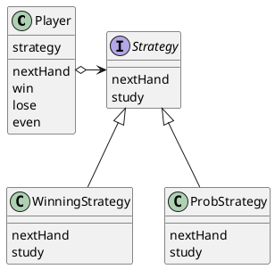

# Strategy
アルゴリズムをこっそり入れ替える

## サンプルプログラム

### クラス図



### Hand クラス
Hand クラスは、内部で 0, 1, 2 でジャンケンの「手」を表す。

Hand クラスのインスタンスは３つしか作られない、Singleton パターンの一種を利用してる。

```java
public class Hand {
    public static final int HANDVALUE_GUU = 0;
    public static final int HANDVALUE_CHO = 1;
    public static final int HANDVALUE_PAA = 2;
    public static final Hand[] hand = {
        new Hand(HANDVALUE_GUU),
        new Hand(HANDVALUE_CHO),
        new Hand(HANDVALUE_PAA),
    };
    private static final String[] name = {
        "グー", "チョキ", "パー",
    };
    private int handvalue;
    private Hand(int handvalue) {
        this.handvalue = handvalue;
    }
    private Hand(int handvalue) {
        this.handvalue = handvalue;
    }
    public static Hand getHand(int handvalue) {
        return hand[handvalue];
    }
    public boolean isStrongerThan(Hand h) {
        return fight(h) == 1;
    }
    public boolena isWeakerThan(Hand h) {
        return fight(h) == -1;
    }
    private int fight(Hand h) {
        if (this == h) {
            return 0;
        } else if ((this.handvalue + 1) % 3 == h.handvalue) {
            return 1;
        } else {
            return -1;
        }
    }
    public String toString() {
        return name[handvalue];
    }
}
```

### Strategy インタフェース
ジャンケンの「戦略」のための抽象メソッドを集めたもの。

```java
public interface Strategy {
    public abstract Hand nextHand();
    public abstract void study(boolean win);
}
```

### WinningStrategy クラス
Strategy インタフェースを実装するクラスの１つ。前回の勝負に勝ったならば、次も同じ手を出す、という戦略に則ったクラス。

```java
import java.util.Random;

public class WinningStrategy implements Strategy {
    private Random random;
    private boolean won = false;
    private WinningStrategy(int seed) {
        random = new Random(seed);
    }
    public Hand nextHand() {
        if (!won) {
            prevHand = Hand.getHand(random.nextInt(3));
        }
        return prevHand;
    }
    public void study(boolean win) {
        won = win;
    }
}
```

### ProbStraetgy クラス
次の手はいつも乱数で決定するが、過去の勝ち負けの履歴を使って、それぞれの手の確率を変える。

history フィールドが過去の勝敗を反映したフィールド。

history[前回に出した手][今回出す手]

この式の値が大きければ大きいほど、過去の勝率が高い、ということになる。

```java
import java.util.Random;

public class ProbStrategy implements Strategy {
    private Random random;
    private int prevHandValue = 0;
    private int currentHandValue = 0;
    private int[][] history = {
        { 1, 1, 1, },
        { 1, 1, 1, },
        { 1, 1, 1, },
    };
    public ProbStrategy(int seed) {
        random = new Random(seed);
    }
    public Hand nextHand() {
        int bet = random.nextInt(getSum(currentHandValue));
        int handvalue = 0;
        if (bet < history[currentHandValue][0]) {
            handvalue = 0;
        } else if (bet < history[currentHandValue][0] + history[currentHandValue][1]) {
            handvalue = 1;
        } else {
            handvalue = 2;
        }
        prevHandValue = currentHandValue
        currentHandValue = handvalue;
        return Hand.getHand(handvalue);
    }
    private int getSum(int hv) {
        int sum = 0;
        for (int i = 0; i < 3; i++) {
            sum += history[hv][i];
        }
        return sum;
    }
    public void study(boolean win) {
        if (win) {
            history[prevHandValue][currentHandValue]++;
        } else {
            history[prevHandValue][(currentHandValue + 1) % 3]++;
            history[prevHandValue][(currentHandValue + 2) % 3]++;
        }
    }
}
```

### Player クラス
ジャンケンを行う人を表現したクラス。

Player クラスは、「名前」と「戦略」を与えられてインスタンスを作る。

```java
public class Player {
    private String name;
    private Strategy strategy;
    private int wincount;
    private int losecount;
    private int gamecount;
    public Player(String name, Strategy strategy) {
        this.name = name;
        this.strategy = strategy;
    }
    public Hand nextHand() {
        return strategy.nextHand();
    }
    public void win() {
        strategy.study(true);
        wincount++;
        gamecount++;
    }
    public void lose() {
        strategy.study(false);
        losecount++;
        gamecount++;
    }
    public void even() {
        gamecount++;
    }
    public String toString() {
        return "[" + name + ":" + gamecount + " games, " + wincount + " win, " + losecount + " lose" + "]";
    }
}
```

### Main クラス
以上のクラスを利用して、実際にジャンケンを行うためのクラス

```java
public class Main {
    public static void main(String[] args) {
        if (args.length != 2) {
            System.out.println("Usage: java Main randomseed1 randomseed2");
            System.out.println("Example: java Main 314 15");
            System.exit(0);
        }
        int seed1 = Integer.parseInt(args[0]);
        int seed2 = Integer.parseInt(args[1]);
        Player player1 = new Player("Taro", new WinningStrategy(seed1));
        Player player2 = new Player("Hana", new ProbStrategy(seed2));
        for (int i = 0; i < 10000; i++) {
            Hand nextHand1 = player1.nextHand();
            Hand nextHand2 = player2.nextHand();
            if (nextHand1.isStrongerThan(nextHand2)) {
                System.out.println("Winner:" + player1);
                player1.win();
                player2.lose();
            } else if (nextHand2.isStrongerThan(nextHand1)) {
                System.out.println("Winner:" + player2);
                player1.lose();
                player2.win();
            } else {
                System.out.println("Even...");
                player1.even();
                player2.even();
            }
        }
        System.out.println("Total result:");
        System.out.println(player1.toString());
        System.out.println(player2.toString());
    }
}
```

## ヒント

### わざわざ Strategy 役を作る必要ってあるの？

普通にプログラミングをしていると、メソッドの中に溶け込んだ形でアルゴリズムを実装してしまいがち。しかし、Strategy パターンでは、アルゴリズムの部分を他の部分と意識的に分離する。そしてアルゴリズムとのインタフェース（API）の部分だけを規定する。そして、プログラムからの委譲によってアルゴリズムを利用する。

このように、**委譲という緩やかな結びつきを使うことで、アルゴリズムを容易に切り替えることができる**。
