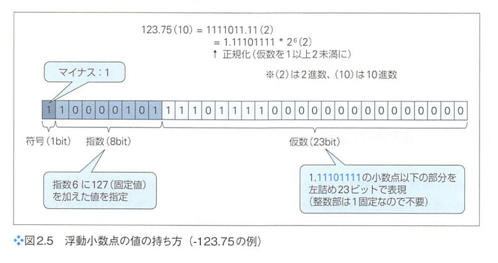

## sec 1

### Java とは

- オブジェクト指向
- Java仮想マシン
- ガベージコレクション

### Java仮想マシン
Javaは、Java仮想マシンと呼ばれるソフトウェアの上で動作します。

従来の、例えばCのような言語は、コードをそれぞれのプラットフォームが理解できる言語ーマシン語に変換してから実行していました。（コンパイル）

マシン語はそれぞれプラットフォームに固有のものなので、例えばWindows環境に対応したアプリをLinux、macOSなど他の環境で実行することはできません。

Javaでも同じく、コードを実行するためにコンパイルという手順を経ますが、その出力はマシン語ではなく、Javaバイトコードと呼ばれる、Java仮想マシンが解釈できる形式となる。よって、Javaでは個々のプラットフォームに応じて実行ファイルを準備する必要はない

Write once, Run anywhere

### ガベージコレクション（GC)
プログラムが確保したメモリ領域のうち、利用されなくなったものを自動的に解釈する機能のこと

### class
Javaではファイルもクラスと対応関係になければならない。つまり、HelloクラスはHello.Javaというファイルで定義する必要がある

class {...} 配下に含まれる要素のことをメンバーと呼ぶ。メンバーには、フィールド、メソッド、コンストラクターなど、さまざまな要素がある。

Java ではメインメソッドは特別な意味を持ち、エントリーポイントと言う。

### ドキュメンテーションコメント（/**...*/）
後でドキュメントの生成に利用できるコメント

@author 作者名 のように、「@...」形式のタグで付加情報を列挙していくのが基本

### 記法
- 変数は camelCase
- クラスは Pascal
- 定数は、アンダースコア記法、USER_NAME

### データ
- マジックナンバーをなくす
- 定数の利用
  - final 修飾子により**再代入できなく**なる

```java
final double TAX = 1.08;
```

- 基本型と参照型のデータ型がある
  - 基本型はプリミティブ型とも呼ばれる
  - Javaにとっては参照型の方が基本
  - プリミティブ型の例
    - byte, short, int, long, float, double, boolean, char
- 浮動小数点の内部形式
  - IEEE 754 規格
  - 符号(1bit)指数(8bit)と仮数(23bit)
  - 仮数は１以上２未満



- 文字型
  - **単一の**文字を表す型
    - 複数の文字は String（参照型）
  - Unicode(UTF-16)
- 真偽型
  - 整数値と相互変換できない
  - true/false
- 型推論
  - var キーワードを利用することで、変数を宣言する際にデータ型を省略できるようになった
    - `var i = 108;`
  - ローカル定数でしか使えない
- リテラル
  - リテラルとは、データ型に格納できる値そのもの。また、値の表現方法のこと。
  - 浮動小数点リテラル
    - 指数表現が可能
- 型サフィックス
  - `System.out.println(2158765456L)`
    - L: long型にすることで、明示的にロング型にしてる
- 数値セパレーター
  - `var value = 1_234_567`
- 文字リテラル
  - ''でくくる
  - 文字列ではないので、文字1つのみ
  - 'あ', '\u3042'
- 文字列リテラル
  - ""でくくる
- キャスト
  - 広い型から狭い型への代入は、明示的に変換（キャスト）が必要
- 参照型
  - クラス型
  - インターフェイス型
  - 配列型
- クラス型
  - クラスをインスタンス化するには、new というキーワードを利用
  - オブジェクトを生成せずに、クラスから直接呼び出せる、クラスフィールド/クラスメソッドなるものもある
- null 型
  - 参照型では、変数がオブジェクトへの参照を持たない状態を表す特別な値として、null がある。
- 配列
  - 宣言
    - `int[] list = new int[5]`
    - `int[] list = {1,2,3,4,5}`
  - 配列は、newによってインスタンス化される一種のオブジェクト
    - よって、lengthのようなフィールドにアクセスできる
  - 多次元配列
    - `int[][] list = new int[4][5]`

## sec 3
メモリの再割り当ては、それなりにオーバーヘッドの大きな処理なので、あらかじめ文字量が想定できているならば、インスタンス化の際にサイズを明示しておく。

`var builder = new StringBuilder(1000)`

前置演算子、後置演算子

```java
var i = 3;
var j = ++i;
System.out.println(i); // 4
System.out.println(j); // 4

var m = 3;
var n = m++;
System.out.println(m); // 4
System.out.println(n); // 3
```

浮動小数店の演算に注意

```java
System.out.println(Math.floor((0.7 + 0.1) * 10)); // 7

// 対策
import java.math.BigDecimal;
var bd1 = new BigDecimal("0.7");
var bd2 = new BigDecimal("0.1");
var bd3 = new BigDecimal("10");
System.out.println(bd1.add(bd2).multiply(bd3)) // 8
```

- 同一性（Identity）と同値性（Equivalence）
  - 同一性：オブジェクト参照同士が同じオブジェクトを参照していること
  - 同値性：オブジェクトが同じ値を持っていること

```java
var builder1 = new StringBuilder("あいう");
var builder2 = new StringBuilder("あいう");
// == 演算子は、同一性を比較
System.out.println(builder1 == builder2); //false
// equals メソッドは、同値性を比較するツール

```

javaの論理演算において、「&&」は短絡評価を行うが、「&」は行わない！


