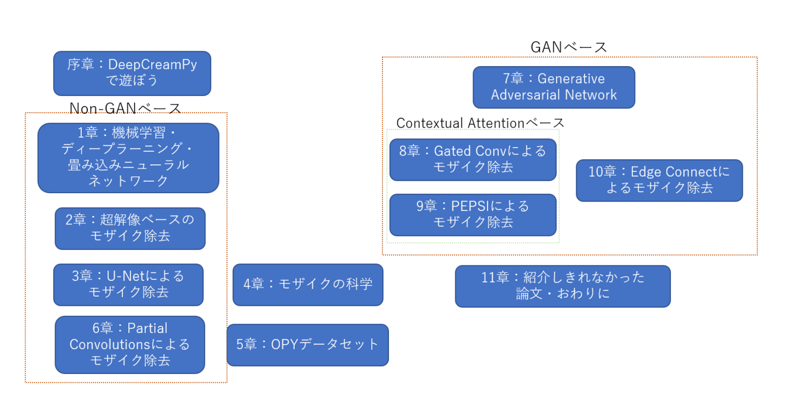

# モザイク除去


State of The Art

## sec 1

### Machine Learning
> A computer program is said to learn from experience *E* with respect to some class of tasks *T* and performance measure *P*, if its performance at tasks in *T*, as measured by *P*, improves with experience *E*.

現在の人工知能は、ほとんどが機械学習のアプリケーションとして実践されている。そして人工知能は、機会自ら考えるような知的なプログラム。そのプログラムの思考は、何によって規定されているかというと**データ**である！データという経験*E*において、人工知能の性能が向上する。

### MLとDL: LSM
DLとは、MLのジャンルの１つ。

DL:「**スケーラビリティ**」と「**表現の多様性**」

モデルが同一なら、1000個のデータを100万個に増やしても精度は上がらない！
データ数に見合ったモデルの大きさが必要。
モデルのスケールを簡単に変更することができるのが、DLの大きな特徴。これはLSMにはないし。他のMLのアルゴリズムでも珍しい

### Python tutorial
スカラー以外で階数が異なるテンソルは、計算の前に reshape するように心がける

(3,) という shape のベクトルと、(3, 3) という shape の行列の和をとる時、ベクトルがわがどっちに伸びるか分からないので、`X.reshape(1, 3)`などとしてからブロードキャストをする

### 多層パーセプトロン
多層パーセプトロンとは、ロジスティック回帰や最小二乗法のすごい版。回帰問題も分類問題も解ける

### 活性化関数

#### 中間層の活性化関数

これにより、モデルのスケールが意味のあるものとなる！

逆に言えば、**非線形の活性化関数がないと、中間層をいくら積み重ねてもスケーラビリティの効果はない**。なぜなら、線形の世界で$a_2(a_1x+b_1)+b_2$という計算をした場合、$a^{\prime}x+b^{\prime}$と表せる$a^{\prime},b^{\prime}$が必ず存在するので、中間層が１層しかないのと同じになる。

- ReLU
- LeakyReLU
- elu

#### 出力層の活性化関数
出力層の活性化関数は特別な意味を持つ。出力そうの活性化関数は回帰問題か分類問題かを特徴付けている。

- Linear
  - 回帰問題で使う。[-∞, ∞]
- Sigmoid
  - 分類問題で使う。[0, 1]
- Softmax
  - 他クラス分類問題で使う
- Tanh
  - 画像を出力とするケースや、基準化したパラメータを回帰問題でときたいとき
- ReLU
  - 答えが正の数となる回帰問題。
  - 統計学の打ち切り回帰

### 損失関数・評価関数
損失関数は、微分できれば何でも良いので、候補は多い

- 回帰問題
  - Mean Squared Error (L2 loss)
  - Mean Absolute Error (L1 loss)
- 分類問題
  - Categorical Cross Entropy (交差エントロピー)
    - 多クラス分類
    - 予測分布と真の分布の差を最小化している

最適化のターゲットとなるのが損失関数、ターゲットとならないただの指標が評価関数

### 交差検証
Cross Validation
伝統的には訓練7,テスト3が良いと言われる

過学習はいつでも起きるのでテストはしておこう。

### memo
> 「random_state」で適当な値（乱数シードという）を設定しておくと、分割が実行するたびに変わることがないことが保証される（分割がランダムだから）。ぜひ設定しておこう。逆に設定しないケースでは、訓練とテストの間でリーク（Leakage）の恐れがあり危険である。

> 本来 𝑦𝑡𝑟𝑢𝑒 は確率値でなければいけないが、「y_true」の変数は確率ではなく「どの数字を表すか」だ。それ専用の損失関数があり、"sparse_categorical_crossentropy"をコンパイル時に指定する。
また、多クラス分類の場合は精度を評価関数（最適化には使わない訓練の進みを可視化するための関数）として用意しておくと便利だ。これは"sparse_categorical_accuracy"とする。

### 画像の使われる量が違いそう？
batch_size が 32 にデフォルトで当てられていて、その分だけ表示では少なくなっているように見える？

### 畳み込み
画像に対する「フィルター処理」にはかなりの部分が畳み込み計算で表される

``` python
from PIL import Image, ImageFilter
import matplotlib.pyplot as plt

### ここにコードを入れる
with Image.open("flower.jpg") as img:
    ### ここまで
    fig = plt.figure(figsize=(14,14))
    ax = fig.gca()
    ax.imshow(img)
```

``` python
import numpy as np

def conv(inputs, kernel):
    row, column = inputs.shape # 行と列の数
    kr, kc = kernel.shape # カーネルサイズ
    # ここからコードの「None」を置き換えて埋めよ
    outputs = np.zeros((row-kr+1, column-kc+1), inputs.dtype) # 適切なサイズで出力を初期化せよ
    for i in range(row-kr+1): # ループ回数に適切な値を入れよ
        for j in range(column-kc+1): # ループ回数に適切な値を入れよ
            patch = inputs[i:i+row-kr+1, j:j+column-kc+1] # パッチの切り出しを行え
            prod = patch * kernel # パッチ×カーネルを行え
            sum = np.sum(prod) # prodの合計を取れ
            outputs[i][j] = sum # 出力に合計を代入せよ
    ###
    return outputs

X = np.arange(25, dtype=np.float32).reshape(5, 5)
kernel = np.arange(9, dtype=np.float32).reshape(3, 3)
conv(X, kernel)
```

### TensorFlow による画像処理の畳み込み
DLのCNNは画像処理の畳み込みの延長線上にある

`tf.nn.conv2d`で計算できる。ただし、注意が必要で、**画像もカーネルも４階テンソル**である必要がある

> TensorFlowにおいて、テンソルの軸の順番には特別な意味がある。画像なら、基本的にバッチ、縦解像度、横解像度、チャンネル（バッチが何かはCNNのところで確認する）という順番になるように取り決めされている。後の章になるともっと自由度高く軸を設定していくのでお楽しみに。

#### 次元追加

##### tf
縦解像度、横解像度、カラーチャンネルである（縦と横の順番に注意すること！）
これは3階テンソルなので4階テンソルに変更する必要がある。具体的には、1番目に軸を付け足す必要がある。
tf.expand_dims(inputs, axis=軸を増やしたい場所のインデックス)
img = tf.expand_dims(img, axis=0)

print(img.shape)

##### numpy
Numpyで軸を付け足す際は.reshape(.., 1)と、次元が1となるようにreshapeすればよい。
例えば、np.array([1,2,3]).reshape(1,3)のshapeは(1,3)である。

#### memo
画像処理の畳み込みとは、tf.nn.conv2dの特別な場合であるということに気づく。特別な場合とは、チャンネル単位で畳み込みをし、同一のカーネルを使うということである。
チャンネル単位で畳み込みをするというのはディープラーニングにも存在し、Depthwise Convolutionと呼ばれる

画像処理の畳み込みとは、Conv2Dに

- カーネルの値を全て同一にする
- チャンネル間の演算をしない（カーネルの入力・出力軸方向に単位行列のマスクをしたのと同じ）

という強い縛りをおいたものである。Conv2Dが従来の畳み込みの延長線上にある

- エッジ検出は畳み込み処理のひとつ
- 画像処理の畳み込みフィルターは、同一の計算にもかかわらず、**カーネルの値を変えるとさまざまな効果が出る**
  - CNNはこの特徴を活かしている
- **CNNが学習しているのは、畳み込みフィルターのカーネルの値**である
- DLの畳み込みとは、**畳み込みフィルターの選択**

> 画像処理の畳み込みでは、同一計算でカーネルの値だけ変えることで、多様なフィルター効果を実現できる

### CNN
画像処理の畳み込み計算の延長として、ディープラーニングの畳み込みがあるのを見た。これをニューラルネットワークとして最適化可能にしたのが、畳み込みニューラルネットワーク（CNN）

CNNは画像の分類や、物体検出などにおいて非常に強力な手法である。Computer Vision（CV）と言われるように、人間の目、つまり「AIの目」を司っているのが畳み込みニューラルネットワーク

``` python
import tensorflow.keras.layers as layers

layers.Conv2D(チャンネル数, カーネルサイズ, padding="same")(入力)
```

Conv2D→BatchNorm→ReLUの1セットで運用することが多い。このConv→BN→ReLUのまとまりを1つの「畳み込み層」と呼ぶこともある。

#### Pooling層
- 計算量を減らしたい
- 大域的な特徴をみたい

といった理由から、Pooling というダウンサンプリング層を導入する。代表的なものは MaxPooling と AveragePooling

**Pooling も畳み込みレイヤーの亜種**

Poolingは畳み込み層と似ているが、パッチのスライドをカーネルサイズと同一にする。つまり、1マスずつずらさない で、カーネルサイズが2x2なら2マスずつずらす。

**Conv2Dでは奇数のカーネルを使い、Poolingでは偶数のカーネルを使う**のが一般的である。

Pooling は割り続けられるように、Conv2D は same padding に対応するため（たぶん）


#### model
解像度を減らす反面、チャンネル数を増やしていくのが一般的。このような構成はVGG（[archiv](https://arxiv.org/abs/1409.1556)）というCNNのも出るから続く習慣。画像分類で高い精度を誇ることが確認されている。


#### Global Average Pooling
画像分類において、出力層は行列：(サンプル数, クラス数)という次元だった。しかし、ConvとPoolingだけでは、(サンプル数, 縦解像度, 横解像度, ch)という4階テンソルであり、行列（2階テンソル）に変換することができない
そのため出力層の直前で、縦解像度と横解像度の軸を潰すという処理を行う。具体的には、「そのときの縦解像度、横解像度をカーネルサイズとしたAverage Poolingをする」ということ
Global Average Poolingにより、縦解像度と横解像度は1になり、2つの軸を無視することができる。

Keras ではこれだけ `x = layers.GlobalAveragePooling2D()(入力)`

最後のDenseは全結合層と言われる

#### cifar10
9層の畳み込み層＋1層のDense（全結合層という）

##### 下準備
CIFAR-10をCNNで訓練するための下準備をいくつかする。まずは、データの型をfloat32に変更し、画像のスケールを[0, 1]に変更する（元データはuint8型で[0, 255]スケール）

##### 訓練
今回はバッチサイズを128とする。バッチサイズとはなにかというと、訓練の1ステップに使うサンプル数である。

バッチサイズを上げるほど訓練は速くなるが、あまりに大きくすると精度が下がる副作用がある（副作用はバッチサイズ8192など極端に大きくしたときに発生するので、128程度では心配しなくて良い）


