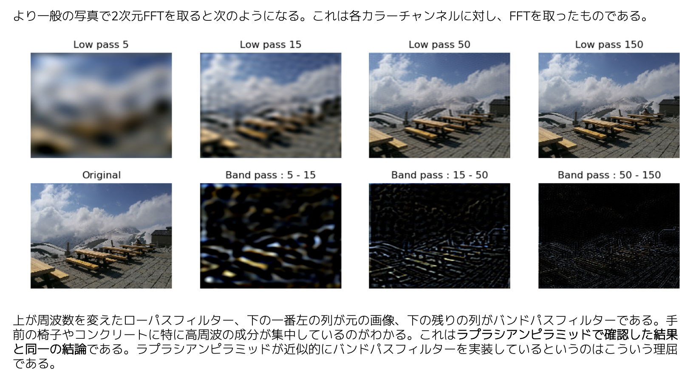

## sec 4
モザイクの科学

画像ピラミッド、フーリエ変換

モザイクとは「**高周波にノイズの乗るローパスフィルター**8」

### 波としての画像
画像の「周波数」に注目する。

音は波の性質を持つ。シンセサイザー。

$$
y = \sin{(x)}
$$

``` python
import numpy as np
x = np.arange(0, 10, 0.01)
y = np.sin(x) # (1000, )
```

$$
z = \sin{(x+y)}
$$

``` python
x = np.arange(0, 10, 0.01)
y = np.arange(0, 10, 0.01)
z = np.sin(x + y) # (1000, 1000)
```

[0, 1] に出力を合わせる

$$
z = \frac{\sin{(x+y)}+1}{2}
$$

並のデータを考えるときには、波を１つの関数と見做して、その関数を複数の sin 関数の合成として捉えるという手法（フーリエ変換）がある。

**音は目的変数がベクトルであったが、目的変数を行列に拡張すれば画像も波として考えることができる**

つまり、画像も sin 波の合成として捉えられ、このアプローチにより「周波数」の概念が出てくる

音において周波数を上げることは音の高さを意味する。

画像における周波数とは。

- 低周波成分：全体のぼやっとした雰囲気、色合い
  - 空や雲
- 高周波成分：細部の輪郭線
  - エッジや髪の毛のような細い線

> 画像の低周波成分とは、全体のぼやっとした雰囲気や色合い、高周波成分とは輪郭線や細い模様をそれぞれ対応

### ガウシアンピラミッド
ラプラシアンピラミッドは、バンドパスフィルターに近い存在として位置付けられる。

ガウシアンピラミッドではカーネルサイズ 5×5 の畳み込みをすることが多い。5×5 の場合カーネルは、

$$
K=\frac{1}{256}
\left(
\begin{array}{ccccc} 
1 & 4 & 6 & 4 & 1\\
4 & 16 & 24 & 16 & 4\\
6 & 24 & 36 & 24 & 6\\
4 & 16 & 24 & 16 & 4\\1 & 4 & 6 & 4 & 1\\
\end{array}
\right)
$$

``` python
x = original_image
results = [x]
for i in range(n):
    x = gaussian_blur(x) # ガウシアンぼかし
    x = downsampling(x) # 1/2 に縮小
    results.append(x)
```

解像度が小さくなるに従い、全体の雰囲気のみが表現されるようになる。
これはガウシアンぼかし＋リサイズにより、次第に高周波の成分が削ぎ落とされ、低周波の部分だけが残るようになったからである。

### ラプラシアンピラミッド
ガウシアンピラミッド同士の差分を取ったもの

ガウシアンぼかしはローパスフィルターの役割がある。

> ラプラシアンピラミッドを使えば、畳み込みとリサイズだけで近似的に周波数特性をみれる

### １次元フーリエ変換
FFTとは高速フーリエ変換の略であるが、単にフーリエ変換のことをFFTということも多い。

逆フーリエは、ifft

### 1d fft

#### 離散フーリエ変換(DFT)
配列のどのインデックスがどの座標に対応してるの？
`numpy.fft.fft`に一次元配列を渡すと、デフォルトでは、インデックス i と、座標 x が等しいものとして計算される。

N個のデータのDFTのデータは、やはりN個になるため、結果は要素N個の一次元配列となる。その順番とkの対応は`numpy.fft.fftfreq`にデータ点数を与えることで得られる。

計算の都合上、f(k) = (-1)^k A_k と、(-1)^k がかかってしまう！


### 2次元フーリエ変換
np.fft.fft2

**境界部分と内側のベタ塗りで周波数が大きく異なる！**

画像では周波数は解像度に対応するので、ほんの小さい領域しか見ない高解像度の畳み込みレイヤーでは、全体の形状を意識しながら画像を生成するのが難しい。



### 画像ピラミッドのDLへの応用
Octave Convolution 少し難しい

### リサイズによる周波数特性
画像では解像度≒周波数なので、**画像を縮小して拡大するという操作は基本的にローパスフィルター**となる。
ただし、リサイズアルゴリズムによって周波数特性はかなり変わる。

- ローパスフィルターによってカットされた高周波成分の回復
- NN 法のようなチープなリサイズアルゴリズムによって乗った、格子状のスペクトルノイズの除去

### ガウシアンぼかしによる周波数特性
ガウシアンローパスフィルター、とも呼ばれる

### L1-loss の問題点
L1ロスはピクセル単位の違いを表現するのに便利な損失関数であるが、パターンや図柄を捉えているかというと、必ずしもそうではない。

このような問題に対し、さまざまな損失関数を足してL1ロスの欠点を補うという方法が考えられる。SP-Loss

損失関数を複数足す方法は古くからあるが、**損失関数のハイパーパラメータ**の調整が大変、という問題がある

$$
L = \alpha L_1 + \beta L_2 + \gamma L_3+\dots
$$

のような、$\alpha,\beta,\gamma$のようなパラメータチューニングがしんどい。**静的な関数では表せないが、その時々で役割が変わり、複数の損失関数をあわせて１つにしたような動的な損失関数**があるといいなぁ。

これを実現したのがGAN（Generative Adversarial Network）で、GANは画像が「本物っぽいかどうか」を判定するメタな損失関数と言える。

> ピクセル単位のL1ロスは必ずしも全体の形状を評価しないため、出力画像がぼやけることが。そのため、画像間の相関や類似度を考えたり、複数の損失関数の合成、GANベースのアプローチが有効

### Perception-Distortion Tradeoff
以下の２つの軸を同時に高めることは**不可能**

- 画像を人間が見て違和感がないかという直感性（Perception）
- L1ロスのようにピクセル間の正確性を高めるという歪み（Distortion）

定量化しやすいのは、やはり歪みの軸で、L1ロスやL2ロスは最もベーシックな指標となる。L2ロスをベースとしているPSNRは最もわかりやすい歪みの指標となる。しかし、PSNRはピクセル間の計算にこだわりすぎる傾向があり、例えば画像を1,2ピクセル平行移動しただけで、大きなマイナスになる。。。

これを補完する形で使われるのが、SSIMやMS-SSIM。

SSIMはPSNRと似た歪みの指標であるが、店ではなく小さいパンチ単位で評価する。

$$
SSIM(x, y) = \frac{(2\mu_x\mu_y+c_1)(2\sigma_{xy}+c_2)}{(\mu_x^2+\mu_y^2+c_1)(\sigma_x^2+\sigma_y^2+c_1)}
$$

SSIMとは画像ノッチさなパッチに対して、平均、分散、共分散を求めて比較することでもとまる。SSIMは -1~1 で表され、1 に近いほど似ている画像とされる。SSIMはパッチ単位で評価しているので微小な平行移動に対してロバストという特徴がある。MS-SSIM は見る解像度を変えて評価するもの。

直感性のスコアはどうやって測定しようか？超解像の Ma et al. スコアなどは参考になるかも

Ma et al. スコアの高いアルゴリズムは「〜〜GAN」というものが多い。失われるトレードオフをうまい具合にチューニングするには、損失関数を以下のように定義

$$
L = L_{GAN} + \lambda L_{L1}
$$


### 演習
ガウシアンピラミッドの縮小操作は、ガウシアンぼかしをかけてからダウンサンプリングをするというものである。TensorFlowのDepthwise Convでは、縦横方向のstrides=2とすれば良い。


