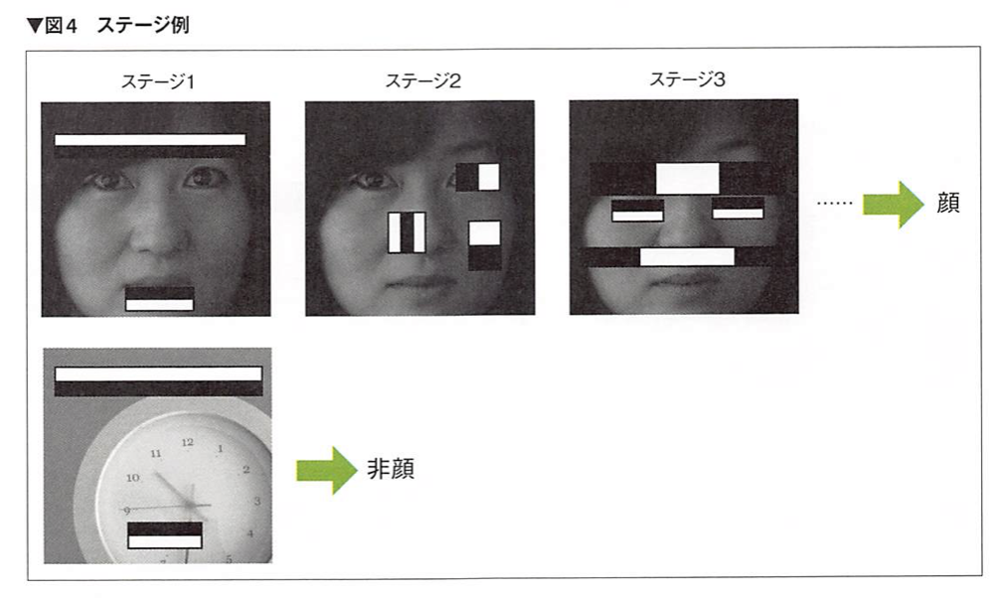
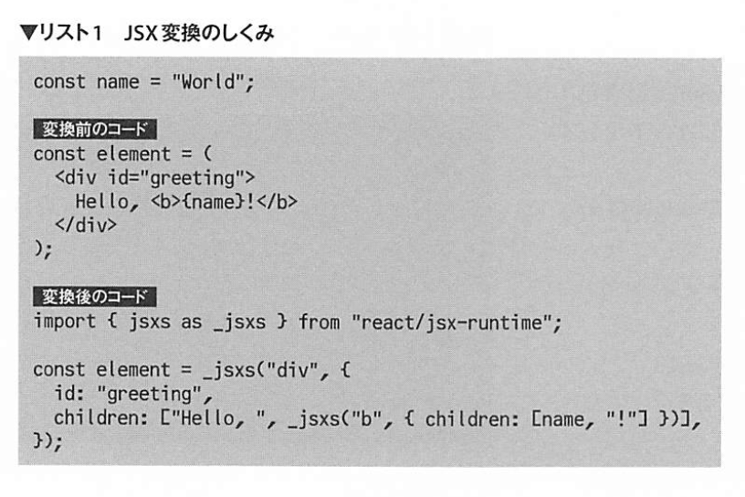

# Software design 2021-08

## Raspberry PiでエッジAI

### Haar Cascade
- Raspberry Piでも比較的高速に動作させることができる顔検出技術
- Raspberry PiでGPUやTPUといったアクセラ レータを使わずにエッジAIの処理をさせるときは、リアルタイムの必要がない単なる顔の検出といった用途では精度が若干高いHOG特徴を使用し、検出した顔の種別に応じた処理をリアルタイムに実施する必要があるときにはHaarCascadeを使用するのが適している？？
- Haar-like特徴量

Qt（キュート）とは、クロスプラットフォームアプリケーションフレームワークである
VNCはVirtual Network Computing

## git
- git rebase -i HEAD^3
- git rebase --abort

## React

### WHY React?
- 仮想DOMと宣言的UIの成果
- 宣言的UI（HTMLのような：対義語は命令的（JS））であるのにもかかわらず、更新速度が高速に行えている点がすごい
- UIを全てJSの力で描画する
- Webの構成要素は「DOM」という、オブジェクト指向のデータモデル
- ヘッドレスCMS?
- むしろHTMLがDOMもどきだったのかと感じるようになる

### JSX
- Reactアプリを書くうえで用いる記法
- JS内にHTML的な記法で「DOMの設計図」を書けるようにするための言語拡張

### hook
- useState
  - useHogeHoge
  - 関数に変数を記憶させる
- 兄弟間などでデータをやり取りしたりすることが多いなら、一番上位のコンポーネントでカウントを保持するstateを作るのも手
  - Reactのデータは、常に上のコンポーネントから下へと流れる

### Flux
- Facebookが提唱している、jsのデータの流れをわかりやすく整理するためのアーキテクチャ
- 単方向データフロー
- Redux
  - Fluxの派生
  - Single Source of Truth

### パフォーマンス
- 描画と読み込みの2つに大別
