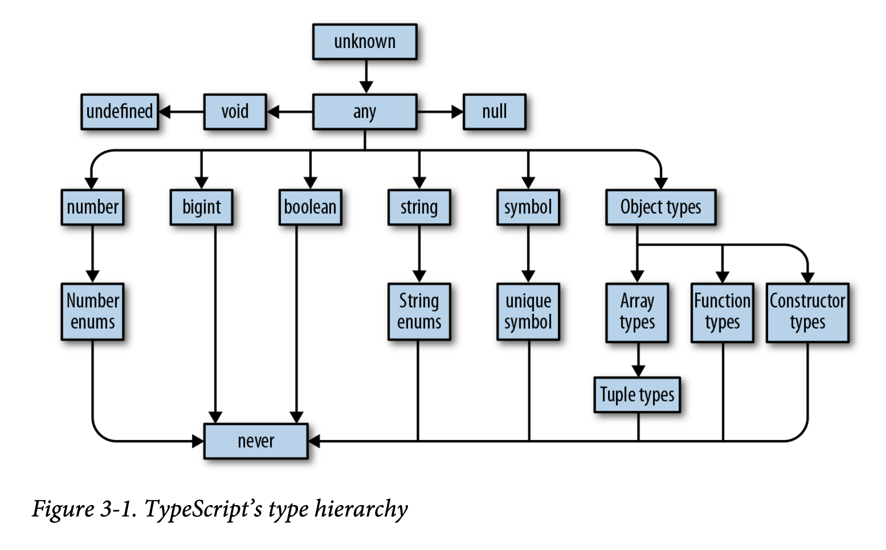
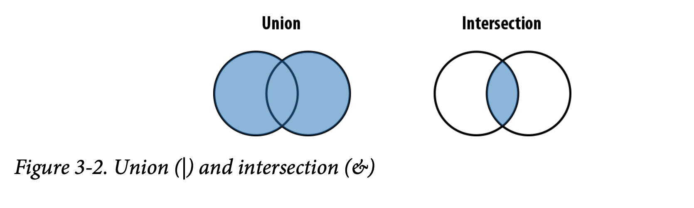

Programming TypeScript shows all the benefits of using a type system on top of JavaScript and provides deep insight into how to master the language.

TypeScript can help you eliminate bugs in your code and enable you to scale your code across more engineers than you could before.

Polymorphism is your best friend.

In practice, how correct your code is is up to you and your team.


## chap 1
- Type safety
  - Using types to prevent programs from doing invalid things.
- You will find yourself sketching out a program at the type level before you fill it in at the value level; you will think about edge cases as you design your program, not as an afterhought.

## chap 2

### The Compiler
Programs are files that contain a bunch of text written by you. That text is parsed by a special program called a compiler, which transforms it into an **abstract syntax tree (AST)**, a data structure that ignores things like whitespace, comments, and where you stand on the tabs versus spaces debate.

The compiler then converts that AST to a lower-level representation called **bytecode**. You can feed that bytecode into another program called a **runtime** to evaluate it and get a result.

So, when you run a program, what you're really doing is telling the runtime to evaluate the bytecode generated by the compiler from the AST parsed from your source code.

Once again, the steps are:

1. Program is parsed into an AST.
2. AST is compiled to bytecode.
3. Bytecode is evaluated by the runtime.

Where TypeScript is special is that instead of compiling straight to bytecode, TypeScript compiles to ... JavaScript code!

> After the TypeScript Compiler generates an AST for your program - but before it emits code - it typechecks your code.

1. TypeScript source -> TypeScript AST
2. AST is checked by typechecker
3. TypeScript AST -> JavaScript Source
4. JavaScript Source -> JavaScript AST
5. AST -> bytecode
6. Bytecode is evaluated by runtime

Steps 1-3 are done by TSC(TypeScript Compiler) and steps 4-6 are done by the JavaScript runtime that lives in your browser, NodeJS, or whatever JavaScript engine you're using.

inference magic

> In general, it is good style to let TypeScript infer as many types as it can for you, keeping explicitly typed code to a minimum.

TypeScript can't catch for you at compile time - things like stack overflows, broken network connections, and malformed user inputs - that will still result in runtime exceptions.

## chap 3
Types



### any
any is the Godfather of types. It does anything for a price, but you don't want to ask any for a favor unless you're completely out of options.

```typescript
let a: any = 666
let b: any = ['danger']
let c = a + b  // doesn't report an error
```

To get TypeScript to complain about implicit anys be sure to enable to noImplicitAny flag in your tscofig.json. It's a part of the strict family of TSC flags.

### unknown
If any is the Godfather, then unknown is Keanu Reeves as undercover FBI agent Johnny Utah in POint Break: laid back, fits right in with the bad guys, but deep down has a respect for the law and is on the side of the good guys.

Like any, it represents any value, but TypeScript won't let you use an unknown type until you refine it by checking what it is.

```typescript
let a: unknown = 30
let b = a === 130   // ok
let c = a + 10      // out
if (typeof a === 'number') {
  let d = a + 10    // ok
}
```

This example shoud give you a rough idea of how to use unknown:

1. TypeScript will never infer something as unknown - you have to explicitly annotate it !
2. You can compare values to values that are of type unknown.
3. But, you can't do things that assume an unknown value is of a specific type; you have to prove to TypeScript that the value really is of that type first

### number
number is the set of all numbers: integers, floats, positives, negatives, Infinity, NaN, and so on.

```typescript
let oneMillion = 1_000_000
```

### bigint
```typescript
let a = 1234n
const b = 5678n
```

### symbol
this is used as an alternative to string keys in objects and maps, in places where you want to be extra sure that people are using the right well-known key and didn't accidentally set the key - think setting a default iterator for your object.

### objects
object is a little narrower than any, but not by much.

```typescript
let a: object = {
  b: 'x'
}
a.b // ERROR

let a = {
  b: 'x'
}
a.b // ERROR
```

You can either let TS infer your object's shape for you, or explicitly describe it inside curly braces

```typescript
let a: {b: number} = {
  b: 'x'
}
a.b // ERROR
```

object literal, or class

```typescript
let c: {
  firstName: string
  lastName: string
} = {
  firstName: 'john',
  lastName: 'barrowman'
}

class Person {
  constructor(
    // public is shorthand for this.blahblah
    public firstName: string,
    public lastName: string
  ) {}
}
c = new Person('matt', 'smith')
```

Can you tell TS that something is optional, or that there might be more properties than you planned for? You bet:

```typescript
let a: {
  b: number
  c?: string
  [key: number]: boolean
}
```

a might have a property c that's a string. And if c is set, it might be undefined.

a might have any number of numeric properties that are booleans

```typescript
a = {b: 1}
a = {b: 1, c: undefined}
a = {b: 1, c: 'd'}
a = {b: 1, 10: true}
a = {b: 1, 10: true, 20: false}
```

#### Index Signatures
The `[key: T]: U` syntax is called an **index signature**, and this is the way you tell TypeScript that the given object might contain more keys.

U must be assignable to eigher number or string.

Also note that you can use any word for the index signature key's name - it doesn't have to be key:

```typescript
let a: {
  [seatNum: string]: string
} = {
  '34D': 'Boris Cherny',
  '34E': 'Boris Gates'
}
```

### memo
- Empty object literal notation ({}). Try to avoid this.
- The Object type. Try to avoid this.

### Type Aliases
Just like you can use variable declarations to declare a variable that aliases a value, you can declare a type that points to a type.

```typescript
type Age = number

type Person = {
  name: String
  age: Age
}
```

Aliases are **never** inferred by TypeScript, so you have to type them explicitly:


### Union and Intersection types



```typescript
type Returns = string | null

function (a: string, b: number) {
  return a || b
}
```

### Arrays
```typescript
let d = [1, 'a']   // (string | number)[]

let g = []
g.push(1)
g.push('red')   // NO error
```

The general rule of thumb is to keep arrays homogeneous. That is, don't mix apples and oranges and numbers in a single array.


### Tuples
Tuples are subtypes of array. They're a special way to type arrays that have fixed lengths, where the values at each index have specific, known types.

```typescript
let a: [number] = [1]

let b: [string, string, number] = ['malcolm', 'gladwell', 1964]
```

Tuples support optional elements too.

```typescript
let trainFares: [number, number?][] = [
  [3.6],
  [3.4, 4],
  [10.50]
]
```

### Read-only arrays and tuples
```typescript
let as: readonly number[] = [1, 2, 3]
```

What is the difference between read-only and constant ???

> read-only vs constant vs immutable

### Enums
Enums are a way to enumerate the possible values for a type. They are unordered data structures that map keys to values.

```typescript
// By convention, enum names are uppercases and singular.
// Their keys are also uppercase.
enum Language {
  English,
  Spanish,
  Russian
}

// or, you can set values explicitly.
enum Language {
  English = 0,
  Spanish = 1,
  Russian = 2
}
Language.English
```

## chap 4
Functions

The return type is inferred, but you can explicitly annotate it too if you want:

```typescript
function add(a: number, b: number): number {
  return a + b
}

let gree3 = (name: string) => {
  return 'hello' + name
}
```

Optional and Default Parameters

```typescript
function log(message: string, userId?: string) {
  let time = new Date().toLocaleTimeString()
  console.log(time, message, userId || 'Not signed in')
}

log('Page loaded')
log('User signed in', 'da763be')
```

### Rest parameters
```typescript
function sumVariadicSafe(...numbers: number[]): number {
  return numbers.reduce((total, n) => total + n, 0)
}
sumVariadicSafe(1, 2, 3)
```

### call, apply, and bind
```typescript
function add(a: number, b: number): number {
  return a + b
}

add(10, 20)
add.apply(null, [10, 20])
add.call(null, 10, 20)
add.bind(null, 10, 20)
```

apply binds a value to this within your function

"this" has a different value depending on how you called your function, which can make it notoriously fragile and hard to reason about.

> For this reason, a lot of teams ban "this" everywhere except in class methods - to do this for your codebase too, enable to no-invalid-this TSLint rule.

The reason that "this" is fragile has to do with the way it's assigned.

### Generator Functions
```typescript
// The asterisk before a function's name makes that function a generator.
function* createFibonacciGenerator() {
  let a = 0
  let b = 1
  while (true) {
    yield a;
    [a, b] = [b, a + b]
  }
}

let fibonacciGenerator = createFibonacciGenerator() // IterableIterator<number>
fibonacciGenerator.next()  // evaluates to {value: 0, done: false}
fibonacciGenerator.next()
fibonacciGenerator.next()
fibonacciGenerator.next()
```

### Iterators
Iterators are the flip side to generators: while generators are a way to produce a stream of values, iterators are a way to consume those values.

> Any object that defines a method called next, which returns an object with the properties value and done.


### Type Level and Value Level Code
A rule of thumb is: if it's valid JavaScript code, then it's value-level; if it's valid TypeScript but not Valid JavaScript, then it's type-level.

### Contextual Typing
```typescript
function times(
  f: (index: number) => void,
  n: number
) {
  for (let i = 0; i < n; i++) {
    f(i)
  }
}

times(n => console.log(n), 4)
```

Note that if we didn't declare f inline, TS wouldn't have been able to infer its type:

```typescript
function f(n) {  // 'n' implicitly has an 'any' type
  console.log(n)
}

times(f, 4)
```

### Generics?
```typescript
type Filter = {
  <T>(array: T[], f: (item: T) => boolean): T[]
}

function map<T, U>(array: T[], f: (item: T) => U): U[] {
  let result = []
  for (let i = 0; i < array.,length; i++) {
    result[i] = f(array[i])
  }
  return result
}
```

### Generic Type Aliases
```typescript
type MyEvent<T> = {
  target: T
  type: string
}
```

### Generic Type Defaults
```typescript
type MyEvent<T> = {
  target: T
  type: string
}
```

To create a new event, we have to explicitly bind a generic type to MyEvent, representing the type of HTML element that the envet was dispatched on:

```typescript
let buttonEvent: MyEvent<HTMLButtonElement> = {
  target: myButton,
  type: string
}
```

We can add a default

```typescript
type MyEvent<T = HTMLElement> = {
  target: T
  type: string
}

let myEvent: MyEvent = {
  target: myElement,
  type: string
}
```

### Type-Driven Development
> A style of programming where you sketch out type signatures first, and fill in values later.

When you apply an expressive type system to a function, the function's type signature might end up telling you most of what you need to know about that function.


## Chap 5
Classes and Interfaces

- [./checc.ts]
- [./index_3.ts]

The **private access modifier** in the constructor automatically assigns the prarameter to "this". and sets its visibility to private, meaning that code within a Position instance can read and write to it, but code outside of a Position instance can't.

**protected** makes the property visible both to instance of Piece and **the instances of any subclass of Piece.**

If we hadn't assigned it a value in the constructor, TS would have told us that the variable is not definitely assigned, i.e., we said it's of type T, but it's actually T | undefined because it's not assigned a value in a property initializer or in the constuctor

### Access modifier
- public
- protected
- private

Using access modifiers, you can design classes that don't expose too much info about their implementations, and instead expose well-defined APIs for others to use.

### others
```typescript
abstract class Piece {
  ...
}
// Cannot create an instance of an abstract class
new Piece('White', 'E', 1)  // ERROR
```

### Interfaces
Like type aliases, interfaces are a way to name a type so you don't have to define it inline.

Everywhere you used your Sushi type alias, you can also use your Sushi interface.

What are the differences between types and interfaces? There are three, and thre're subtle.

when you extend an interface, TS will make sure that the interface you're extending is assignable to your extension!

### Implementing Interfaces Versus Extending Abstract Classes
The difference is that interfaces are more general and lightweight, and abstract classes are more special-purpose and feature-rich.


## English

### Words
- aficionados
  - someone who is very interested in and enthusiastic about a particular subject: 
- nerd
  - engage in or discuss a technical field obsessively or with great attention to detail.
- squiggly
  - a short, irregular curve or twist, as in writing or drawing. 
- undercover
  - involving secret work within a community or organization, especially for the purposes of police investigation or espionage.
- pesky
  - annoying or causing trouble
- pitfall
  - a hidden or unsuspected danger or difficulty.
- arity
  - the number of arguments that a function can take


### sentences
- I'll wrap up with how to use TypeScript with your favorite frameworks, migrating your existing JavaScript project to TypeScript.
- What exactly do I mean when I say "safer"? What I am talking about, of course, is type safety.
- Don't get me wrong.
- When are errors surfaced?
- Why? Don't ask me, I'm just the guy writing this book.
- Here's what a function looks like in TypeScript
- Thankfully, TypeScript has your back.
- That is intentional.
  - Was it intentional?
- So far in this book, we've been talking about the hows and whys of concrete types, and functions that use concrete types.
- You are spot-on
  - Your guess was spot-on
- How exactly does this work? Let's walk through it step by step.


