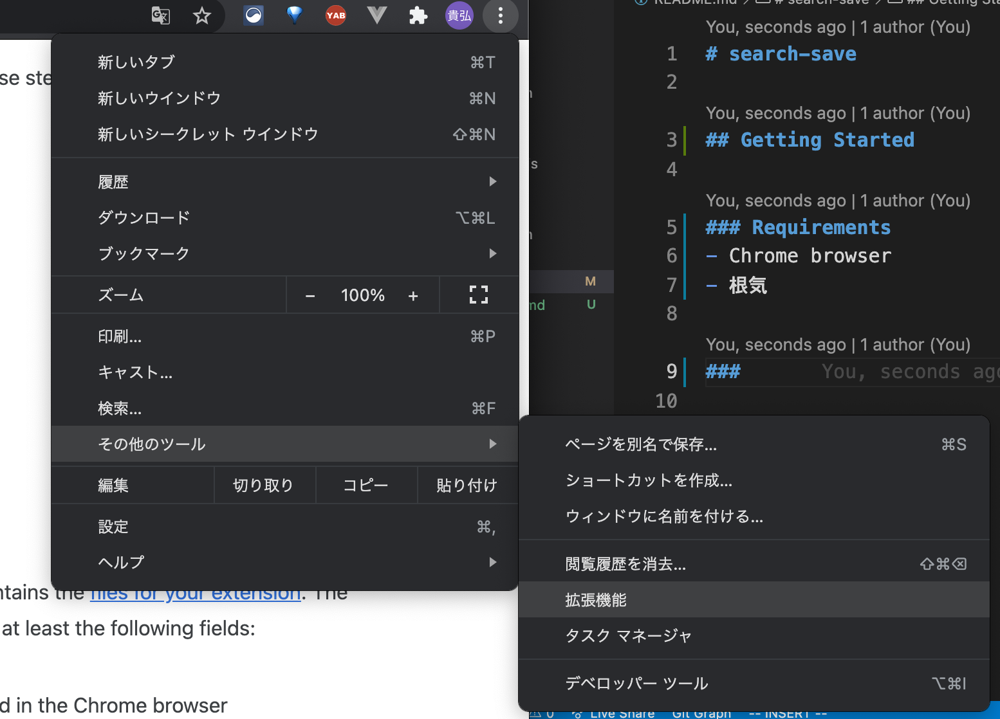
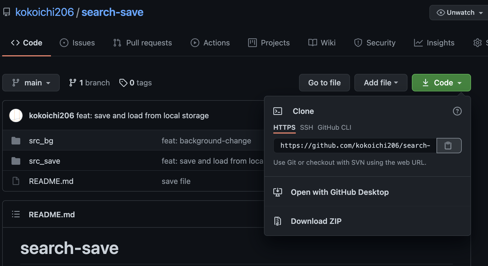
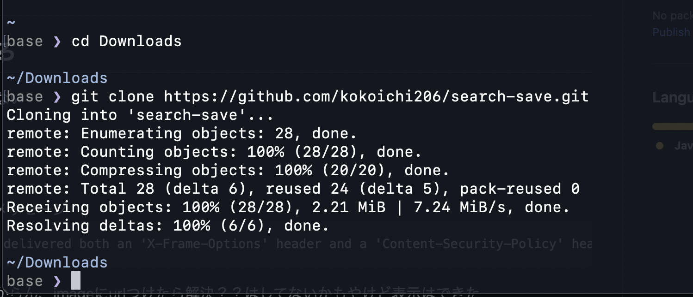
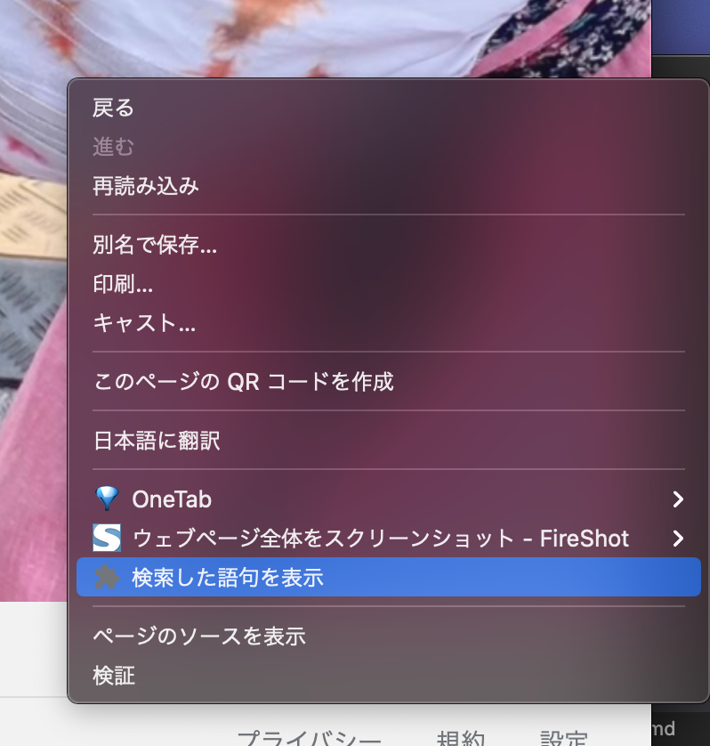

# search-save
- [search-save](#search-save)
  - [Getting Started](#getting-started)
    - [Requirements](#requirements)
    - [自作拡張機能インストール方法](#自作拡張機能インストール方法)
    - [このリポジトリの拡張機能を使う場合](#このリポジトリの拡張機能を使う場合)
  - [src_bg](#src_bg)
  - [src_save](#src_save)
    - [最終的にやりたいこと](#最終的にやりたいこと)

## Getting Started

### Requirements
- Chrome brows- [search-save](#search-save)
- 根気

### 自作拡張機能インストール方法
- Chromeの右上の3点リーダー → その他ツール → 拡張機能


- 右上のデベロッパーツールをONにする
- 「パッケージ化されていない拡張機能を読み込む」をクリックし、自作拡張機能を読み込む


### このリポジトリの拡張機能を使う場合
- 緑の"Code"ボタン → URLの右のクリップボードをクリックしてURLをコピー



- 保存したい場所で以下のコマンドを実行（この場合、コピーいらない）
```
git clone https://github.com/kokoichi206/search-save.git
```
- 下のは`Downloads`フォルダにクローンした場合




## src_bg
`google.com`以下のURLの背景が一様に変わります

## src_save
- `google.com`における検索結果を`localstorage`に保存する。
- 右クリックで、拡張機能に基づいた何かしらのページに飛べるようにはなっている



### 最終的にやりたいこと
検索した履歴を保存する拡張機能
