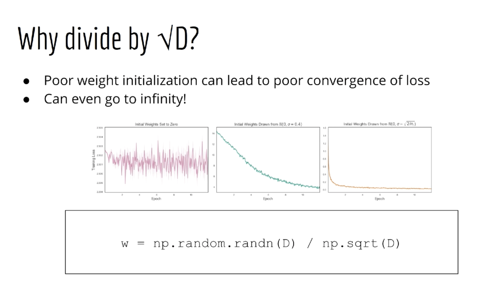

## CodeMemo
```python
import numpy as np
a = np.random.randn(5)
expa = np.exp(a)
A = np.random.randn(100, 5)
expA = np.exp(A)
ans = expA / expA.sum()
ans = expA / expA.sum(axis=1, keepdims=True)
```


## softmax
- 確率で考えたいから、負の数嫌だ〜〜 → exp取ろう
- めっちゃ数デカくなっちゃって嫌だ〜〜 → 相対比にしよう


## Training Summary
- Training == finding the "best" weights for the neural network
- "best" weights are the weights that minimize the cost
- Cost == negative log-likelihood of categorical distribution
- Ex. die roll
- Also improves prediction accuracy
- Backpropagation
- Fancy name for gradient descent

Nonlinear classifier

classic examples: XOR and donut

to gain deeper insight

## ANNs for Regression
- Classification is the typical use-case for ANNs
- All famous results were classification problems(MNIST, ImageNet, etc)
- ANNs are better at classification than regression

### How to use ipython
```sh
$ ipython
```

### Which Activation function should I use for hidden layers?
Experiment is the best

- Sigmoid
  - Of theoretical interest
  - 0 -> 1
  - "Repeating structures"
    - Just like neurons of the brain!
  - In realitym we just want a good function approximator
  - Problem: most of it is flat!(slope ~= 0)
  - If gradient is 0, then nothing will be learned!
  - Another prob: we like mean=0, val=1
  - sigma(0) = 0.5
    - It keeps offseting the data
- tanh
  - Solves one prob:
    - tanh(0) = 0
  - slope still vanishes at edges
  - tanh is typically better than sigmoid
  - In some scenarios we require sigmoid.
- ReLU
  - It's pretty ugly.
  - Derivative is not even defined at 0!
  - Might bother someone who is theoretically inclined.
  - Doesn't matter if we assign the derivative 0 for x=0
  - Trains are easily
  - Half of it is still slat.
  - "Dead neurons"
    - once output is 0 the weights that depend on its gradient can never learn
  - One solution:
    - Just add more hidden units.
    - Leaky ReLU (max(0.05z, z))

### hyperparameters
- Practice!
- This isn't grade school, don't depend on someone to give you homework.




- randn() == sample from N(0,1)
- randn()*C == sample from N(0,C^2)
- Think of Standardization
  - z = (X-mu)/sigma
  - X = Z*sigma + mu
- This means we want w to have mean 0, variance 1/D
- variance is large, so make it smaller.
