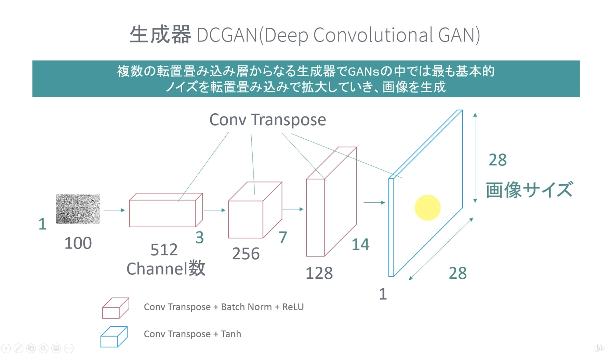
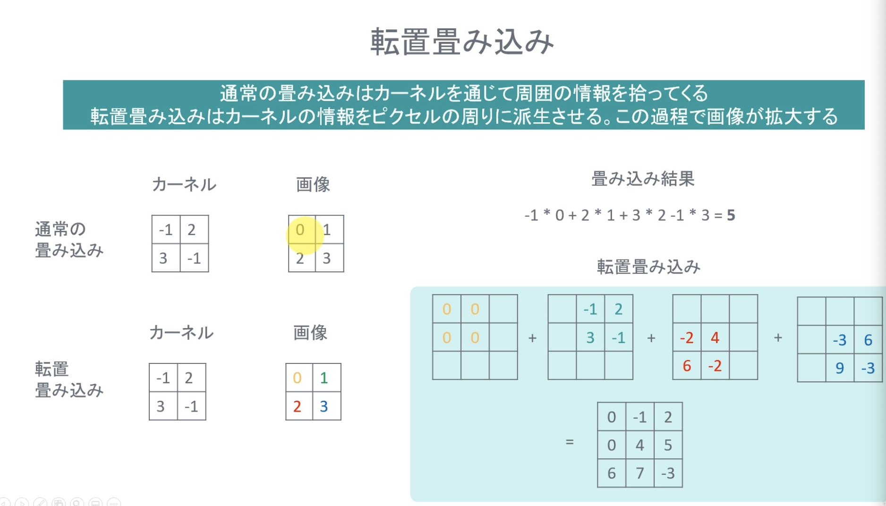
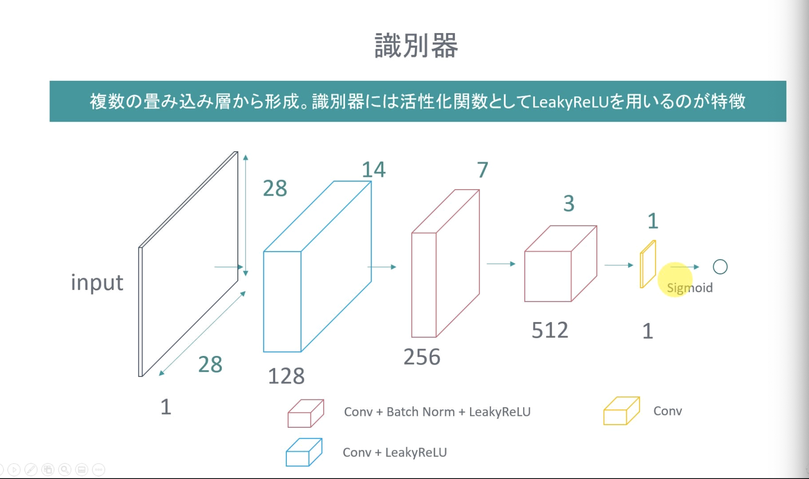
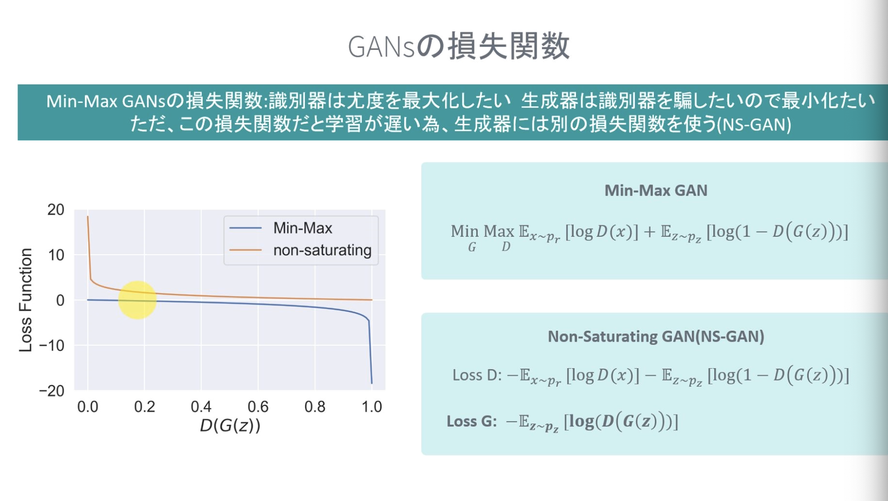

## GANs
- GANsは教師なしに属する
    - 生成モデリング

## 数学
- GANs では確率変数が生成されるターゲット
- データが従う確率分布 p そのものはわからないので、生成器の確率分布で近似する
    - 学習では、確率分布を近づけることとなる
- pGをprに近づけるための指標として、KL divergence と JS divergence

### Binary Cross Entropy

なぜ、これで実装するのか

## 実装方針

### 生成器

入力の次元は別に１００じゃなくても良い

#### 転置畳み込み層

画素値をカーネルで重みづけて、周りに派生させていく。

### 識別器

複数の畳み込みから構成

誤差をしっかり伝播させたいので、LeakyReLU

### 損失関数
Min-Max GAN: 

## Conditional GAN
COnditional GAN は、ノイズや画像にラベルを付与することで、特定の画像を生成することができる！

100次元のノイズ＋One hot vector 10次元（ここでは、0-9 の数字の分類に使うので、10次元の One hot vector）

画像に対してラベルを付与する場合は、チャネル方向に追加する。
モノクロに対しては、1次元＋10次元 ⇨ １１チャネルになる
