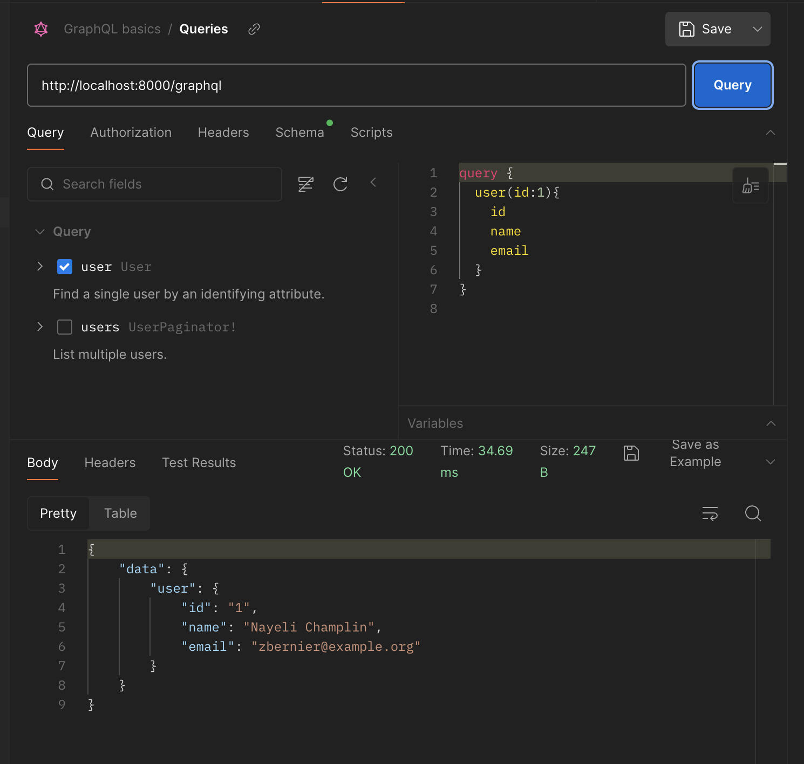
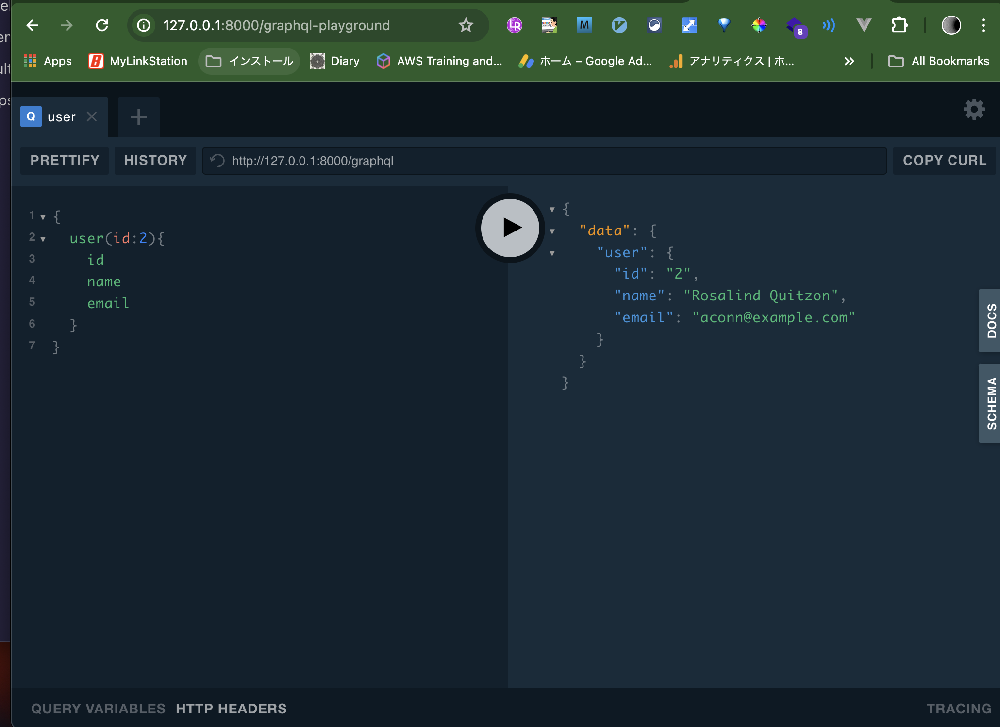

## Installation

https://lighthouse-php.com/5/getting-started/installation.html#install-via-composer

``` sh
composer require nuwave/lighthouse
php artisan vendor:publish --tag=lighthouse-schema


cp vendor/nuwave/lighthouse/src/lighthouse.php config/

mkdir -p graphql
cp vendor/nuwave/lighthouse/src/default-schema.graphql graphql/schema.graphql


php artisan lighthouse:ide-helper
```



``` sh
composer require mll-lab/laravel-graphql-playground
```


